# 🏢 Redmyre House BMS — Master Manual Part 2

**페이지별 완전 상세 (20개 HTML)**

---

## 📖 Part 2 구성

Part 1이 DB/Edge Function/Cron 중심이라면, Part 2는 **각 페이지가 실제로 어떻게 동작하는지** 코드 기준으로 기록한 매뉴얼입니다.

**페이지 그룹:**
- **그룹 A (4개):** 공개 페이지 (인증 없음)
- **그룹 B (2개):** Overview + 공지
- **그룹 C (4개):** 입주자 기능
- **그룹 D (6개):** 견적/작업/리포트/서비스리포트 ⭐ 핵심
- **그룹 E (4개):** 관리자 기능
- **그룹 F (2개):** 가이드

**각 페이지 문서화 내용:**
1. 용도 / 접근 권한
2. HTML 구조 (주요 영역)
3. Role별 UI 분기
4. DB 쿼리/RPC/Edge Function 호출
5. 주요 이벤트 핸들러
6. 금기사항 / 주의점

---

# 🔗 시스템 데이터 플로우 — 페이지 간 연결

**이 섹션이 매뉴얼의 핵심.** 각 페이지가 독립적이지 않고 **데이터로 연결**되어 있습니다. 한 페이지를 수정하면 다른 페이지에 영향이 갑니다.

> 💡 **다이어그램 보기:** Mermaid 형식. GitHub, VS Code (Markdown Preview Mermaid 확장), Notion, Obsidian에서 자동으로 그래프로 렌더링됩니다.

---

## 🔥 플로우 1: 견적 → 작업 → 리포트 → 비용 분석 (메인 플로우)

**같은 `quotes` 테이블을 4개 페이지가 공유**. 컬럼 값에 따라 어디서 보이는지 결정됨.

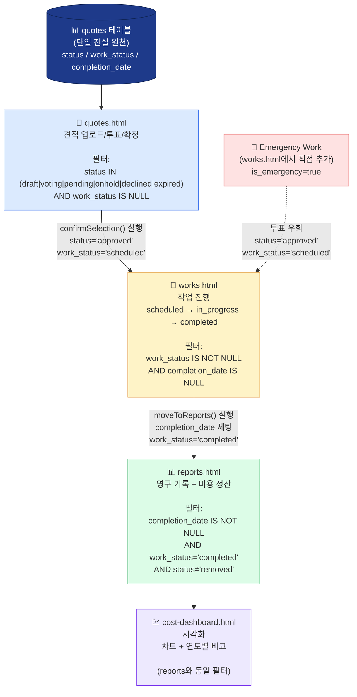

**핵심 포인트:**
- `quotes.html`은 `work_status IS NULL`만 보여줌 (Works 진행 중인 건 안 보임)
- `works.html`은 `work_status NOT NULL AND completion_date IS NULL`
- `reports.html` + `cost-dashboard.html`은 같은 데이터, 다른 시각
- **소프트 삭제:** Reports에서 삭제 시 `status='removed'` 업데이트만, 행 자체는 안 지워짐
- **Emergency Work:** quotes.html을 거치지 않고 works.html에서 직접 추가 (`is_emergency=true`)

**이 플로우 깨지면 안 되는 이유:**
- `confirmSelection()`이 work_status='scheduled' 안 세팅 → works.html에 안 나타남
- `moveToReports()`가 completion_date 안 세팅 → reports/cost-dashboard에 안 나타남
- status='removed' 처리 안 하면 영구 삭제 → 감사 불가

**관련 절대 수정 금지 함수:**
- `confirmSelection()` (quotes.html)
- `moveToReports()` (works.html)
- `parseQuoteCategory()` (cost-dashboard.html, reports.html)

---

## 👥 플로우 2: Occupants → 다른 페이지 (유닛 매칭의 중심)

**`occupants` 테이블이 모든 입주자 매칭의 출발점.**

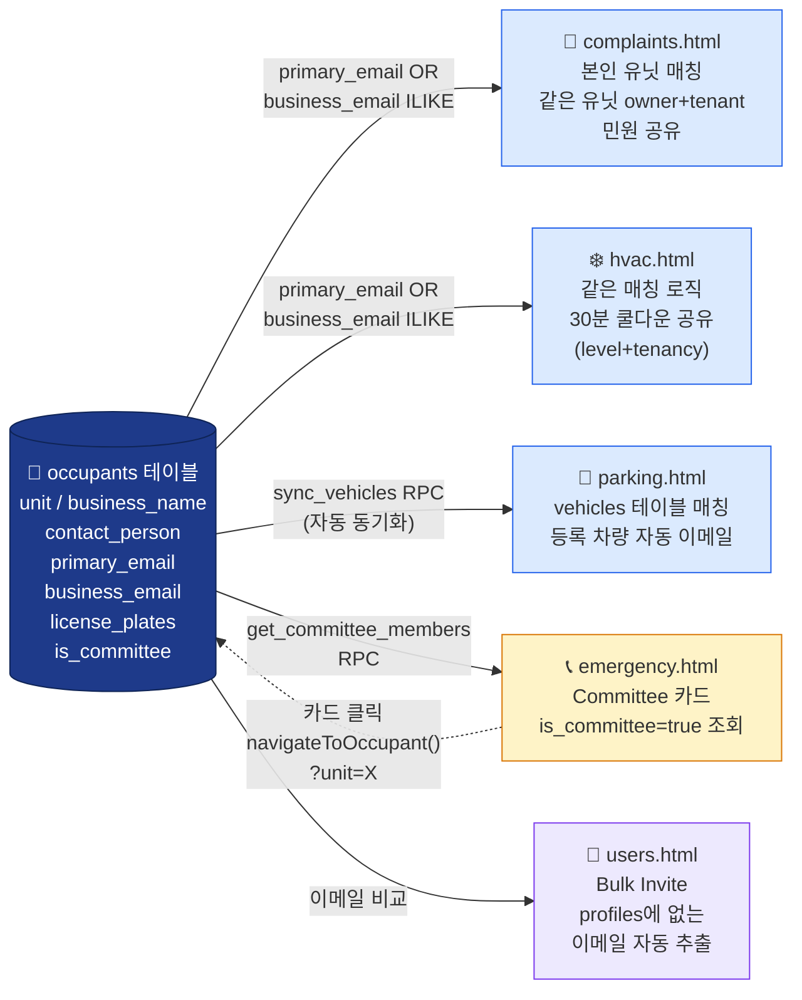

**occupants 수정 시 영향 범위:**
- `primary_email` / `business_email` 변경 → complaints/hvac에서 본인 유닛 인식 변경
- `license_plates` 변경 → sync_vehicles로 vehicles 테이블 자동 업데이트 → parking에 즉시 반영
- `is_committee` 변경 → emergency.html Committee 카드 즉시 변경
- `contact_person` 변경 → emergency.html Committee 카드 이름 변경

**RLS와의 관계:**
- `occupants` SELECT RLS: 본인 유닛만 (이메일 매칭)
- 다른 유닛 보려면 → `get_all_occupants_public()` RPC (제한된 컬럼만)
- 차량 매칭은 → `lookup_vehicle_plates()` RPC (전체 RLS 우회)

---

## 🚗 플로우 3: Occupants → Vehicles → Parking (차량 동기화)

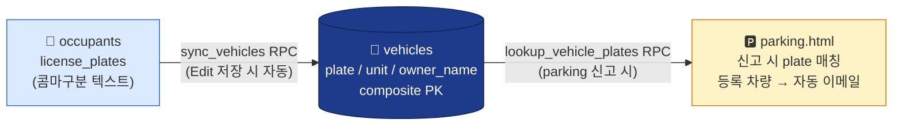

**중요:**
- occupants의 `license_plates`는 **단일 텍스트** (콤마 구분)
- vehicles 테이블은 **각 행이 (plate, unit)** PK
- 한 사람이 여러 유닛 보유 시 같은 plate가 여러 행 (composite PK라 가능)
- sync_vehicles는 occupants Edit 저장 시 **자동 호출** (직접 vehicles 수정 금지)

---

## 🔐 플로우 4: 인증 흐름 (Index → Setup → Building)

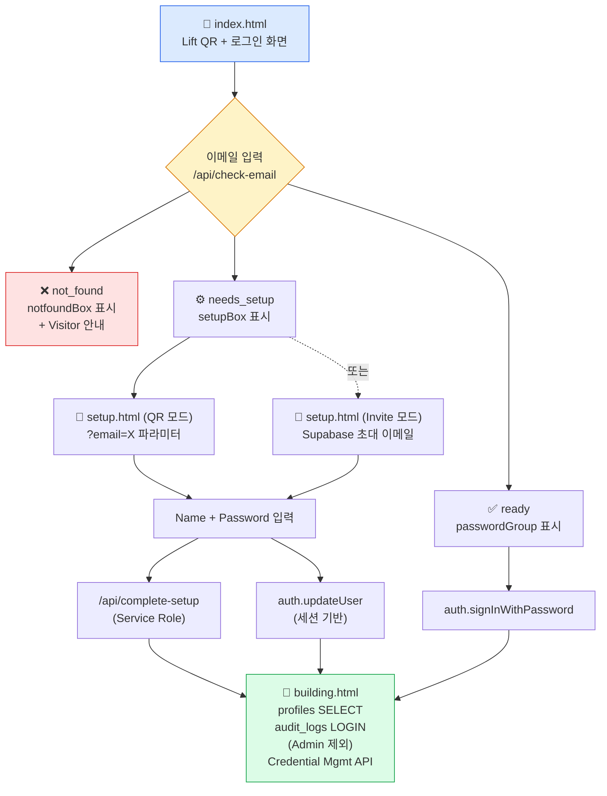

**users.html에서 `/api/send-invite`로 신규 유저 생성 시:**
- `skipEmail=false` → Supabase 초대 이메일 발송 → Invite 모드
- `skipEmail=true` → 랜덤 비번으로 즉시 활성화 → Admin이 직접 안내 (QR 모드)

---

## 📢 플로우 5: 공지 / 푸시 알림 흐름

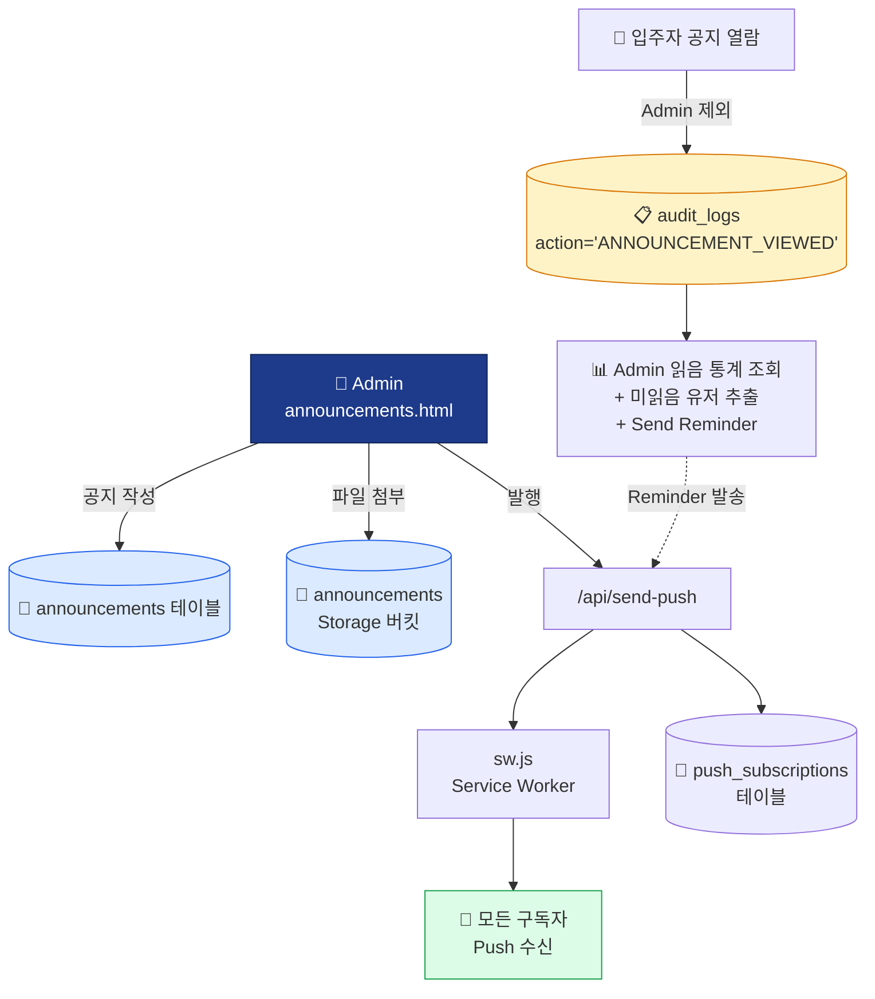

**Push 알림 발신 페이지 (전체):**
- announcements.html (공지 발행/재발송/리마인더)
- complaints.html (신규 민원 → Admin / Admin 답변 → 작성자)
- hvac.html (신규 요청 → Admin / 승인·거절 → 요청자)
- parking.html (신고 → 전체, 15분 쿨다운)
- works.html (작업 완료 → 전체)
- quotes.html (투표 시작 / 결과 확정 → Admin)

**Email 알림 발신 페이지 (한정):**
- email-quote-voting (quotes.html 투표 시작)
- email-quote-confirm (quotes.html 결과 확정)
- email-parking-notice (parking.html 등록 차량 매칭 시)
- **complaints.html은 이메일 발송 안 함** (4/21 이후 제거됨, Push만)
- **announcements.html은 이메일 발송 안 함** (Resend 한도 보호, Push만)

---

## 🏢 플로우 6: Building Overview → 4개 페이지 (입주자 대시보드)

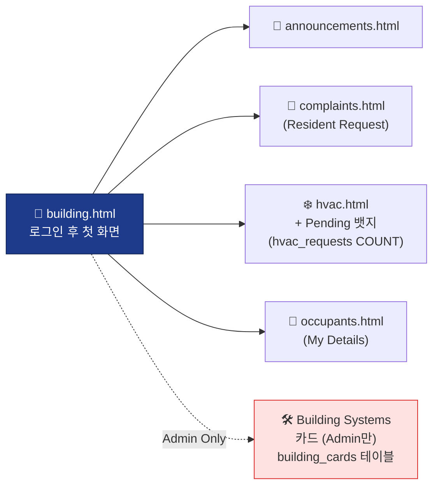

---

## 🌐 플로우 7: 공개 페이지 ↔ Admin 페이지

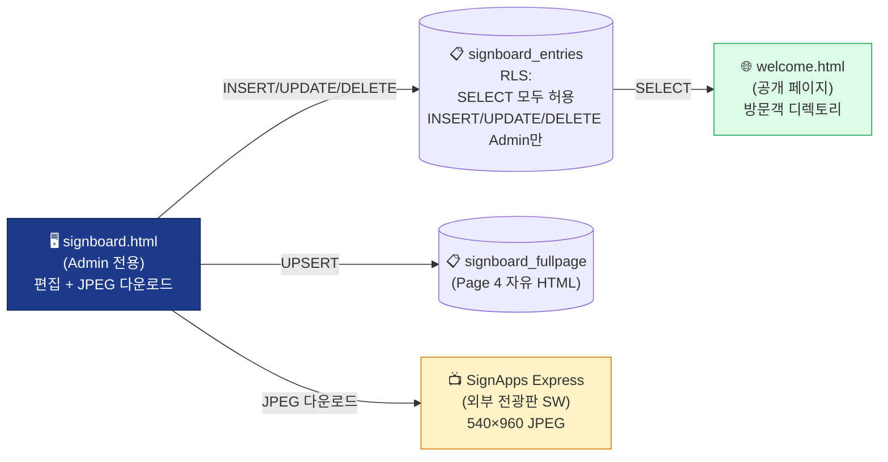

**QR 추적 (qr_analytics 테이블):**
- 리프트 QR → index.html → trackQR('lift_entry')
- index.html → Resident → trackQR('lift_resident')
- index.html → Visitor → trackQR('lift_visitor') + qr_from_lift sessionStorage
- 전광판 QR → welcome.html → trackQR('signboard_entry')
- system.html (Admin)에서 통계 조회 + Drop-off 계산

---

## 🚨 플로우 8: 비상 연락처 → Occupants

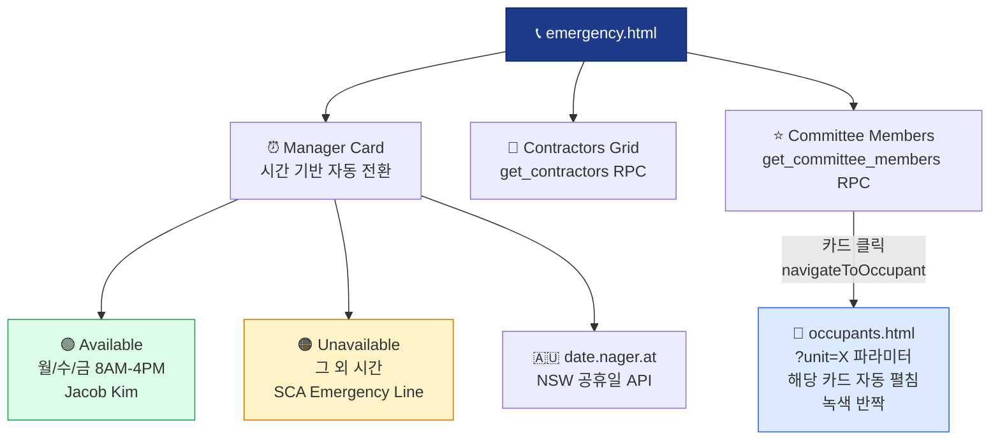

---

## 🛠️ 플로우 9: 시스템 관리 (system.html)

**모든 페이지의 데이터를 종합해서 모니터링:**

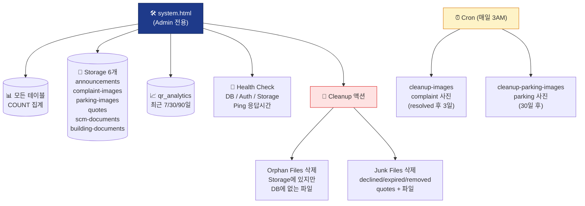

---

## 📋 플로우 10: 권한 관리 흐름

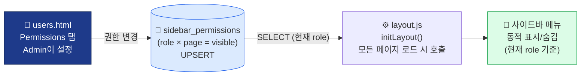

**Role 5개:**
- admin / committee / observer (Strata) / owner / tenant (Staff)
- 화면 표시명만 변경 (DB role 값은 그대로)

**4중 방어망 (Quotes Storage):**

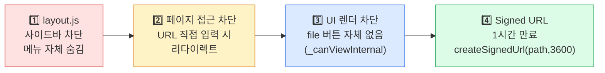

---

## 🔑 핵심 요약: 데이터 흐름의 단일 진실 원천

| 데이터 | 단일 진실 원천 (테이블) | 사용 페이지 |
|---|---|---|
| 견적/투표/작업/리포트 | `quotes` + `votes` | quotes / works / reports / cost-dashboard |
| 입주자 정보 | `occupants` | occupants / complaints / hvac / parking / emergency / users |
| 차량 | `vehicles` (occupants에서 sync) | parking |
| 공지 | `announcements` + `audit_logs(ANNOUNCEMENT_VIEWED)` | announcements |
| 민원 | `complaints` + `complaint_messages` | complaints |
| HVAC 요청 | `hvac_requests` | hvac / history |
| 주차 신고 | `parking_reports` | parking |
| 디렉토리 | `signboard_entries` | signboard / welcome |
| Push 구독 | `push_subscriptions` | (모든 페이지에서 send-push 호출) |
| 전체 활동 | `audit_logs` | users / announcements |
| 권한 | `sidebar_permissions` | users (설정) / layout.js (적용) |

**한 데이터 = 한 테이블 = 한 RLS 정책.** 같은 데이터를 여러 곳에 저장하지 않음.

---

## 🗺️ 전체 시스템 한눈에 보기

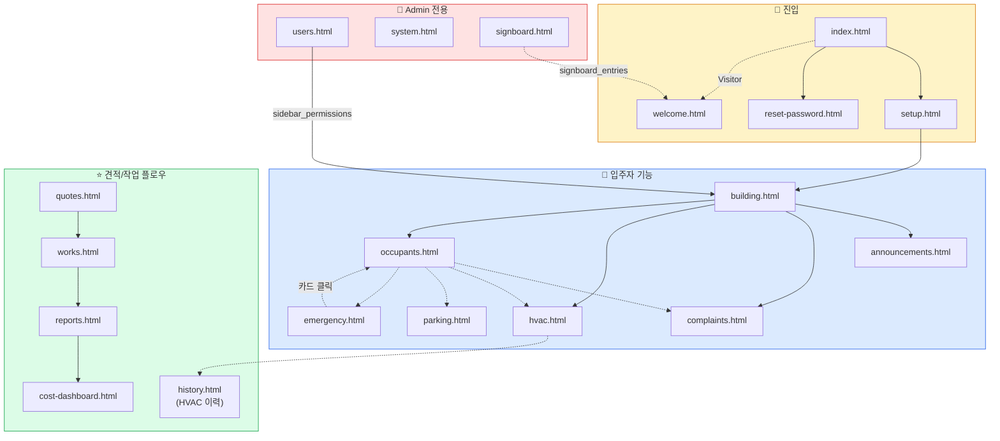

---


# 🌐 그룹 A: 공개 페이지 (4개)

이 페이지들은 **로그인 없이도 접근 가능**하거나 **인증 플로우의 시작점**입니다.

---

## 📄 1. `index.html` — 로그인 진입점

**URL:** `/` (vercel.json rewrites로 매핑)
**파일 크기:** 744줄
**인증 필요:** ❌ (로그인 전 페이지)

### 📌 용도

Redmyre House BMS의 **진입점**. 세 가지 역할:
1. Resident 로그인
2. Visitor → welcome.html로 이동
3. 이메일 입력 시 계정 상태 자동 판별 후 플로우 분기

### 🎨 화면 구성

**① Choice Overlay (최초 진입 시 전체 화면)**
- `REDMYRE HOUSE` 타이틀
- `9–13 Redmyre Road, Strathfield`
- 🏢 **Resident** 버튼 → 로그인 폼 표시
- 👋 **Visitor** 버튼 → `/welcome.html`로 이동
- 하단: `Managed by SCA Facility Management / 1300 785 007`

**② Login Form (Resident 선택 후)**
- **좌측 패널 (48%):**
  - Redmyre House 로고
  - "Building Management System"
  - 하단 통계: `SP 77249` / `L6 Levels` / `8 Active Works`
  - SCA Facility Management 링크
- **우측 패널 (52%):**
  - "Secure Portal" 이몸브로우
  - "Welcome back" 타이틀
  - Email 입력 필드 (자동 체크)
  - Password 필드 (조건부 표시)
  - Sign In 버튼
  - Forgot password 링크
  - **Roles Section:** Admin / Committee / Owner / Tenant (Staff) / Observer (Strata)

**③ 상태별 조건부 박스**
- `notfoundBox`: 이메일 미등록 시 (한/영/중 3개 언어 안내 + Visitor 버튼)
- `setupBox`: 첫 로그인 시 (Set Up Account → 버튼)

**④ Forgot Password 모달**
- 이메일 입력 → Supabase `resetPasswordForEmail` 호출
- `redirectTo`: `/pages/reset-password.html`

### 🔑 핵심 로직

**이미 로그인된 경우 자동 리다이렉트:**
```javascript
const { data:{ session } } = await supabase.auth.getSession();
if (session) {
  window.location.href = '/pages/building.html';
}
```

### 📡 API/DB 호출

| 호출 | 목적 |
|---|---|
| `fetch('/api/check-email')` | 이메일 등록/셋업 상태 확인 |
| `supabase.auth.signInWithPassword()` | 로그인 |
| `supabase.auth.resetPasswordForEmail()` | 비번 재설정 이메일 |
| `supabase.from('qr_analytics').insert()` | QR 추적 |
| `supabase.from('profiles').select('role')` | Admin 아니면 audit_logs 기록 |
| `supabase.from('audit_logs').insert()` | LOGIN 이벤트 기록 (Admin 제외) |

### 🔄 check-email API 응답 처리

**check-email.js (Vercel API)**
```javascript
profiles 테이블 조회 → 이메일 매칭:
- 없음 → status: 'not_found'
- setup_complete = false → status: 'needs_setup'
- setup_complete = true → status: 'ready'
```

**프론트 분기:**
- `not_found` → notfoundBox 표시, 버튼 텍스트 "Continue →"
- `needs_setup` → setupBox 표시, 버튼 텍스트 "Set Up Account →" → 클릭 시 `/pages/setup.html?email=...`로 이동
- `ready` → passwordGroup 표시, 버튼 텍스트 "Sign In →"

### 🎯 주요 이벤트 핸들러

**이메일 입력 이벤트:**
```javascript
emailInput.addEventListener('blur', () => {
  checkTimer = setTimeout(checkEmail, 200);  // 0.2초 딜레이 후 체크
});
emailInput.addEventListener('input', () => {
  resetStatus();  // 수정 시 상태 리셋
});
```

**Enter 키:**
- Email 필드에서 Enter → handleMainButton() (체크 → 플로우 진행)
- Password 필드에서 Enter → handleMainButton() (로그인)

**로그인 성공 후:**
1. `profiles`에서 role 조회
2. Admin이 아니면 `audit_logs`에 LOGIN 기록
3. Credential Management API로 브라우저 비번 저장 요청
4. `/pages/building.html`로 리다이렉트

### 📊 QR 추적 이벤트

`sessionStorage`로 중복 방지:
- `lift_entry` — 리프트 QR 최초 스캔 (세션 내 1회)
- `lift_resident` — Resident 버튼 클릭
- `lift_visitor` — Visitor 버튼 클릭 (qr_from_lift 플래그 저장)

### ⚠️ 주의사항

**파일 자체 주의:**
- `index.html`은 공개 페이지라 Supabase anon key 노출 (정상)
- HTML 구조 수정 시 `choiceOverlay`, `login-wrap`, `notfoundBox`, `setupBox` 모두 유지
- Choice Overlay는 `#choiceOverlay` ID로 JavaScript에서 제어

**인증 관련 절대 건드리지 말 것:**
- `handleLogin()` 함수의 audit_logs 로직
- Credential Management API 로직
- 자동 리다이렉트 로직

**3개 언어 안내 문구** (한국어/영어/중국어):
```
⚠️ Email not registered.
⚠️ 등록되지 않은 이메일입니다.
⚠️ 该邮箱未注册。
```
이거 바꾸거나 빼면 다국적 입주자 혼란. 유지.

### 🔗 연결되는 파일

- `/js/auth.js` — Supabase 클라이언트 생성
- `/api/check-email.js` — Vercel API
- `/pages/setup.html` — 최초 설정 페이지
- `/pages/reset-password.html` — 비번 재설정
- `/pages/building.html` — 로그인 성공 후 이동
- `/welcome.html` — Visitor 페이지

### 🔧 index.html 보조 함수 동작 (전체 7개)

**showLoginForm()** — Choice Overlay 닫고 로그인 폼 노출
- `#choiceOverlay` 숨김
- `#loginWrap` 표시
- QR 추적: `lift_resident` 이벤트 (sessionStorage 1회만)

**goToVisitor()** — Visitor 버튼 클릭 핸들러
- `qr_from_lift` 플래그 sessionStorage 저장 (welcome.html에서 중복 카운트 방지)
- QR 추적: `lift_visitor` 이벤트
- `/welcome.html`로 이동

**trackQR(eventType)** — QR 이벤트 기록 헬퍼
- sessionStorage 중복 체크
- `qr_analytics` INSERT
- 이벤트: lift_entry / lift_resident / lift_visitor

**checkEmail()** — 이메일 입력 후 상태 확인
- `/api/check-email` POST
- 응답에 따라 분기:
  - `not_found` → notfoundBox 표시
  - `needs_setup` → setupBox 표시
  - `ready` → passwordGroup 표시 (기존 유저)

**resetStatus()** — 이메일 수정 시 모든 박스 숨김
- notfoundBox / setupBox / passwordGroup 모두 hidden

**handleMainButton()** — 통합 버튼 클릭 핸들러
- 상태에 따라 동작 분기:
  - 'not_found' / 'needs_setup' → setup.html로 이동
  - 'ready' → handleLogin 호출
  - 초기 → checkEmail 호출

**handleLogin()** — Sign In 버튼 동작
- `signInWithPassword()`
- 성공 시:
  1. profiles role 조회
  2. Admin 아니면 audit_logs LOGIN 기록
  3. Credential Management API로 비번 저장 요청
  4. `/pages/building.html` 리다이렉트

---

## 📄 2. `setup.html` — 최초 계정 설정

**URL:** `/setup` (rewrites)
**파일 크기:** 675줄
**인증 필요:** 조건부 (invite 모드만 세션 필요)

### 📌 용도

신규 계정의 **이름 설정 + 비밀번호 생성**.

**두 가지 진입 모드:**
1. **QR 모드** — URL에 `?email=...` 파라미터 있음 (초대 이메일 클릭 또는 Admin이 링크 전달)
2. **Invite 모드** — Supabase 초대 이메일 클릭 후 세션 보유 상태

### 🎨 화면 구성

**단계별 화면 (4단계 stepper):**
- Step 1: Loading / Invalid
- Step 2: Name 입력
- Step 3: Password 설정
- Step 4: Success

**각 Screen ID:**
- `screenLoading` — 초기 로딩
- `screenInvalid` — 잘못된 접근
- `screenName` — 이름 입력
- `screenPassword` — 비번 + 확인
- `screenSuccess` — 완료 + 이동 버튼

**표시 정보:**
- 이메일 뱃지 (`invitedEmailBadge`)
- Role/Unit 박스 (`roleUnitBox`) — **invite 모드에서만** 표시
- Password strength bar (4단계: Weak/Fair/Good/Strong)

### 🔑 두 모드의 차이

| 항목 | QR 모드 | Invite 모드 |
|---|---|---|
| 트리거 | URL `?email=...` 파라미터 | Supabase 초대 이메일 클릭 |
| 세션 | 없음 (로그인 안 된 상태) | 있음 (magic link로 자동 로그인) |
| API 호출 | `/api/complete-setup` | `supabase.auth.updateUser()` |
| RLS 접근 | ❌ (Role/Unit 정보 안 보임) | ✅ (profiles 조회 가능) |
| 비번 설정 | Service Role로 처리 (서버) | 본인 세션으로 처리 |

### 📡 API/DB 호출

**QR 모드 진입 시:**
```javascript
fetch('/api/check-email', { email })
  → status: 'not_found' → invalid 화면
  → status: 'ready' → invalid 화면 ("Already set up")
  → status: 'needs_setup' → screenName으로 진행
```

**Invite 모드 진입 시:**
```javascript
supabase.auth.getSession() + refreshSession()
  → 세션 없음 → invalid 화면
  → 세션 있음 → profiles 조회 → Role/Unit 표시
  → full_name + setup_complete 이미 있으면 → building.html로 이동
```

**Password 제출 시:**

**QR 모드:**
```javascript
fetch('/api/complete-setup', { email, full_name, password })
  → complete-setup.js 내부:
    1. profiles에서 이메일로 조회
    2. setup_complete = true면 403 에러
    3. Service Role로 auth.users 비번 업데이트 + email_confirm: true
    4. profiles full_name + setup_complete = true 업데이트
  → 성공 시 클라이언트에서 자동 로그인 (signInWithPassword)
```

**Invite 모드:**
```javascript
supabase.auth.updateUser({ password })  // 세션 기반 비번 변경
supabase.from('profiles').update({ full_name, setup_complete: true })
supabase.auth.updateUser({ data: { full_name } })  // auth user_metadata 업데이트
```

### 🎯 주요 이벤트 핸들러

**Name 입력 (screenName):**
- 2자 이상 필수
- Enter 키로 제출 가능

**Password 입력 (screenPassword):**
- 8자 이상 필수
- 2번 입력 일치 확인
- Strength 실시간 계산:
  ```javascript
  if (pw.length >= 8) score++;
  if (pw.length >= 12) score++;
  if (대소문자 혼용) score++;
  if (숫자/특수문자) score++;
  ```
- Back 버튼으로 Name 화면 복귀

**Success 화면:**
- 이름 표시 (`successName`)
- Role Pill 표시 (`successRolePill`)
- URL 파라미터 지우기 (`history.replaceState`)

### ⚠️ 주의사항

**이미 setup_complete = true인 경우:**
- QR 모드: API가 403 반환 → invalid 화면
- Invite 모드: profiles 체크 후 자동 리다이렉트

**QR 모드에서 Role/Unit 안 보이는 이유:**
- 세션 없어서 RLS 차단됨
- profiles SELECT 불가능 → roleUnitBox 자체를 숨김

**중요 설계:**
- QR 모드는 Service Role로 서버에서 처리 (보안)
- anon key로는 absoutely 비번 변경 불가 (보안)

### 🔗 연결되는 파일

- `/js/auth.js` — Supabase 클라이언트
- `/api/complete-setup.js` — Service Role 기반 계정 설정
- `/api/check-email.js` — 이메일 상태 체크
- `/pages/building.html` — 완료 후 이동

### 🔧 setup.html 보조 함수 동작 (전체 4개)

**setStep(step)** — Stepper UI 업데이트
- 4단계 (Loading / Name / Password / Success)
- 활성/완료 단계 시각화

**submitName()** — 이름 입력 검증 + 다음 단계
- 2자 이상 필수
- 통과 시 → screenPassword 화면

**submitPassword()** — 비밀번호 검증 + 저장
- 8자 이상 + 2번 일치 필수
- QR 모드: `/api/complete-setup` 호출 → 자동 로그인
- Invite 모드: `auth.updateUser({password})` + profiles update

**(Strength 계산)** — 비번 강도 실시간 계산 (Weak/Fair/Good/Strong)

---

## 📄 3. `reset-password.html` — 비밀번호 재설정

**URL:** `/reset-password` (rewrites)
**파일 크기:** 378줄
**인증 필요:** 비번 재설정 토큰 필수

### 📌 용도

사용자가 비밀번호를 잊었을 때 재설정. 3가지 진입 방법 지원.

### 🎨 화면 구성

**3개 Screen:**
- `screenLoading` — 초기 토큰 검증 중
- `screenInvalid` — 유효하지 않은 링크
- `screenReset` — 새 비번 입력
- `screenSuccess` — 성공

**UI 요소:**
- 새 비밀번호 입력
- 비밀번호 확인 입력
- Password strength bar (setup.html과 동일 로직)
- Reset Password 버튼

### 🔑 3가지 인증 흐름

#### METHOD 1: PKCE flow (`?code=`)
```javascript
const code = searchParams.get('code');
if (code) {
  await supabase.auth.exchangeCodeForSession(code);
  // → 세션 교환 성공 시 screenReset
}
```
최신 Supabase 기본 방식. URL 파라미터로 code 받음.

#### METHOD 2: Legacy implicit flow (`#access_token=`)
```javascript
const hash = window.location.hash;
const hashParams = new URLSearchParams(hash.replace('#','?'));
if (accessToken && type === 'recovery') {
  await supabase.auth.setSession({ access_token, refresh_token });
  // → 세션 설정 성공 시 screenReset
}
```
구버전 Supabase 또는 이메일 링크 방식.

#### METHOD 3: 기존 활성 세션
```javascript
const { data:{ session } } = await supabase.auth.getSession();
if (session) showScreen('screenReset');
else showScreen('screenInvalid');
```
이미 로그인된 상태에서 직접 접근.

### 📡 API/DB 호출

```javascript
supabase.auth.exchangeCodeForSession()  // PKCE
supabase.auth.setSession()               // Legacy
supabase.auth.getSession()               // 기존 세션
supabase.auth.updateUser({ password })   // 비번 업데이트
```

### 🎯 주요 이벤트 핸들러

**Password 강도 체크:** setup.html과 완전 동일 로직

**Reset 버튼:**
- 8자 이상 필수
- 2번 입력 일치 필수
- `supabase.auth.updateUser({ password: pw })`
- 성공 시 `screenSuccess` 화면

### ⚠️ 주의사항

**보안 설계:**
- 토큰 검증 후에만 `screenReset` 표시
- 토큰이 URL에 남지 않도록 `history.replaceState`로 지움
- 비번 업데이트는 세션 기반 (Service Role 불필요)

**email 주소 표시 안 함:**
- 재설정 대상 이메일을 화면에 표시하지 않음
- 세션 자체가 인증 역할 (토큰 소유 = 이메일 소유자)

### 🔗 연결되는 파일

- `/js/auth.js` — Supabase 클라이언트
- `index.html` Forgot Password 모달에서 이 페이지로 리디렉션

### 🔧 reset-password.html 보조 함수 동작 (전체 2개)

**submitReset()** — 새 비번 저장
- 8자 이상 + 2번 일치 필수
- `auth.updateUser({password: pw})`
- 성공 시 screenSuccess 표시

**(Password strength)** — setup.html과 동일 로직

---

## 📄 4. `welcome.html` — 방문객 안내 페이지

**URL:** `/welcome.html` (직접 접근)
**파일 크기:** 536줄
**인증 필요:** ❌ (완전 공개)

### 📌 용도

방문객이 **건물 내 유닛/업체를 검색**하는 공개 디렉토리.

**진입 경로:**
- index.html의 "Visitor" 버튼
- 1층 로비 QR 코드 (welcomeqr.png)
- 전광판 QR 코드

### 🎨 화면 구성

**① Hero 섹션**
- "REDMYRE HOUSE" 타이틀
- "9–13 Redmyre Road, Strathfield NSW 2135" 주소

**② 언어 선택 (Google Translate)**
- 우측 상단 언어 버튼 (14개 언어 지원)
- 지원 언어: EN, 中文, 한국어, 日本語, ES, FR, DE, IT, PT, RU, TH, ID
- 선택 시 쿠키 기반 번역 + localStorage 저장

**③ 검색 섹션**
- 검색 입력 (업체명, 유닛번호, 층 등)
- 층별 탭: G / L1 / L2 / L3 / L4 / L5 / L6 / ALL

**④ 결과 카드**
- Unit 뱃지 (유닛번호 + 층 단축)
- Business name
- 대체 이름 (display_name_alt)
- 부가 정보 (sub_info)

### 📡 DB 호출

```javascript
// Supabase 클라이언트 직접 생성 (persistSession: false)
const supabase = createClient(SUPABASE_URL, SUPABASE_ANON_KEY, {
  auth: { persistSession: false, autoRefreshToken: false, detectSessionInUrl: false }
});

// QR 추적
supabase.from('qr_analytics').insert({ event_type: 'signboard_entry' });

// 디렉토리 데이터 로드
supabase.from('signboard_entries').select('*').order('page').order('sort_order');
```

### 🔑 QR 추적 로직 (중복 방지)

```javascript
// 1. 리프트 경유 시 제외 (lift_visitor로 이미 카운트됨)
if (sessionStorage.getItem('qr_from_lift')) {
  sessionStorage.removeItem('qr_from_lift');
  return;
}

// 2. 세션 내 1회만
if (sessionStorage.getItem('qr_signboard_entry_tracked')) return;
sessionStorage.setItem('qr_signboard_entry_tracked', '1');

await supabase.from('qr_analytics').insert({ event_type: 'signboard_entry' });
```

**QR 이벤트 유형:**
- `lift_entry` — 리프트 QR 최초 스캔
- `lift_resident` — 리프트에서 Resident 선택
- `lift_visitor` — 리프트에서 Visitor 선택
- `signboard_entry` — 전광판/로비 QR 직접 접근 (리프트 경유 제외)

### 🎯 주요 이벤트 핸들러

**층별 탭 필터:**
```javascript
document.querySelectorAll('.floor-btn').forEach(btn => {
  btn.addEventListener('click', () => {
    activeFloor = btn.dataset.floor;  // 'GROUND', 'LEVEL 1', 등
    render();
  });
});
```

**검색 필터:**
```javascript
searchInput.addEventListener('input', e => {
  searchTerm = e.target.value;
  // 검색 시 층 탭 active 해제, 검색 내용 지울 시 층 탭 복귀
  render();
});
```

**검색 필드:** business_name, display_name_alt, unit_display, sub_info, floor 전부 포함

### 🌐 Google Translate 동작

**언어 선택 시:**
1. Cookie `googtrans` 설정 (여러 도메인에 대해)
2. localStorage에 `selectedLang`, `selectedLangLabel` 저장
3. `window.location.reload()` — 번역 활성화

**초기화:**
```javascript
var saved = localStorage.getItem('selectedLang') || 'en';
// 저장된 언어 복원
```

### ⚠️ 주의사항

**signboard_entries 테이블 RLS:**
- SELECT: 모두 허용 (welcome.html용)
- 즉 로그인 없이도 조회 가능

**공개 페이지 설계:**
- `persistSession: false` — 세션 안 만들어짐
- anon key 노출 (정상)
- 로그인 상태에 영향 없음

**XSS 방지:**
```javascript
function escapeHtml(s) {
  return String(s).replace(/[&<>"']/g, c => ({
    '&':'&amp;','<':'&lt;','>':'&gt;','"':'&quot;',"'":'&#39;'
  }[c]));
}
```
모든 DB 데이터는 이 함수 거쳐서 HTML 삽입.

### 🔗 연결되는 파일

- `https://esm.sh/@supabase/supabase-js@2` — Supabase 클라이언트 (ESM)
- `https://translate.google.com` — Google Translate
- `signboard_entries` 테이블 — 디렉토리 데이터
- `qr_analytics` 테이블 — 통계

### 🔧 welcome.html 보조 함수 동작

**loadEntries() — 디렉토리 데이터 로드**
- `signboard_entries` 전체 SELECT (page, sort_order 정렬)
- 화면에 층별 그룹핑하여 렌더

**render()** — 검색/탭 필터 적용 후 카드 렌더

**escapeHtml(s)** — XSS 방지 이스케이프 (모든 DB 데이터 거치기)

**Google Translate 함수들** (welcome.html과 가이드 페이지에서 공통):
- `googleTranslateElementInit` — 위젯 초기화
- `setCookie` — 쿠키 도메인 다중 설정
- `selectLang` — 언어 변경
- `renderLangMenu` / `toggleLangMenu` — UI

---

# ✅ 그룹 A 완료

**4개 공개 페이지 문서화 완료:**
1. ✅ `index.html` — 로그인 진입점 (744줄)
2. ✅ `setup.html` — 최초 계정 설정 (675줄)
3. ✅ `reset-password.html` — 비밀번호 재설정 (378줄)
4. ✅ `welcome.html` — 방문객 안내 (536줄)

**총 2,333줄 HTML 코드 분석 완료**

---

# 🏠 그룹 B: Overview + 공지 (2개)

로그인 후 첫 화면과 공지사항 페이지.

---

## 📄 5. `building.html` — Overview (시작 페이지)

**URL:** `/building` (rewrites)
**파일 크기:** 527줄
**인증 필요:** ✅ (`initLayout()` 필수)
**접근 가능 Role:** 전체 (admin/committee/observer/owner/tenant)

### 📌 용도

로그인 후 **기본 시작 페이지**. 두 가지 섹션:
1. **Overview 섹션** — 주요 기능 4개 퀵 액세스 카드
2. **Building Systems 섹션** — 건물 시설 상태 카드 (동적 추가 가능)

### 🎨 화면 구성

**① Overview 섹션 (4개 고정 카드)**
- 📢 **Announcements** → `/pages/announcements.html`
- 💬 **Residents Request** → `/pages/complaints.html`
- ❄️ **HVAC Request** → `/pages/hvac.html` (Pending 개수 뱃지 표시)
- 👥 **My Details** → `/pages/occupants.html`

**② Building Systems 섹션 (동적 카드)**
- DB `building_cards` 테이블 기반
- 각 카드: 아이콘 / 상태 뱃지 / 이름 / 프리뷰 노트 / 업데이트 시간
- 클릭 시 상세 뷰 팝업
- Admin만 `+ Add System` 버튼 표시

### 🔑 Role별 UI 동작

| 기능 | admin | committee/observer/owner/tenant |
|---|---|---|
| Overview 4개 카드 조회 | ✅ | ✅ |
| Building Systems 카드 조회 | ✅ | ✅ |
| `+ Add System` 버튼 | ✅ 표시 | ❌ 숨김 |
| 카드 클릭 시 View 팝업 | ✅ | ✅ |
| View 팝업의 `✏️ Edit` 버튼 | ✅ 표시 | ❌ 숨김 |
| Add/Edit 모달 (cardModal) | ✅ 접근 가능 | ❌ 접근 불가 |

**코드 증거:**
```javascript
// 284줄: Add 버튼 Admin만
if (role === 'admin') {
  document.getElementById('addCardBtn').style.display = 'inline-flex';
}

// 428줄: View 팝업 Edit 버튼 Admin만
editBtn.style.display = role === 'admin' ? 'flex' : 'none';

// 457줄: Edit 함수 진입 차단
window.openEditCard = (i) => {
  if (role !== 'admin') return;
  // ...
};
```

### 📡 DB 호출

```javascript
// HVAC pending 개수 조회 (카드 뱃지용)
supabase.from('hvac_requests').select('*').eq('status','pending');

// Building Systems 카드 로드
supabase.from('building_cards').select('*').order('position');

// 최초 로드 시 DB 비어있으면 DEFAULT_CARDS 자동 삽입 (Admin만 가능, RLS로 차단됨)
supabase.from('building_cards').insert(toInsert).select();

// Admin 동작
supabase.from('building_cards').update(data).eq('id', id);
supabase.from('building_cards').insert(data);
supabase.from('building_cards').delete().eq('id', id);
```

### 🎯 주요 이벤트 핸들러

**Overview 4개 카드:**
- 단순 링크. JavaScript 처리 없음.
- HVAC 카드만 초기 로드 시 pending 개수 뱃지 업데이트 (`loadOverviewCards`)

**Building Systems 카드 클릭:**
```javascript
onclick="openViewCard(${i})"
→ viewPopup 열림 → 상세 정보 표시
→ Admin일 때만 Edit 버튼 표시
```

**Admin Edit 모달 (cardModal):**
- System Name: 20개 시스템 중 선택 (드롭다운)
- Status: normal/inprog/monitor/pending/urgent/investigation/done
- Note: textarea (자유 기술)
- Contractor: 별도 필드 (녹색 강조)
- Progress: 별도 필드 (파란색 강조)

### 📋 Note 파싱 로직

DB에 저장되는 `note` 컬럼은 **단일 텍스트**지만 3개 파트로 구조화:

```
Body text (자유 기술)
Contractor: TK Elevator
Progress: Technician attending 17 Apr
```

**파싱 함수:**
```javascript
function parseNote(raw) {
  const lines = (raw||'').split('\n');
  let body = [], contractor = '', progress = '';
  lines.forEach(l => {
    if (/^Contractor:\s*/i.test(l.trim())) contractor = l.replace(/^Contractor:\s*/i,'');
    else if (/^Progress:\s*/i.test(l.trim())) progress = l.replace(/^Progress:\s*/i,'');
    else body.push(l);
  });
  return { body: body.join('\n').trim(), contractor, progress };
}
```

**빌드 함수 (역으로):**
```javascript
function buildNote(text, contractor, progress) {
  let n = text.trim();
  if (contractor.trim()) n += '\nContractor: ' + contractor.trim();
  if (progress.trim()) n += '\nProgress: ' + progress.trim();
  return n;
}
```

### 🎨 상태별 색상 매핑 (STATUS_MAP)

| Status | Label | 배경색 | 글자색 | 도트 |
|---|---|---|---|---|
| normal | Normal | `#ecfdf5` | `#065f46` | `#10b981` (녹색) |
| inprog | In Progress | `#eff6ff` | `#1e40af` | `#3b82f6` (파랑) |
| monitor | Monitoring | `#fffbeb` | `#92400e` | `#f59e0b` (주황) |
| pending | Pending | `#fffbeb` | `#92400e` | `#f59e0b` (주황) |
| investigation | Investigation | `#ede9fe` | `#5b21b6` | `#8b5cf6` (보라) |
| urgent | Urgent | `#fef2f2` | `#991b1b` | `#ef4444` (빨강) |
| done | Completed | `#ecfdf5` | `#065f46` | `#10b981` (녹색) |

### 🎨 시스템 아이콘 매핑 (SYSTEM_ICONS)

20개 시스템 미리 정의:
- Lift 🛗 / HVAC ❄️ / Fire Safety (AFSS) 🔥 / Electrical ⚡
- Garage / Car Park 🚗 / Plumbing 💧 / Stormwater / Drainage 🌊
- Water Leak 🚿 / Hot Water System ♨️ / Intercom / Doorbell 🔔
- CCTV / Security 📹 / Access Control 🚪 / Common Area Lighting 💡
- Flooring / Common Area 🏢 / Roof / Waterproofing 🏠
- Pest Control 🐛 / Cleaning 🧹 / Waste Management ♻️
- Garden / Landscaping 🌿

### 📡 Realtime 구독

```javascript
supabase.channel('building_cards_changes')
  .on('postgres_changes', { event: '*', schema: 'public', table: 'building_cards' }, async () => {
    await loadCards();
    // 팝업이 열려있으면 해당 카드 재로드
  })
  .subscribe();
```

**즉 Admin이 카드 수정하면 다른 유저 화면에 실시간 반영.**

### ⚠️ 주의사항

**DEFAULT_CARDS 자동 삽입 로직:**
- DB에 building_cards가 0개면 DEFAULT_CARDS 4개(Lift/HVAC/Fire/Electrical) 자동 INSERT
- RLS로 Admin만 INSERT 가능하므로, **최초 로그인 사용자가 Admin이 아니면 카드 없이 빈 화면**
- 현재 운영에서는 이미 카드 있음

**Time Ago 포맷:**
- just now (<1분)
- N m ago (<60분)
- N h ago (<24시간)
- N d ago (<7일)
- N w ago (≥7일)

### 🔗 연결되는 파일

- `/js/layout.js` — initLayout() 사이드바/탑바 렌더
- `building_cards` 테이블 — 동적 카드 데이터
- `hvac_requests` 테이블 — Pending 뱃지
- 리디렉션: announcements, complaints, hvac, occupants

### 🔧 building.html 보조 함수 동작 (전체 10개)

**loadOverviewCards() (322줄)** — 4개 고정 카드 정보 로드
- HVAC pending 개수 → 뱃지 표시

**loadCards() (339줄)** — Building Systems 카드 로드
- `building_cards` SELECT (position 정렬)
- DB 비어있으면 DEFAULT_CARDS 자동 INSERT (Admin만 RLS 통과)

**timeAgo(dateStr) (373줄)** — 상대 시간 (just now / m / h / d / w)

**parseNote(raw) (386줄)** — Note 텍스트 파싱
- "Contractor: ..." / "Progress: ..." 라인 분리
- `{body, contractor, progress}` 객체 반환

**buildNote(text, contractor, progress) (398줄)** — Note 텍스트 빌드 (역방향)
- body + Contractor + Progress 라인 결합

**openViewCard(i)** — 카드 클릭 → 상세 팝업
- viewPopup 표시
- 모든 정보 + Edit 버튼 (Admin만)

**closeViewPopup()** — 상세 팝업 닫기

**openAddCard()** — Admin 신규 카드 모달

**vpOpenEdit(i)** — 상세 팝업에서 Edit 버튼 클릭
- 편집 모달 열기

**openEditCard(i)** — 카드 편집 모달 (Admin만)
- Role 체크: `if (role !== 'admin') return;`
- 기존 값 채움 + Delete 버튼 표시

---

## 📄 6. `announcements.html` — 공지사항

**URL:** `/announcements` (rewrites)
**파일 크기:** 631줄
**인증 필요:** ✅
**접근 가능 Role:** 전체

### 📌 용도

Admin이 공지 작성 + 전체 구성원 조회 + **읽음 추적** + Push 알림.

### 🎨 화면 구성

**① 카테고리 필터 탭 (5개)**
- All / 🚨 Urgent / 🔧 Maintenance / 📅 Meeting / 🔔 Reminder / 📌 General

**② 공지 목록 (`annList`)**
- 📌 Pinned 공지 상단 고정
- 각 카드: 제목 + 작성일 + 카테고리 뱃지
- 클릭 시 상세 모달

**③ `+ New Announcement` 버튼** (Admin만 — Hero 박스 내부에 위치, max-width 제약 없음)

**④ 공지 상세 모달 (`annDetailModal`)**
- 제목 + 작성일 + 카테고리
- 본문 (HTML 자동 감지, 일반 텍스트는 \n → <br> 변환)
- 첨부파일 (이미지/PDF 썸네일)
- **Admin 전용 풋터:**
  - 👀 `N/M read` 뱃지 (읽음 통계)
  - 📨 Resend 버튼 (재발송)
  - ✏️ Edit 버튼
  - Delete 버튼

**⑤ Admin 작성 모달 (`annModal`)**
- Title 입력
- Content textarea
- Category 선택 (general/urgent/maintenance/meeting/reminder)
- Pin Toggle
- 📎 첨부파일 (최대 5개, 각 10MB)
- Delete 버튼 (편집 시)

**⑥ 읽음 통계 모달 (`viewedModal`)** (Admin만)
- 탭: **Not Read** / **Read**
- 이니셜 아바타 + 이름 + Role
- 🔴/🟢 상태 도트
- 🔔 Send Reminder to Unread Users 버튼

**⑦ Push 알림 배너 (`pushBanner`)**
- 최초 방문 시 표시 (permission === 'default')
- "Enable Notifications" / "Dismiss" 버튼
- Dismiss 시 localStorage에 기록

### 🔑 Role별 UI 동작 (상세)

| 기능 | admin | 그 외 role |
|---|---|---|
| 공지 목록 조회 | ✅ | ✅ |
| 카테고리 필터 | ✅ | ✅ |
| 공지 상세 조회 | ✅ | ✅ |
| `+ New Announcement` 버튼 | ✅ 표시 | ❌ 숨김 |
| Edit / Delete 버튼 | ✅ 표시 | ❌ 숨김 |
| 📨 Resend 버튼 | ✅ 표시 | ❌ 숨김 |
| 👀 Read 뱃지 (통계) | ✅ 표시 | ❌ 숨김 |
| 읽음 자동 기록 | ❌ (Admin 제외) | ✅ (audit_logs ANNOUNCEMENT_VIEWED) |

**코드 증거:**
```javascript
// 167줄: Admin은 audit_logs에 ANNOUNCEMENT_VIEWED 기록 안 함
async function logActivity(action, record_id = null) {
  if (role === 'admin') return;
  await supabase.from('audit_logs').insert({...});
}

// 179줄: Add 버튼 Admin만
if (role === 'admin') document.getElementById('addAnnBtn').style.display = 'inline-flex';

// 194줄: Admin만 읽음 통계 로드
if (role === 'admin') {
  const { data: profiles } = await supabase.from('profiles').select('email, full_name, role').neq('role', 'admin');
  allProfilesList = profiles || [];
  const { data: logs } = await supabase.from('audit_logs').select('user_email, record_id').eq('action', 'ANNOUNCEMENT_VIEWED')...;
}
```

### 📡 DB / API 호출

**로드:**
```javascript
// 공지 목록 (pinned 우선, 최신순)
supabase.from('announcements').select('*').order('pinned',{ascending:false}).order('created_at',{ascending:false});

// Admin 전용: 전체 프로필 (자신 제외)
supabase.from('profiles').select('email, full_name, role').neq('role', 'admin');

// Admin 전용: 읽음 로그
supabase.from('audit_logs').select('user_email, record_id').eq('action', 'ANNOUNCEMENT_VIEWED')...;
```

**상세 조회 시 (Admin 제외):**
```javascript
// ANNOUNCEMENT_VIEWED 자동 기록
supabase.from('audit_logs').insert({
  user_email, user_role: role, action: 'ANNOUNCEMENT_VIEWED', record_id, created_at
});
```

**작성/수정:**
```javascript
// 파일 업로드 → Storage
supabase.storage.from('announcements').upload(fileName, file, { upsert: true });
supabase.storage.from('announcements').getPublicUrl(fileName);

// DB INSERT (신규)
supabase.from('announcements').insert({ title, content, category, pinned, author_id, attachments });

// DB UPDATE (편집)
supabase.from('announcements').update(data).eq('id', id);
```

**Push 알림 (신규 작성/재발송 시):**
```javascript
fetch('/api/send-push', {
  body: JSON.stringify({ 
    title: `📢 Redmyre House — ${title}`, 
    message: content.substring(0, 100), 
    url: '/pages/announcements.html' 
  })
});
// ⚠️ target_role 없음 = 전체 푸시 구독자에게 발송
```

**❗ Email 발송 없음:**
- `email-announcement` Edge Function은 **호출 안 함**
- Resend 무료 한도(100/일) 방지 위해 Push만 사용

**재발송 (Resend):**
```javascript
// 1. 기존 읽음 기록 삭제
supabase.from('audit_logs').delete().eq('action', 'ANNOUNCEMENT_VIEWED').eq('record_id', id);
// 2. 새로운 Push 발송
fetch('/api/send-push', {...});
```

**리마인더 (Admin만):**
```javascript
// 미읽음 유저 ID 조회
supabase.from('profiles').select('id').in('email', notReadUsers.map(u=>u.email));

// 각 유저에게 개별 Push 발송 (user_id 지정)
for (const uid of ids) {
  fetch('/api/send-push', {
    body: JSON.stringify({ user_id: uid, title: '📢 Reminder: ' + a.title, ... })
  });
}
```

### 🎯 HTML 자동 감지 렌더링

```javascript
const hasHTML = /<[a-z][\s\S]*>/i.test(a.content || '');
const renderedContent = hasHTML
  ? a.content  // HTML 그대로 렌더
  : (a.content || '').replace(/&/g,'&amp;').replace(/</g,'&lt;').replace(/>/g,'&gt;').replace(/\n/g,'<br>');
```

**즉 Admin이 HTML 태그 사용 가능** (예: `<strong>`, `<a href=...>` 등). 일반 텍스트는 자동 XSS 이스케이프 + 줄바꿈 변환.

### 📎 첨부파일 처리

**제한:**
- 최대 5개 파일
- 각 10MB 이하
- 이미지 + PDF 지원

**흐름:**
1. Camera / File 버튼으로 선택 (`annCameraBtn`, `annFileBtn`)
2. `annFiles` 배열에 추가
3. 프리뷰 표시 (이미지: 썸네일 / PDF: 아이콘)
4. Save 시 Storage `announcements` 버킷에 업로드
5. `attachments` JSONB 컬럼에 `{name, url, type}` 배열 저장

**파일명 패턴:** `ann_${timestamp}_${random}.${ext}`

### 🔔 Service Worker / Push 구독

**VAPID Public Key 하드코딩:**
```javascript
const VAPID_PUBLIC_KEY = 'BNyzSuyh9RRzRLNiPq1mngiuEH35QX3smFJoYQGWdOSdu_4koNy4s65I8WUpI1gxanRgJLNU0gDJfhW1PUdxQrI';
```

**⚠️ sw.js의 키와 일치해야 함. Key rotation 시 둘 다 업데이트 필수.**

**초기화 플로우:**
```javascript
1. navigator.serviceWorker.register('/sw.js')
2. Notification.permission 확인
3. 'default' & 미dismiss → pushBanner 표시
4. 'granted' → 자동으로 subscribeUser()
5. subscribeUser(): pushManager.subscribe() → push_subscriptions upsert
```

**구독 저장:**
```javascript
supabase.from('push_subscriptions').upsert(
  { user_id: user.id, subscription: sub.toJSON() },
  { onConflict: 'user_id' }
);
```

### ⚠️ 주의사항

**읽음 추적 로직:**
- Admin이 공지 상세 열어도 ANNOUNCEMENT_VIEWED 기록 **안 함** (167줄 `if (role === 'admin') return;`)
- Admin이 본인이 쓴 공지를 읽음 처리하면 통계 오염됨 → 의도된 제외

**Resend 동작:**
- 단순히 Push 다시 보내는 게 아니라 **기존 읽음 기록 삭제** 후 재발송
- 즉 "전체 다시 못 읽은 상태로 리셋"

**공지 작성자 (`author_id`):**
- INSERT 시 `user.id` 저장
- 현재 화면에 표시는 안 함 (Admin만 작성하니 이름 표시 불필요)

**Pin 기능:**
- `pinned: true`인 공지는 상단 고정
- 📌 아이콘 추가 표시
- ORDER BY에서 `pinned DESC` 먼저 적용

### 🔗 연결되는 파일

- `/js/layout.js` — initLayout()
- `/api/send-push.js` — Push 알림 발송
- `/sw.js` — Service Worker (Push 수신)
- `announcements` Storage 버킷 — 첨부파일
- `announcements` 테이블 — 공지 데이터
- `audit_logs` 테이블 — 읽음 추적
- `profiles` 테이블 — 읽음 통계용 유저 목록
- `push_subscriptions` 테이블 — Push 구독 관리

### 🔧 announcements.html 보조 함수 동작 (전체 17개)

#### Render

**loadAnnouncements()** — 공지 + 읽음 로그 로드
- `announcements` SELECT (pinned DESC, created_at DESC)
- Admin인 경우 profiles + audit_logs(ANNOUNCEMENT_VIEWED) 추가 로드
- renderAnns() 호출

**renderAnns()** — 카테고리 필터 적용 후 리스트 렌더
- pinned 카드 상단 고정 + 📌 아이콘
- 각 카드: 제목 + 카테고리 뱃지 + 작성일

#### 모달

**openAnnDetail(id)** — 상세 모달 열기
- 본문 HTML 자동 감지 (`<태그>` 있으면 그대로, 없으면 escape + br)
- Admin: 읽음 통계 + Resend + Edit 버튼 표시
- 일반 유저: ANNOUNCEMENT_VIEWED 자동 기록 (Admin 제외)

**openEditAnn(id)** — Admin 편집 모달
- 기존 값 채움 (title, content, category, pinned)
- 첨부파일 프리뷰

**openViewedModal(id)** — 읽음 통계 모달 (Admin만)
- Not Read / Read 탭
- 미읽음 유저 목록 + Send Reminder 버튼

**switchViewedTab(tab)** — 탭 전환 (Not Read ↔ Read)

**renderViewedList(tab)** — 해당 탭 유저 목록 렌더
- 이니셜 아바타 + 이름 + Role
- 🔴/🟢 상태 도트

#### CRUD

**(Save 버튼)** — 신규/편집 저장
- 신규: insert + Push 알림
- 편집: update only

**resendAnnouncement(id)** — 재발송 (Admin만)
- 기존 ANNOUNCEMENT_VIEWED 로그 전부 DELETE
- send-push 다시 호출 (전체 푸시)

**confirmDeleteAnn(id)** — 삭제 확인 + 실행
- attachments Storage 파일도 함께 삭제

**sendReminder()** — 미읽음 유저에게 Push (Admin만)
- 미읽음 유저 ID 추출
- 각각에 개별 Push 발송 (user_id 지정)

#### 첨부파일

**annHandleFiles(files)** — 파일 input 변경
- 5개 / 10MB 제한
- annFiles 배열 추가
- annUpdatePreview 호출

**annUpdatePreview()** — 첨부파일 프리뷰 갱신
- 이미지: 썸네일 / PDF: 아이콘 + 파일명
- 각 파일 ✕ 제거 버튼

**annUpdateButtons()** — Save/Delete 버튼 상태 갱신

#### Push / Service Worker

**initServiceWorker()** — SW 등록 + 권한 확인
- `navigator.serviceWorker.register('/sw.js')`
- Notification.permission이 'default'면 pushBanner 표시
- 'granted'면 자동 subscribeUser

**subscribeUser()** — Push 구독
- `pushManager.subscribe(VAPID)`
- `push_subscriptions` upsert (user_id 기준)

**urlBase64ToUint8Array(base64)** — VAPID 키 변환 헬퍼

#### 기타

**logActivity(action, record_id)** — audit_logs 기록 (Admin 제외)

---

# ✅ 그룹 B 완료

**2개 페이지 문서화 완료:**
1. ✅ `building.html` — Overview (527줄)
2. ✅ `announcements.html` — 공지사항 (578줄)

**총 1,105줄 HTML 코드 분석 완료**

---

# 🙋 그룹 C: 입주자 기능 (4개)

입주자(owner/tenant)가 직접 사용하는 핵심 기능 페이지들.

---

## 📄 7. `complaints.html` — 민원/요청

**URL:** `/complaints` (rewrites)
**파일 크기:** 1,147줄
**인증 필요:** ✅
**접근 가능 Role:** 전체 (observer는 조회만)

### 📌 용도

입주자가 민원/요청 제출, Admin 답변, 같은 유닛 공유, 공개 요청(Public) 지원.

### 🎨 화면 구성

**① 상단 섹션 (role별 조건부)**
- 📊 **Stats Wrap** (Total / Open / In Progress / Resolved) — admin/committee/observer만
- **Filter Bar** (카테고리/상태 필터) — admin/committee/observer만
- **View Tabs** (My Requests / 🌐 Public) — owner/tenant만

**② 민원 목록 테이블 (`complaintList`)**
- 상태 도트 + 제목 + 카테고리 이모지
- 진행 바 (Open → In Progress → Resolved)
- Submitter, 날짜, 상태 뱃지, 📷 사진 유무
- **🌐 Public 뱃지** (My Requests 탭에서 공개 요청 표시)
- **YOURS 뱃지** (Public 탭에서 본인 작성 표시)

**③ `+ New Request` 버튼** (canSubmit만)

**④ 민원 작성 모달 (`complaintModal`)**
- Title / Category 선택 (9개) / Body
- **🌐 Make Public 체크박스** (owner/tenant만)
- **Unit 선택** (다중 유닛 소유자만 radio 표시)
- 📎 사진 첨부 (복수 파일)

**⑤ 민원 상세 모달 (`detailModal`)**
- 제목 + 상태 뱃지 + 작성자 정보
- 본문 + 진행 바
- 사진 갤러리 (이미지/PDF 지원)
- **메시지 스레드** (대화형)
- **답변 입력 영역 (`replyWrap`)**
  - Admin: 자동 서명 포함 ("Jacob Kim / Building Manager / SCA Facility Management Pty Ltd")
  - 본인 민원이면: Reply 가능
  - 그 외: 답변 영역 숨김
- **Admin 전용:** Status 변경 드롭다운, Delete 버튼

**⑥ 메시지 편집 모달 (`editMsgModal`)**
- 본인 작성 메시지만 편집 가능

**⑦ Push 알림 배너** (최초 방문 시)

### 🔑 Role별 UI 동작 (정확)

```javascript
const canSubmit   = ['admin','committee','owner','tenant'];  // observer 제외
const canViewAll  = ['admin','committee','observer'];
const privileged  = ['admin','committee','observer'];
```

| 기능 | admin | committee | observer | owner | tenant |
|---|---|---|---|---|---|
| 민원 조회 | 전체 | 전체 | 전체 | 본인+본인유닛 | 본인+본인유닛 |
| `+ New Request` 버튼 | ✅ | ✅ | ❌ | ✅ | ✅ |
| Stats 요약 | ✅ | ✅ | ✅ | ❌ | ❌ |
| Filter Bar | ✅ | ✅ | ✅ | ❌ | ❌ |
| **View Tabs** (My / Public) | ❌ | ❌ | ❌ | ✅ | ✅ |
| ANNOUNCEMENT_VIEWED 추적 | ❌ | N/A | N/A | N/A | N/A |
| 상세 모달에서 답변 작성 | ✅ (모든 민원) | ❌ | ❌ | 본인만 | 본인만 |
| 자동 서명 표시 | ✅ | N/A | N/A | N/A | N/A |
| Status 변경 드롭다운 | ✅ | ❌ | ❌ | ❌ | ❌ |
| Delete 민원 | ✅ | ❌ | ❌ | ❌ | ❌ |
| Edit 민원 | ✅ | ❌ | ❌ | 본인 & !resolved | 본인 & !resolved |

**같은 유닛 공유 (RLS 기반):**
- complaints/complaint_messages 모두 `unit IN (SELECT unit FROM occupants WHERE primary_email/business_email 매칭)` 
- 즉 같은 유닛 Owner/Tenant는 서로의 민원+메시지 전부 조회 가능

### 📡 DB / API 호출

**로드 (canViewAll / 일반 유저 분기):**
```javascript
let query = supabase.from('complaints').select('*').order('created_at',{ascending:false});
if (!canViewAll.includes(role)) {
  // 본인의 유닛 목록 조회 후 IN 필터
  const { data: occs } = await supabase.from('occupants')
    .select('unit')
    .or(`primary_email.eq.${user.email},business_email.ilike.%${user.email}%`);
  const unitList = [...new Set((occs || []).map(o => o.unit).filter(Boolean))];
  if (unitList.length) query = query.in('unit', unitList);
  else query = query.eq('user_id', user.id);  // Fallback
}
```

**Public 민원 조회 (owner/tenant Public 탭):**
```javascript
supabase.rpc('get_public_complaints');
// → SECURITY DEFINER RPC로 RLS 우회, is_public=true 민원만 반환
```

**메시지 스레드:**
```javascript
// 일반 모달
supabase.from('complaint_messages').select('*').eq('complaint_id', id).order('created_at');

// Public 모달 (RLS 우회)
supabase.rpc('get_public_complaint_messages', { p_complaint_id: id });
```

**작성:**
```javascript
const { data: inserted, error } = await supabase.from('complaints').insert({
  user_id: user.id,
  submitter_name: name,
  submitter_role: role,
  title, body, category,
  unit: unitInfo,
  status: 'open',
  has_photos: pendingPhotos.length > 0,
  is_public: document.getElementById('complaintIsPublic').checked,
}).select().single();

// 사진 업로드
for (const file of pendingPhotos) {
  supabase.storage.from('complaint-images').upload(`${inserted.id}/${fileName}`, file);
}

// audit_logs
logActivity('COMPLAINT_CREATED', inserted.id);

// Push to Admin
fetch('/api/send-push', {
  body: JSON.stringify({ target_role: 'admin', title: '📬 New Resident Request', ... })
});
```

**답변 (Admin or 본인):**
```javascript
// Admin만: complaints 자체 업데이트
if (role === 'admin' && status) {
  supabase.from('complaints').update({ admin_response, status, updated_at }).eq('id', id);
}

// 메시지 스레드에 추가
supabase.from('complaint_messages').insert({
  complaint_id, user_id, sender_name, sender_role, message
});

// Push 알림 분기
if (role === 'admin' && c?.user_id) {
  fetch('/api/send-push', { user_id: c.user_id, title: '📬 New Reply from Management' });
} else if (role !== 'admin' && c?.user_id) {
  fetch('/api/send-push', { target_role: 'admin', title: '📬 Resident Replied' });
}
```

**메시지 편집 (본인만):**
```javascript
supabase.from('complaint_messages').update({ message: newText })
  .eq('id', msgId).eq('user_id', user.id);  // ⭐ user_id 체크 (본인 메시지만)
```

**메시지 삭제 (본인만):**
```javascript
supabase.from('complaint_messages').delete()
  .eq('id', msgId).eq('user_id', user.id);
```

**민원 삭제 (Admin만):**
```javascript
// 1. Storage 사진 전부 삭제
const { data: files } = await supabase.storage.from('complaint-images').list(currentComplaintId);
supabase.storage.from('complaint-images').remove(files.map(f=>`${currentComplaintId}/${f.name}`));

// 2. DB 삭제
supabase.from('complaints').delete().eq('id', currentComplaintId);
```

### 🎯 Public 민원 시스템

**목적:** 다른 입주자에게 공개되는 민원. 예: 주민회의 제안, 공용시설 의견.

**작성 시:**
- `is_public: true` 체크박스
- 작성 후 is_public 변경 시 "공개로 전환되었습니다" 알림

**표시:**
- **My Requests 탭** (owner/tenant):
  - 본인이 작성한 민원 + 같은 유닛 민원
  - 본인 공개 민원에는 🌐 Public 뱃지
- **Public 탭** (owner/tenant):
  - `get_public_complaints()` RPC로 전체 공개 민원 조회
  - **완전 익명화:** submitter_name을 "A Resident"로 표시
  - 본인 작성 민원에는 "YOURS" 뱃지
  - 본인 민원만 Reply/Edit 가능

**Public 메시지 스레드:**
- `get_public_complaint_messages()` RPC 사용
- Admin 답변: "Jacob Kim · Management" (실명)
- 작성자 메시지: 본인이면 "(You)", 아니면 "A Resident"

### 📊 Stats 계산

```javascript
if (canViewAll.includes(role)) {
  statTotal    = allComplaints.length
  statOpen     = allComplaints.filter(c=>c.status==='open').length
  statInprog   = allComplaints.filter(c=>c.status==='inprog').length
  statResolved = allComplaints.filter(c=>c.status==='resolved').length
}
```

### 📋 카테고리 (9개)

```javascript
const CAT_EMOJI = { 
  noise:'🔊', leak:'💧', cleaning:'🧹', parking:'🚗',
  elevator:'🛗', access:'🔒', hvac:'❄️', common:'🏢', other:'📝' 
};
const CAT_LABEL = { 
  noise:'Noise / Vibration', leak:'Leak / Plumbing', cleaning:'Cleaning', 
  parking:'Parking', elevator:'Elevator', access:'Access / Security', 
  hvac:'HVAC / Temperature', common:'Common Area', other:'Other' 
};
```

### 📏 상태 3단계 진행 바

```javascript
// Open → In Progress → Resolved
// 각 단계: idle / active / done
```

### 🎨 다중 유닛 처리

```javascript
async function loadMyUnits() {
  const { data } = await supabase.from('occupants').select('*');
  
  // 이메일로 필터링 (콤마/세미콜론 처리)
  myUnits = (data || []).filter(occ => {
    const primaryEmails = (occ.primary_email || '').split(/[,;]/).map(e => e.trim().toLowerCase());
    const businessEmails = (occ.business_email || '').split(/[,;]/).map(e => e.trim().toLowerCase());
    return primaryEmails.includes(userEmail) || businessEmails.includes(userEmail);
  });
}
```

**UI:**
- 1개 유닛: 자동 선택 (`unitAutoBox`)
- 2개 이상: 라디오 버튼 선택 (`unitRadioBox`)
- 0개: selectedUnit = null

**예시:**
- Sarah (1A/1B/1C): 3개 라디오 버튼
- Hajun (2H/6G): 2개 라디오 버튼
- Y Jin (4D): 자동 선택

### 📡 Realtime 구독

```javascript
supabase.channel('complaints-realtime')
  .on('postgres_changes', {event: '*', schema: 'public', table: 'complaints'}, async () => {
    await loadComplaints();
    if (currentTab === 'public') await loadPublicComplaints();
  })
  .on('postgres_changes', {event: '*', schema: 'public', table: 'complaint_messages'}, async () => {
    // 현재 열린 상세 모달의 메시지 갱신
    if (currentComplaintId) {
      if (currentTab === 'public') loadPublicMessageThread(currentComplaintId, isOwn);
      else loadMessageThread(currentComplaintId);
    }
  })
  .subscribe();
```

**즉 Admin이 답변하면 사용자 화면에 실시간 반영.**

### ⚠️ 주의사항

**admin_response 컬럼:**
- 레거시 필드 (현재는 complaint_messages 스레드 사용)
- Admin 답변 시에만 업데이트됨
- 프론트엔드에서 사용 안 함

**loadMyUnits 주의:**
- `supabase.from('occupants').select('*')` 전체 조회 후 프론트에서 필터링
- RLS로 차단되는 유닛은 애초에 결과에 없음
- 이메일 필터는 콤마+세미콜론 둘 다 처리 (`split(/[,;]/)`)

**편집 시 Public 상태 전환:**
```javascript
if (original && !original.is_public && newIsPublic) {
  // 비공개 → 공개 전환 경고
}
```

### 🔗 연결되는 파일

- `/js/layout.js` — initLayout()
- `/api/send-push.js` — Push 알림
- `complaint-images` Storage 버킷 — 사진/PDF
- `complaints` / `complaint_messages` 테이블
- `audit_logs` 테이블 — COMPLAINT_CREATED 기록
- `get_public_complaints()` / `get_public_complaint_messages()` RPC
- `occupants` 테이블 — 유닛 목록

### 🔧 complaints.html 보조 함수 동작 (전체 21개)

#### Render

**renderComplaints()** — 메인 렌더 디스패처
- canViewAll vs 일반 유저 분기
- Stats 박스 업데이트 (canViewAll만)
- Filter 적용 후 리스트 렌더

**buildProgressBar(status)** — 3단계 진행 바 HTML 생성
- Open → In Progress → Resolved
- 각 단계: idle / active / done

**renderUnitSelection()** — 다중 유닛 라디오 버튼 렌더
- 1개: 자동 선택 / 2개+: 라디오

#### 모달

**openDetail(id)** — 본인 또는 Admin이 보는 상세 모달
- 메시지 스레드 + 답변 영역
- Admin: Status 변경 / Delete 버튼
- 본인: Edit 버튼 (resolved가 아닐 때만)

**openPublicDetail(id)** — Public 탭에서 익명 상세
- `get_public_complaint_messages` RPC 사용
- 작성자명 익명화 ("A Resident")
- 본인이면 (You) 표시

**openEditComplaint(id)** — 본인 또는 Admin 편집
- title / body / category / unit 수정
- is_public 전환 시 경고

#### 사진 / 파일

**previewPhotos(files)** — 사진 첨부 프리뷰
- pendingPhotos 배열에 추가
- 썸네일 표시

**removePreviewPhoto(idx)** — 사진 제거

**openLightbox(url)** — 이미지 라이트박스 (확대)

**closeLightbox()** — 라이트박스 닫기

**openPdfLightbox(url)** — PDF 뷰어 (iframe)

**closePdfLightbox()** — PDF 뷰어 닫기

**handleBackdropClick(e)** — 모달 외부 클릭 닫기

#### 메시지 스레드

**editMessage(msgId, currentText)** — 본인 메시지 편집
- editMsgModal 열기
- 저장 시 user_id 체크 (본인만 가능)

**deleteMessage(msgId)** — 본인 메시지 삭제
- confirm 후 DELETE (user_id eq 본인)

**loadMessageThread(complaintId)** — 메시지 스레드 로드
- `complaint_messages` SELECT (complaint_id 필터)
- 작성자/시간/내용 표시

**loadPublicMessageThread(complaintId, isOwn)** — Public 모달용
- `get_public_complaint_messages` RPC
- Admin → "Jacob Kim · Management" / 작성자 → "(You)" 또는 "A Resident"

#### 기타

**loadComplaints()** — canViewAll vs 본인 유닛 분기 조회

**loadPublicComplaints()** — Public 탭용 RPC 호출

**loadMyUnits()** — occupants에서 본인 이메일 매칭 → myUnits 배열

**logActivity(action, record_id)** — audit_logs 기록

---

## 📄 8. `hvac.html` — 온도 조절 요청

**URL:** `/hvac` (rewrites)
**파일 크기:** 745줄
**인증 필요:** ✅
**접근 가능 Role:** 전체

### 📌 용도

HVAC(에어컨) 온도 조절 요청 + Admin 승인/거절 + 실시간 온도 기록.
**핵심 안전장치: 같은 유닛 30분 쿨다운.**

### 🎨 화면 구성 (Role별)

**① Admin 패널 (adminPanel)** — Admin만
- Temp Min/Max 설정 (settings 테이블)
- **Pending List** (대기 중 요청)
  - Approve ✓ / Reject 버튼
- **Progress List** (승인됨/처리 중)
- **Completed List** (완료/실패/거부)
  - Tenancy / Level 필터
  - 🗑️ Delete 버튼

**② User 패널 (userPanel)** — committee/owner/tenant
- 요청 제출 폼
  - 🥵 Too Hot / 🥶 Too Cold 버튼
  - Level + Tenancy 선택 (다중 유닛이면 라디오)
  - Comment (선택)
- 내 요청 목록 (본인 + 같은 유닛)
  - Filter: all / pending / progress / completed
  - 각 요청에 Progress Bar 표시

**③ Observer 패널 (observerPanel)** — committee/observer
- 전체 요청 조회 (Pending / Progress / Completed)
- 읽기 전용

**④ 30분 쿨다운 모달 (cooldownModal)**
- "Too many requests!" 메시지
- 남은 시간 카운트다운 표시

### 🔑 Role별 UI 조건부 렌더링 (정확)

**코드 (396-440줄):**
```javascript
if (role === 'admin') {
  adminPanel.style.display = 'block';
  await loadAdminData();
  // admin-hvac-updates 채널 구독 (전체 실시간)
  
} else if (role === 'committee') {
  userPanel.style.display = 'block';       // 본인 요청
  observerPanel.style.display = 'block';   // 전체 조회
  await loadMyUnits();
  await loadMyRequests();
  await loadObserverData();
  // committee-hvac-updates 채널 구독 (my + observer)
  
} else if (role === 'observer') {
  submit-form.style.display = 'none';      // 제출 불가
  observerPanel.style.display = 'block';   // 전체 조회만
  await loadObserverData();
  // observer-hvac-updates 채널 구독
  
} else {  // owner, tenant
  userPanel.style.display = 'block';
  await loadMyUnits();
  await loadMyRequests();
  // user-hvac-updates 채널 구독
}
```

| Role | Admin 패널 | User 패널 | Observer 패널 | 요청 제출 |
|---|---|---|---|---|
| admin | ✅ | ❌ | ❌ | ❌ (직접 승인) |
| committee | ❌ | ✅ | ✅ | ✅ |
| observer | ❌ | ❌ | ✅ | ❌ |
| owner | ❌ | ✅ | ❌ | ✅ |
| tenant | ❌ | ✅ | ❌ | ✅ |

### ⭐ 30분 쿨다운 로직 (핵심 안전장치)

**hvac.html 260-274줄:**
```javascript
// 30-min cooldown check per tenancy (admin bypass)
if (role !== 'admin') {
  const thirtyMinAgo = new Date(Date.now() - 30 * 60 * 1000).toISOString();
  
  // ⭐ 유닛 기준 체크 (user_id 조건 없음!)
  const { data: recent } = await supabase.from('hvac_requests')
    .select('created_at')
    .eq('level', level)
    .eq('tenancy', tenancy)
    .gte('created_at', thirtyMinAgo)
    .order('created_at', { ascending: false })
    .limit(1);
    
  if (recent && recent.length > 0) {
    const lastTime = new Date(recent[0].created_at);
    const remaining = Math.ceil((30 * 60 * 1000 - (Date.now() - lastTime.getTime())) / 60000);
    document.getElementById('cooldownTime').textContent = `${remaining} minute${remaining !== 1 ? 's' : ''} remaining`;
    document.getElementById('cooldownModal').classList.add('show');
    return;  // ⭐ 요청 자체를 막음 (INSERT 안 됨)
  }
}
```

**🔑 핵심 특징:**
- `user_id` 조건 **없음** → 같은 유닛 다른 사람도 차단
- **level + tenancy** 기준 (유닛 단위)
- Admin은 예외
- 30분 내 재요청 시 overlay 표시

**왜 유닛 단위인가:**
1. HVAC 시스템 보호 (1회당 0.5°C, 연속 토글 시 과부하)
2. 같은 공간 다른 사람 중복 요청 방지
3. 입주자 간 협의 유도 (RLS로 서로의 요청 조회 가능)

### 📡 DB / API 호출

**요청 제출:**
```javascript
supabase.from('hvac_requests').insert({
  user_id: user.id,
  user_name: name,
  type: selectedType,   // 'hot' | 'cold'
  level, tenancy,
  comment: '...',
  status: 'pending'
});

// audit_logs 기록
supabase.from('audit_logs').insert({
  user_email, user_role, action: 'HVAC_REQUESTED', 
  details: { type, level, tenancy }
});

// Push to Admin
fetch('/api/send-push', {
  body: JSON.stringify({ 
    target_role: 'admin', 
    title: '❄️ New HVAC Request',
    message: `${type === 'hot' ? 'Too Hot 🥵' : 'Too Cold 🥶'} — ${level}, ${tenancy}`
  })
});
```

**내 요청 로드 (committee/owner/tenant):**
```javascript
// 1. 본인 유닛 찾기
const { data: occs } = await supabase.from('occupants').select('unit')
  .or(`primary_email.eq.${user.email},business_email.ilike.%${user.email}%`);

// 2. tenancy IN (본인 유닛) 쿼리
let query = supabase.from('hvac_requests').select('*').order('created_at', {ascending: false}).limit(50);
if (unitList.length > 0) query = query.in('tenancy', unitList);
else query = query.eq('user_id', user.id);  // Fallback
```

**Admin: Pending / Progress / Completed:**
```javascript
// Pending
supabase.from('hvac_requests').select('*').eq('status', 'pending')...;

// Progress
supabase.from('hvac_requests').select('*').in('status', ['approved', 'processing'])...;

// Completed (최근 50개)
supabase.from('hvac_requests').select('*').in('status', ['completed', 'failed', 'rejected']).limit(50);
```

**Admin Approve:**
```javascript
supabase.from('hvac_requests').update({
  status: 'approved', 
  approved_at: new Date().toISOString()
}).eq('id', id);

// Push to requester
fetch('/api/send-push', { 
  user_id: req.user_id, 
  title: '❄️ HVAC Request Approved',
  message: `${type === 'hot' ? 'Too Hot 🥵' : 'Too Cold 🥶'} — ${level}, ${tenancy}`
});
```

**Admin Reject:**
```javascript
const reason = prompt('Reason for rejection (required):');
supabase.from('hvac_requests').update({
  status: 'rejected', 
  admin_comment: reason.trim()
}).eq('id', id);

// Push to requester
fetch('/api/send-push', { 
  user_id: req.user_id, 
  title: '❄️ HVAC Request Rejected',
  message: `Rejected: ${reason.trim()}`
});
```

**Temp Min/Max 설정 (settings 테이블):**
```javascript
supabase.from('settings').upsert({key: 'temp_min', value: String(min)}, {onConflict: 'key'});
supabase.from('settings').upsert({key: 'temp_max', value: String(max)}, {onConflict: 'key'});
```

### 🎯 상태 플로우

**요청 상태 (status):**
- `pending` — 대기 중 (입주자 제출)
- `approved` — 승인됨 (Admin 승인, 처리 대기)
- `processing` — 처리 중 (HVAC Python Daemon이 온도 변경 시도)
- `completed` — 완료 (온도 변경 성공, temp_before/temp_after 기록)
- `failed` — 실패 (Daemon 에러)
- `rejected` — 거부 (Admin이 사유와 함께 거부)

**Progress Bar (getProgressBar):**
```
Submitted → Approved → Processing → Completed
```
각 단계: idle / active / done

### 🌡️ HVAC Python Daemon 연동

**외부 시스템:**
- `redmyre.dyndns.biz` — iControl HVAC 시스템
- Python Selenium Daemon이 주기적으로 DB 조회
- `status = 'approved'` 요청 발견 → 브라우저 자동 제어
- 온도 변경 후 `temp_before`, `temp_after` 기록 + `status = 'completed'`

**⚠️ Daemon 코드는 GitHub 업로드 금지** (크리덴셜 포함).

### 📡 다중 유닛 처리

**loadMyUnits():**
```javascript
const { data: occs } = await supabase.from('occupants').select('*');
const userEmail = user.email.toLowerCase();
myUnits = (data || []).filter(occ => {
  const primaryEmails = (occ.primary_email || '').split(/[,;]/).map(e => e.trim().toLowerCase());
  const businessEmails = (occ.business_email || '').split(/[,;]/).map(e => e.trim().toLowerCase());
  return primaryEmails.includes(userEmail) || businessEmails.includes(userEmail);
});
```

**UI:**
- 1개 유닛: 자동 선택 (autoBox)
- 2개 이상: 라디오 버튼 선택 (radioBox)
- suite → tenancy 변환: `selectedUnit.suite.replace('Suite', 'Tenancy')`

### 📡 Realtime 구독 (Role별 채널)

- `admin-hvac-updates` — Admin 전체 변화 감지
- `committee-hvac-updates` — my 요청 + observer 뷰
- `observer-hvac-updates` — observer 뷰
- `user-hvac-updates` — 본인 요청만

### 🎨 필터 (Admin Completed)

```javascript
const filtered = window._adminCompleted.filter(r => 
  (!t || r.tenancy === t) && 
  (!l || r.level === l)
);
```

드롭다운: Tenancy (유닛별), Level (층별).

### ⚠️ 주의사항

**30분 쿨다운 절대 수정 금지:**
- 유닛 단위(`level + tenancy`) 기준 유지
- `user_id` 조건 추가 금지 (같은 유닛 공유 목적 훼손)
- Admin 예외 유지
- **Master Manual Part 1에 "BMS 핵심 안전장치"로 기록됨**

**RLS 연동:**
- hvac_requests_select: `tenancy IN (본인 유닛)` 다중 유닛 지원
- 같은 유닛 사람끼리 서로의 요청 조회 가능
- A가 요청 → B가 확인 → 중복 방지

**Completed 최근 50개 제한:**
- Admin과 Observer 모두 limit(50)
- 오래된 기록은 스크롤/필터로만 조회

**user_name 저장:**
- 삽입 시점에 프로필 이름 저장
- Admin이 처리 시 "누구 요청인지" 즉시 확인

### 🔗 연결되는 파일

- `/js/layout.js` — initLayout()
- `/api/send-push.js` — Push 알림
- `hvac_requests` 테이블
- `occupants` 테이블 (유닛 매칭)
- `settings` 테이블 (temp_min, temp_max)
- `audit_logs` 테이블 (HVAC_REQUESTED)
- **외부:** redmyre.dyndns.biz (HVAC 제어 시스템)

### 🔧 hvac.html 보조 함수 동작 (전체 10개)

**loadAdminData()** — Admin 패널 데이터 로드
- Pending / Progress / Completed 3개 리스트 동시 조회
- Completed는 limit(50)

**loadMyRequests()** — User 패널: 본인+같은 유닛 요청
- occupants에서 myUnits 추출 (다중 유닛 지원)
- `tenancy IN (myUnits)` 쿼리

**loadObserverData()** — committee/observer 전체 조회

**loadMyUnits()** — occupants 기반 본인 유닛 추출
- primary_email + business_email 콤마 분리 매칭

**renderMyRequests()** — 내 요청 카드 리스트 렌더
- Filter 적용 (all/pending/progress/completed)
- 각 카드: type 아이콘 + 상태 + 진행 바 + (완료 시 temp_before→temp_after)

**renderUnitSelection()** — 1개: autoBox / 2개+: 라디오

**approveReq(id)** — Admin 승인
- `status='approved' + approved_at`
- 요청자에게 Push 알림

**rejectReq(id)** — Admin 거절
- prompt('Reason for rejection (required):')
- `status='rejected' + admin_comment`
- 요청자에게 Push 알림 (사유 포함)

**deleteHvacRequest(id)** — Admin 삭제 (Completed 섹션만)
- DELETE 쿼리

**(쿨다운 체크)** — 30분 쿨다운 (Submit 시)
- level + tenancy 기준 (유닛 단위, user_id 조건 없음)
- Admin 예외
- cooldownModal + 카운트다운

---

## 📄 9. `parking.html` — 주차 위반 신고

**URL:** `/parking` (rewrites)
**파일 크기:** 868줄
**인증 필요:** ✅
**접근 가능 Role:** 전체

### 📌 용도

주차 위반 신고 + 등록 차량 자동 이메일 + 경고 프린트 + Admin 해결 처리.

### 🎨 화면 구성

**PC 레이아웃:** `grid-template-columns: 400px 1fr` (폼 고정 400px + 목록 가변)
**모바일 (≤900px):** `grid-template-columns: 1fr` (1열)

**① 신고 제출 폼**
- 차량 번호 입력 (`plateInput`)
- Location Area 선택 드롭다운 (entry/ground/b1/b2)
- Bay 선택 (area 선택 후 자동 채움)
- 위반 유형 버튼 6개
- Comment (선택)
- 📸 사진 첨부 (Camera/File)
- 🚨 Report Now 버튼

**② 신고 목록 (`reportsList`)**
- Filter: Active / Resolved / All
- 각 카드:
  - 번호판 (큰 뱃지)
  - 위치 + 위반 유형 뱃지
  - 등록 차량 태그 (🏢 Suite / ⚠️ External / 🔴 Repeat)
  - 시간 정보
  - 사진 썸네일 + PDF 아이콘
  - Comment
  - Actions: Warning Notice / Mark Resolved / Delete

**③ 이미지 모달 (`imageModal`)** — 클릭 시 확대

**④ Warning Notice 모달 (`warningModal`)** — 동적 생성
- 빨간색 PARKING WARNING 헤더
- 차량/위반/위치/시간 정보
- 경고 문구 (영문)
- Building Manager 서명
- CCTV 감시 안내
- 🖨️ Print 버튼

### 🔑 Role별 UI 동작 (정확)

| 기능 | admin | committee | observer | owner | tenant |
|---|---|---|---|---|---|
| 위반 신고 제출 | ✅ 무제한 | ✅ 하루 5건 | ✅ 하루 5건 | ✅ 하루 5건 | ✅ 하루 5건 |
| 전체 신고 조회 | ✅ | ✅ | ✅ | ✅ | ✅ |
| **신고자 이름 조회** | ✅ | ❌ | ❌ | ❌ | ❌ |
| Warning Notice 프린트 | ✅ | ✅ | ✅ | ✅ | ✅ |
| ✓ Mark Resolved 버튼 | ✅ | ❌ | ❌ | ❌ | ❌ |
| Delete 버튼 | ✅ | ❌ | ❌ | ❌ | ❌ |

**코드 증거:**
```javascript
// 287줄: 하루 5건 제한 (Admin 제외)
if (role !== 'admin') {
  const todayStart = new Date(); todayStart.setHours(0,0,0,0);
  const { count } = await supabase.from('parking_reports').select('id', { count: 'exact', head: true })
    .eq('user_id', user.id)
    .gte('created_at', todayStart.toISOString());
  if (count >= 5) { 
    showToast('Daily report limit reached (max 5 per day)', true); 
    return; 
  }
}

// 703줄: 신고자 이름 Admin만
`${role==='admin' ? `Reported by ${r.reporter_name||'Unknown'} · ` : ''}${absTime}`

// 709-710줄: Resolve / Delete Admin만
${!isResolved&&role==='admin'?`<button class="btn-success">✓ Mark Resolved</button>`:''}
${role==='admin'?`<button class="btn-danger">Delete</button>`:''}
```

### 🎯 위반 유형 6종

```javascript
const VIO_LABELS = {
  occupied:   "Someone else's bay",
  disabled:   "Disabled bay violation",
  loading:    "Loading bay violation",
  blocking:   "Blocking access",
  contractor: "Contractor bay violation",
  other:      "Other violation"
};
```

### 🗺️ 주차 위치 구조 (BAYS)

- **entry**: Loading Bay 1, Loading Bay 2
- **ground**: Disabled Bay 1~2, Contractor/Management Bay, GF 1A~2H (20개)
- **b1**: 지하 1층 B1 1A~6H (48개)
- **b2**: 지하 2층 B2 1A~6H (48개)

### 📡 DB / API 호출

**신고 제출:**
```javascript
// 1. 하루 제한 체크 (Admin 제외)
if (role !== 'admin') {
  const { count } = await supabase.from('parking_reports')
    .select('id', { count: 'exact', head: true })
    .eq('user_id', user.id)
    .gte('created_at', todayStart.toISOString());
  if (count >= 5) return;  // 차단
}

// 2. 사진 업로드 (Storage)
for (const file of window._pkFiles) {
  const fileName = `parking_${Date.now()}_${safePlate}_${rand}.${ext}`;
  supabase.storage.from('parking-images').upload(fileName, file, { upsert: true });
  const { data: urlData } = supabase.storage.from('parking-images').getPublicUrl(fileName);
  image_urls.push(urlData.publicUrl);
}

// 3. DB INSERT
supabase.from('parking_reports').insert({
  plate, location: bay||area, violation: selectedVio, comment,
  image_url: image_urls[0],
  image_urls,  // 전체 배열
  user_id: user.id,
  reported_by: user.id,
  reporter_name: name,  // Admin만 조회 (DB엔 저장)
  status: 'active'
}).select().single();

// 4. audit_logs
logActivity('PARKING_REPORTED', prInserted.id);
```

**등록 차량 자동 이메일:**
```javascript
// lookup_vehicle_plates RPC로 전체 차량 조회 (RLS 우회)
const { data: vehicles } = await supabase.rpc('lookup_vehicle_plates');

// 번호판 매칭
const matchedUnits = (vehicles || [])
  .filter(v => v.plate.replace(/\s/g,'').toUpperCase() === plate)
  .map(v => v.unit)
  .filter((unit, idx, arr) => unit && arr.indexOf(unit) === idx);  // 중복 제거

// 매칭된 유닛마다 이메일 발송
matchedUnits.forEach(unit => {
  supabase.functions.invoke('email-parking-notice', {
    body: { unit, plate, violation, location, date, time }
  });
});
```

**Push 알림 (15분 쿨다운):**
```javascript
const cooldownMins = 15;
const cutoff = new Date(Date.now() - cooldownMins * 60 * 1000).toISOString();

// 같은 plate 최근 15분 내 신고 있는지 체크
const { data: recentReports } = await supabase.from('parking_reports')
  .select('id').eq('plate', plate).gte('created_at', cutoff).neq('id', prInserted.id);

if (!recentReports || recentReports.length === 0) {
  // 15분 내 동일 번호판 신고 없으면 Push
  fetch('/api/send-push', {
    body: JSON.stringify({ 
      title: '🚨 Illegal Parking Reported',
      message: `Plate: ${plate} — ${bay||area}`
    })
  });
  // ⚠️ target_role 없음 = 전체 푸시
}
```

**Resolve (Admin):**
```javascript
supabase.from('parking_reports').update({
  status: 'resolved', 
  resolved_at: new Date().toISOString()
}).eq('id', id);
```

**Delete (Admin):**
```javascript
supabase.from('parking_reports').delete().eq('id', id);
```

### 🏷️ 차량 태그 분류

**loadReports() 내부:**
```javascript
// vehicles 테이블 전체 로드
const { data: vehicles } = await supabase.rpc('lookup_vehicle_plates');
vehicleMap[normalized_plate] = vehicle;

// 신고별 offender 카운트
offenderMap[plate]++;

// 태그 판정
const isInternal = !!vehicleMap[plate];    // 🏢 Suite {unit}
const isExternal = !vehicleMap[plate];     // ⚠️ External
const isRepeat = offenderMap[plate] >= 3;  // 🔴 Repeat (3회 이상)
```

### 🖨️ Warning Notice PDF 생성

**iframe 모달 방식 (모바일 팝업 차단 대응):**
```javascript
window.generateWarningPDF = function(plate, violation, location) {
  // 1. 동적 모달 생성
  const modal = document.createElement('div');
  modal.innerHTML = `PARKING WARNING 템플릿 HTML`;
  document.body.appendChild(modal);
  
  // 2. Print 버튼 클릭 시 iframe에 복제 후 print()
};

window.printWarning = function() {
  const iframe = document.createElement('iframe');
  iframe.contentWindow.document.write(warningHTML);
  iframe.contentWindow.print();
};
```

**Warning 내용:**
- **Redmyre House / 9-13 Redmyre Road / SP 77249**
- Vehicle Rego / Violation / Location / Date+Time
- NOTICE: "violation of by-laws / wheel clamping / towing / strata law"
- VISITOR PARKING: "This building does NOT have visitor parking. Please use the adjacent Strathfield Plaza car park."
- **Building Manager: Jacob Kim / SCA Facility Management Pty Ltd / M 0478 705 406 / T 1300 785 007**
- "This area is monitored by CCTV"

### 🧹 자동 정리 (Cron 매일 3AM)

**cleanup-images-job** (3일 경과 resolved):
```
resolved_at < NOW() - 3 days → image_url 삭제 + DB 컬럼 NULL
```

**cleanup-parking-images-job** (30일 경과 전체):
```
created_at < NOW() - 30 days → image_url + image_urls 둘 다 삭제 + DB 컬럼 NULL
⚠️ parking_reports 레코드 자체는 유지 (이력 보존)
```

### ⚠️ 주의사항

**익명성 설계:**
- `reporter_name`은 DB에 저장되지만 Admin만 조회
- 일반 유저는 신고자 누구인지 알 수 없음
- 이웃간 갈등 방지 목적

**15분 Push 쿨다운:**
- 같은 번호판이 15분 내 재신고되면 Push 발송 안 함
- 여러 명이 동시에 같은 차량 신고해도 스팸 안 됨

**Email 쿨다운 없음:**
- email-parking-notice는 쿨다운 없이 매 신고마다 발송
- 단 해당 유닛의 primary_email + business_email로만 발송 (외부 유출 X)

**image_url vs image_urls:**
- `image_url` (text): 레거시 단일 이미지
- `image_urls` (jsonb): 다중 이미지 배열 (현재 사용)
- DB에는 둘 다 저장 (호환성)
- 프론트는 `image_urls` 우선, 없으면 `image_url` fallback

**BAYS 하드코딩:**
- 모든 주차 슬롯이 하드코딩됨 (ground+b1+b2 = ~116개)
- DB 기반이 아님
- 변경 시 parking.html 직접 수정 필요

### 🔗 연결되는 파일

- `/js/layout.js` — initLayout()
- `/api/send-push.js` — Push 알림
- `email-parking-notice` Edge Function — 자동 이메일
- `lookup_vehicle_plates()` RPC — 전체 차량 매칭 (RLS 우회)
- `parking-images` Storage 버킷
- `parking_reports` 테이블
- `audit_logs` 테이블 — PARKING_REPORTED
- `vehicles` 테이블 — 차량→유닛 매칭

### 🔧 parking.html 보조 함수 동작 (전체 11개)

**loadReports()** — 신고 리스트 로드
- Filter 적용 (active / resolved / all)
- 차량 매칭: `lookup_vehicle_plates` RPC
- offender 카운트 → repeat 판정

**togglePk(filter)** — Active/Resolved 필터 탭 전환

**resolveReport(id)** — Admin: 해결 처리
- `status='resolved' + resolved_at`

**deleteReport(id)** — Admin: 신고 삭제

**generateWarningPDF(plate, violation, location)** — Warning Notice 모달 생성
- 동적 모달 HTML (PARKING WARNING 템플릿)
- 차량 정보 + Building Manager 서명 + CCTV 안내

**printWarning()** — iframe 통한 print
- 모바일 팝업 차단 회피
- iframe.contentWindow.print()

**showImage(url)** — 이미지 라이트박스

**pkHandleFiles(files)** — 사진 첨부 핸들러
- pkFiles 배열 추가
- 5개 / 10MB 제한 없음 (parking은 사진 여러장 가능)

**pkUpdatePreview()** — 첨부 사진 프리뷰

**pkUpdateButtons()** — Submit 버튼 상태 갱신

**(submit)** — 신고 제출
- 하루 5건 제한 (Admin 제외)
- pkFiles → Storage 업로드 (parking-images)
- `parking_reports` INSERT
- 등록 차량 매칭 → email-parking-notice 자동 호출
- 15분 Push 쿨다운

---

## 📄 10. `emergency.html` — 비상 연락처

**URL:** `/emergency` (rewrites)
**파일 크기:** 703줄
**인증 필요:** ✅
**접근 가능 Role:** 전체

### 📌 용도

**3개 섹션:**
1. **Building Manager 카드** — 시간 기반 자동 전환 (Jacob / SCA Emergency)
2. **Contractors** — 계약업체 연락처 (15개+)
3. **Committee Members** — 직책순 정렬된 커미티 멤버

### 🎨 화면 구성

**① Manager Card (`mgrCard`)**
- 시간대 자동 판별 기반 2가지 모드:
  - **근무 시간:** 🟢 Available now → Jacob Kim
  - **근무 외/휴일:** 🟠 Unavailable → SCA Emergency Line

**② Strata Manager 카드**
- `contractors` 테이블에서 `service='Strata Manager'` 1건으로 관리 (하드코딩 제거됨)
- `get_contractors` RPC로 로드 후 service로 분리 표시
- ⚠️ 이전 Cloudflare 난독화 방식(`const _h = [...]`) 제거됨

**③ Contractor Grid (`contractorGrid`)**
- 서비스별 아이콘 자동 매핑
- `+ Add` 버튼 (Admin만)
- 카드 클릭 시 Edit 모달 (Admin만)

**④ Committee Members Grid (`committeeGrid`)**
- contact_person 기준 그룹핑 (같은 사람 다중 유닛 → 1개 카드)
- 직책 순서 정렬: Chairman → Treasurer → Secretary → Committee Member
- 📞 Call / ✉️ Email 버튼
- **카드 클릭 시 Occupants로 이동** (admin/committee/observer만)

### 🔑 Role별 UI 동작 (정확)

**Manager Card:**
- 모두 조회 가능 (시간 자동 판별)

**Contractors:**
| 기능 | admin | 그 외 |
|---|---|---|
| Contractors 조회 (RPC 사용) | ✅ | ✅ |
| `+ Add` 버튼 | ✅ | ❌ 숨김 |
| 카드 클릭 시 Edit 모달 | ✅ | ❌ (동작 없음) |
| Delete 버튼 | ✅ | ❌ |

**Committee Members:**
| 기능 | admin | committee | observer | owner | tenant |
|---|---|---|---|---|---|
| Committee 카드 조회 | ✅ | ✅ | ✅ | ✅ | ✅ |
| 📞 Call / ✉️ Email 버튼 | ✅ | ✅ | ✅ | ✅ | ✅ |
| **카드 클릭 시 Occupants 이동** | ✅ | ✅ | ✅ | ❌ | ❌ |

**코드 증거 (419줄):**
```javascript
const canNavigate = ['admin', 'observer', 'committee'].includes(role);

const clickableAttr = canNavigate 
  ? `class="person-card green clickable" onclick="navigateToOccupant('${primaryUnit}', event)"` 
  : `class="person-card green"`;  // owner/tenant는 clickable 클래스 없음
```

### ⏰ 시간 기반 Manager Card 로직

**NSW 근무 시간 판정:**
```javascript
const day = now.getDay();  // 0=일, 1=월, ..., 6=토
const timeNum = now.getHours()*60 + now.getMinutes();
const isWorkDay = [1,3,5].includes(day);  // 월/수/금
const isWorkHours = timeNum >= 8*60 && timeNum < 16*60;  // 8AM-4PM
const isHoliday = await isNSWPublicHoliday(now);  // NSW 공휴일 API

const available = isWorkDay && isWorkHours && !isHoliday;
```

**공휴일 API:**
```javascript
async function isNSWPublicHoliday(date) {
  const res = await fetch(`https://date.nager.at/api/v3/PublicHolidays/${year}/AU`);
  const holidays = await res.json();
  return holidays.some(h => h.date === today && (!h.counties || h.counties.includes('AU-NSW')));
}
```

**Available 모드:**
- 🟢 Available now
- Jacob Kim / Building Manager / 0478 705 406
- "Mon / Wed / Fri · 8:00 AM – 4:00 PM"
- Email: sp77249.redmyre@gmail.com

**Unavailable 모드:**
- 🟠 Public holiday / Building manager unavailable / Outside working hours
- SCA Emergency Line / 1300 785 007
- "Available 24/7 for urgent matters"
- Email: info@scafacility.com
- 주의 문구: "Jacob Kim is available Mon/Wed/Fri 8AM–4PM. For urgent matters outside these hours, call SCA."

### 📡 DB / API 호출

**Contractors (RPC로 우회):**
```javascript
// 모든 role 접근 가능
const { data } = await supabase.rpc('get_contractors');
```

**Admin 전용 CRUD:**
```javascript
// Add
supabase.from('contractors').insert({...data, position: maxPos + 1});

// Update
supabase.from('contractors').update(data).eq('id', id);

// Delete
supabase.from('contractors').delete().eq('id', id);
```

**Committee Members (RPC로 다중 유닛 지원):**
```javascript
const { data } = await supabase.rpc('get_committee_members');
// → unit별 row 반환 → contact_person으로 프론트에서 그룹핑
```

### 🎯 서비스별 아이콘 자동 매핑

```javascript
function getServiceIcon(service) {
  const s = (service||'').toLowerCase();
  if (s.includes('lift')) return '🛗';
  if (s.includes('air') || s.includes('hvac')) return '❄️';
  if (s.includes('fire')) return '🔥';
  if (s.includes('plumb') || s.includes('water')) return '💧';
  if (s.includes('electr')) return '⚡';
  if (s.includes('lock')) return '🔑';
  if (s.includes('pest')) return '🐛';
  if (s.includes('clean')) return '🧹';
  if (s.includes('garage') || s.includes('gate')) return '🚪';
  if (s.includes('access') || s.includes('security')) return '🔒';
  if (s.includes('waste') || s.includes('recycl')) return '♻️';
  return '🔧';
}
```

### 👥 Committee Members 그룹핑 로직

**같은 사람이 여러 유닛 보유 시 1개 카드로 병합:**

```javascript
const groupMap = new Map();
data.forEach(row => {
  const key = row.contact_person;
  if (!groupMap.has(key)) {
    groupMap.set(key, { units: [], ...row });
  }
  groupMap.get(key).units.push(row.unit);
});
```

**대표 유닛 매핑 (하드코딩):**
```javascript
const PRIMARY_UNIT = {
  'Jimmy Gupta': '6H',
  'Michael': '5G',
  'Sudesh': '5B',
  'Niranjan': '6B',
  'Sarah': '1A',
  'Laura': '4A',
  'Eva': '4D'
};
// Michelle은 "on behalf of Dr. Jung Sook Kim" 포함해서 startsWith로 처리 → 3H
```

**예시:**
- Michael (5G + 5H) → 메인: 5G, 부가: (5H)
- Sarah (1A + 1B + 1C) → 메인: 1A, 부가: (1B / 1C)
- Sudesh (4G + 5B + 5D) → 메인: 5B, 부가: (4G / 5D)
- Michelle (2C + 2E + 3G + 3H) → 메인: 3H, 부가: (2C / 2E / 3G)

### 🎯 이름 분리 로직

```javascript
function splitName(name) {
  const match = name.match(/^(.+?)\s+(on behalf of\s+.+)$/i);
  if (match) {
    return { main: match[1].trim(), sub: match[2].trim() };
  }
  return { main: name, sub: null };
}
```

**예시:**
- "Michelle on behalf of Dr. Jung Sook Kim" → main: "Michelle", sub: "on behalf of Dr. Jung Sook Kim"
- "Eva Chen" → main: "Eva Chen", sub: null

### 🏷️ 직책 뱃지 색상

| 직책 | 뱃지 클래스 |
|---|---|
| Chairman | `.chair` |
| Treasurer | `.treas` |
| Secretary | `.sec` |
| Committee Member | (기본) |

### 🎯 navigateToOccupant 함수

```javascript
window.navigateToOccupant = function(unit, event) {
  if (event.target.closest('a, button')) return;  // 버튼 클릭 시 무시
  window.location.href = '/pages/occupants.html?unit=' + encodeURIComponent(unit);
};
```

클릭 시 해당 유닛이 강조된 상태로 occupants 페이지 로드.

### ⚠️ 주의사항

**Strata Manager 카드:**
- 이전 하드코딩 방식 제거됨
- 현재 `contractors` 테이블 DB에서 동적 로드 (Admin이 직접 편집 가능)
- Strata Manager 변경 시 DB contractors 테이블만 수정하면 됨

**공휴일 API 의존:**
- `date.nager.at` API 호출
- 실패 시 `return false` (근무일로 간주)
- API 다운 되어도 앱은 정상 동작

**전화번호 포맷:**
- `primaryPhone()` 함수: 쉼표/슬래시로 구분된 번호에서 첫 번째만 사용
- 예: "0478 705 406, 1300 785 007" → "0478 705 406"

**Call/Email 버튼 stopPropagation:**
```javascript
onclick="event.stopPropagation()"
```
카드 전체가 clickable이라 버튼 클릭 시 이동 방지.

### 🔗 연결되는 파일

- `/js/layout.js` — initLayout()
- `get_contractors()` RPC — 전체 role 접근 (RLS 우회)
- `get_committee_members()` RPC — Committee만 필터
- `contractors` 테이블 (Admin만 직접 CRUD)
- `occupants.html?unit=X` — 카드 클릭 시 이동
- **외부:** `date.nager.at` — NSW 공휴일 API

### 🔧 emergency.html 보조 함수 동작 (전체 7개)

**renderManagerCard()** — 시간 기반 매니저 카드 렌더
- 월/수/금 + 8AM-4PM + 공휴일 아님 → Available 모드 (Jacob)
- 그 외 → Unavailable 모드 (SCA Emergency)
- isNSWPublicHoliday 호출

**isNSWPublicHoliday(date)** — date.nager.at API 호출
- NSW 공휴일 체크
- API 실패 시 false 반환 (근무일 간주)

**loadContractors()** — Contractors 로드 + 렌더 (모든 role)
- `get_contractors()` RPC 호출
- 서비스명 → 아이콘 자동 매핑 (getServiceIcon)
- Admin만 + Add 버튼 + Edit/Delete

**loadCommitteeMembers()** — Committee 카드 로드
- `get_committee_members()` RPC
- contact_person 그룹핑 (Map)
- PRIMARY_UNIT 매핑으로 메인 유닛 결정
- splitName으로 "on behalf of" 분리

**openContractorEdit(id)** — Admin 편집 모달
- 기존 값 채움 + Delete 버튼

**getServiceIcon(service)** — 서비스명 → 이모지 매핑
- lift→🛗, hvac→❄️, fire→🔥, plumbing→💧, electrical→⚡ 등

**navigateToOccupant(unit, event)** — Committee 카드 클릭
- 버튼/링크 클릭은 무시 (`event.target.closest`)
- `/pages/occupants.html?unit=${unit}` 이동

---

# ✅ 그룹 C 완료

**4개 입주자 기능 페이지 문서화 완료:**
7. ✅ `complaints.html` — 민원/요청 (1063줄)
8. ✅ `hvac.html` — 온도 조절 요청 (745줄)
9. ✅ `parking.html` — 주차 위반 신고 (721줄)
10. ✅ `emergency.html` — 비상 연락처 (494줄)

**총 3,023줄 HTML 코드 분석 완료**

---

# ⭐ 그룹 D: 견적/작업/리포트 (5개) — BMS 핵심

**BMS의 존재 이유이자 핵심 플로우:**

```
[QUOTES 페이지 — 시작점]
  Admin 견적 업로드 → Committee 투표 → Admin 승인
     ↓
[WORKS 페이지 — 진행]
  작업 현황 관리 + 파일 첨부 + 완료 처리
     ↓
[REPORTS 페이지 — 종착역]
  완료된 작업 영구 기록 + 비용 집계
     ↓
[COST-DASHBOARD — 분석]
  카테고리별/연도별 비용 시각화

[HISTORY — 투표 이력]
  완료/취소된 프로젝트 아카이브
```

**⚠️ 이 그룹의 모든 함수는 `절대 수정 금지` 목록에 포함됩니다:**
- `calculateResult()` — 투표 결과 계산
- `doUpsert()` — 투표 저장
- `forceAction()` — 강제 승인
- `confirmSelection()` — 선정 확정
- `syncQuoteToWorks()` (works.html) — Works 이동

---

## 📄 11. `quotes.html` — 견적 관리 ⭐⭐⭐

**URL:** `/quotes` (rewrites)
**파일 크기:** 2,351줄 (가장 복잡한 페이지)
**인증 필요:** ✅
**접근 가능 Role:** admin / committee / observer (owner/tenant 접근 차단)

### 📌 용도

견적 관리의 **A to Z**:
1. Admin이 견적 업로드 (프로젝트별 여러 견적)
2. "Send to Committee" → 투표 시작
3. Committee 5명 중 5명 승인 → 자동 Approved
4. Admin이 "Confirm & Send Notification" → Works로 이동
5. Hold/Declined 처리 및 재투표 가능

### 🎨 화면 구성

**① Pending Quotes 섹션**
- 활성 견적 (draft / voting / pending)
- 프로젝트별 그룹화
- 각 프로젝트: 제목 + 여러 견적 카드 (벤더별)
- Admin이 보는 Select/Force 버튼
- Committee가 보는 Approve/Decline/Hold 버튼

**② Archive 테이블**
- `onhold` / `declined` / `expired` 상태
- Reopen / Delete / Mark Expired 버튼 (Admin만)

**③ Create Project 모달** (Admin만)
- Project Title, Project ID (자동)
- 여러 Vendor 견적 추가 가능

**④ Add Quote 모달** (Admin만)
- Vendor / Amount / Category (8개)
- Priority (Normal / High / Urgent)
- **Scope / Notes (Public)** — 투표자에게 공개
- 🔒 **Internal Notes** — 관리용 (Admin + Committee만)
- 📎 Attachments (PDF, Word, Excel, Images)

**⑤ Comments 섹션 (per project + per quote)**
- Admin/Committee가 논의
- Observer는 조회만

### 🔑 핵심 RULES 상수

```javascript
const RULES = { 
  approvalsRequired: 5,        // 5표 승인 = approved
  declinesToAutoDecline: 4,    // 4표 거절 = declined
  holdsToAutoHold: 3           // 3표 hold = hold
};
```

### 🎯 calculateResult() 함수 — 투표 로직 단일 진실 원천

**절대 수정 금지.**

**⚠️ 현재 상태 (2026-05-12 기준 — Interim Fix 적용 중):**
```javascript
function calculateResult({ approvals, declines, holds, hasTie = false }) {
  if (hasTie && approvals >= 4) return 'hold';   // Tie + 4승인 이상 → hold (deadlock 방지)
  if (approvals >= RULES.approvalsRequired) return 'approved';
  if (declines  >= RULES.declinesToAutoDecline) return 'declined';
  if (holds     >= RULES.holdsToAutoHold) return 'hold';
  return 'pending';
}
```

**isTieHold / resultDetermined 분리 (현재 코드):**
```javascript
const isTieHold        = resultHold && hasTie;
const resultDetermined = resultApproved || resultDeclined || (resultHold && !hasTie);
// Tie hold는 resultDetermined에서 제외 → 투표 계속 열려있음
```

**🔧 전체 Tie 로직 Fix (현재 투표 완료 후 적용 예정):**
1. line 525: `if(hasTie) return 'hold'` 복원
2. lines 713-718: `isTieHold` 분리, Tie hold는 `resultDetermined` 제외
3. line 1592: Tie hold guard 추가

**우선순위:** Tie > Approved > Declined > Hold > Pending

**내장 검증 테스트 (페이지 로드 시 자동 실행, 콘솔에 결과):**
- 11개 테스트 케이스 전부 통과해야 함
- 실패 시 `console.error` — 투표 로직 버그 신호

### 🔑 COMMITTEE_ORDER 고정 순서

```javascript
const COMMITTEE_ORDER = [
  { name: 'Jimmy',    role: 'Chairman' },
  { name: 'Michael',  role: 'Treasurer' },
  { name: 'Michelle', role: 'Secretary' },
  { name: 'Sudesh',   role: 'Committee Member' },
  { name: 'Niranjan', role: 'Committee Member' },
  { name: 'Sarah',    role: 'Committee Member' },
  { name: 'Laura',    role: 'Committee Member' },
  { name: 'Eva',      role: 'Committee Member' }
];
```

**8명 고정.** 이름 기반 프로필 매칭 (이메일은 profiles에서 조회).

### 🔑 Role별 UI 동작 (상세)

| 기능 | admin | committee | observer |
|---|---|---|---|
| Pending Quotes 조회 | ✅ | ✅ | ✅ |
| Archive 조회 | ✅ | ✅ | ✅ |
| **`+ Create Project` 버튼** | ✅ | ❌ | ❌ |
| 개별 quote Add/Edit/Delete | ✅ | ❌ | ❌ |
| Send to Committee 버튼 | ✅ | ❌ | ❌ |
| Vendor 선택 (Select 버튼) | ❌ | ✅ (voting 중) | ❌ |
| **투표 (Approve/Decline/Hold)** | ❌ | ✅ | ❌ |
| Force Action (Admin overrides) | ✅ | ❌ | ❌ |
| Confirm & Send Notification | ✅ (result determined 후) | ❌ | ❌ |
| **Internal Notes 조회** | ✅ | ✅ | ✅ |
| Archive 액션 (Reopen/Delete/Expire) | ✅ | ❌ | ❌ |
| project_comments 작성 | ✅ | ✅ | ❌ (observer는 조회만) |
| quote_comments 작성 | ✅ | ✅ | ❌ (조회만) |

### 📡 DB 호출

**loadData():**
```javascript
// 활성 견적 (archived=false, is_emergency≠true)
supabase.from('quotes').select('*')
  .eq('archived', false)
  .or('is_emergency.eq.false,is_emergency.is.null')
  .order('created_at', { ascending: false });

// 모든 투표
supabase.from('votes').select('*');
```

**분리 렌더링:**
```javascript
// Active: draft / voting / pending (work_status=null, completion_date=null)
const active = allQuotes.filter(q => 
  (q.status === 'draft' || q.status === 'voting' || q.status === 'pending') && 
  q.work_status === null && 
  q.completion_date === null && 
  !q.archived
);

// Archive: onhold / declined / expired
const archived = allQuotes.filter(q => 
  ['onhold','declined','expired'].includes(q.status)
);
```

### 🎯 doUpsert() — 투표 저장 (절대 수정 금지)

**개요 (1414줄):**
1. **Per-(projectId + email) lock** — 빠른 클릭 중복 방지
2. **Result-lock guard** — 투표 완료된 프로젝트 재투표 차단
3. **Vendor 선택 필수** — vote='approve' 시 selected_quote_id 필수 (single quote 예외)
4. **UPSERT 분기:**
   - `existingRow` 있으면 → UPDATE (by id)
   - 없으면 → INSERT
5. **투표 완료 감지:**
   - `calculateResult()` 실행
   - 결과가 `pending`이 아니면 → Admin에게 Push 알림

**핵심 설계 이유:**
- `votes` 테이블에 `(project_id, user_email)` UNIQUE 제약 있음
- 동시 클릭 시 race condition으로 중복 row 생성 가능 → lock으로 원천 차단
- guard로 결과 확정된 프로젝트에 추가 투표 방지

### 🎯 forceAction() — Admin 강제 변경 (절대 수정 금지)

**세 가지 액션:**
- `approved`: 선택된 quote → approved + work_status='scheduled', 나머지 → declined
- `declined`: 모든 quote → declined
- `onhold`: 모든 quote → onhold (프로젝트 전체 보류)

### 🎯 confirmSelection() — 최종 확정 (절대 수정 금지)

**1625줄. 가장 중요한 함수.**

**동작:**
1. 확정 시점에 투표 결과 **재계산** (UI 전달값 무시)
2. 결과에 따라 분기:
   - `approved`: 승자 → approved + work_status='scheduled', 나머지 → declined
   - `hold`: 모든 quote → onhold
   - `declined`: 모든 quote → declined
3. 해당 프로젝트 `votes` 전부 삭제 (투표 완료 시 깨끗하게)
4. **Push 알림** → admin/committee/observer
5. **Email 알림** → `email-quote-confirm` Edge Function
   - body: `{ project, result, quotes: [{vendor, amount}] }`

**Works로 이동 트리거:**
- `work_status: 'scheduled'` 세팅 → works.html에서 자동 표시

### 📡 투표 시작 (sendToCommittee, 1544줄)

```javascript
await supabase.from('quotes').update({ status: 'voting' }).in('id', quoteIds);

// Push + Email
fetch('/api/send-push', { target_roles: ['admin','committee','observer'], title: '🗳 Voting Started', ... });
fetch('.../functions/v1/email-quote-voting', {
  body: { 
    project: '...', 
    quotes: [{vendor, amount}] 
  }
});
```

### 📡 투표 결과 자동 알림 (1510줄)

```javascript
// 투표 확정 시점 (Committee가 마지막 투표)
if (pCalcResult !== 'pending' && !resultEmailSent.has(projectId)) {
  resultEmailSent.add(projectId);  // 중복 전송 방지
  
  // Admin에게만 Push
  const { data: adminProfiles } = await supabase.from('profiles').select('id').eq('role', 'admin').single();
  fetch('/api/send-push', {
    user_id: adminProfiles.id,
    title: `🗳 Voting Complete — ${resultLabel}`,
    message: `${project} — Please confirm`
  });
}
```

**Email 발송 없음** (Push만).

### 🎨 프로젝트 UI 렌더링 단계

**Phase 1: Draft (Admin만 편집)**
- "Send to Committee" 버튼 표시
- Admin이 견적 추가/수정/삭제

**Phase 2: Voting (Committee 투표)**
- Committee에게 Approve/Decline/Hold 버튼
- Admin에게 Force Action 버튼 (override)
- Vote Progress 표시 (승인 5명 필요)

**Phase 3: Result Determined (Admin 확정 대기)**
- 결과 표시 (Approved / Declined / Hold)
- Admin에게 "✔ Confirm & Send Notification" 버튼

**Phase 4: Archive**
- `onhold` / `declined` / `expired`
- Admin: Reopen / Delete / Mark Expired

### 🎯 파일 업로드 시스템 (uploadFiles, 1918줄)

**업로드 경로:**
```javascript
const path = `${quoteId}/${Date.now()}-${safeName}`;
await supabase.storage.from('quotes').upload(path, file);
```

**Quotes Storage 4중 방어망:**
- Storage RLS: 인증된 모든 유저 SELECT 가능 (느슨)
- **실제 보호 레이어:**
  1. 사이드바 차단 (layout.js) — owner/tenant 메뉴 없음
  2. 페이지 접근 차단 — URL 직접 입력해도 redirect
  3. UI 렌더 차단 — file 버튼 자체가 없음
  4. Signed URL 1시간 만료 (`createSignedUrl(path, 3600)`)

**⚠️ Quotes Storage RLS 절대 수정 금지 (4/8 사고 방지).**

### 📡 Realtime 구독

```javascript
supabase.channel('quotes-realtime')
  .on('postgres_changes', {event: '*', schema: 'public', table: 'quotes'}, ...)
  .on('postgres_changes', {event: '*', schema: 'public', table: 'votes'}, ...)
  .on('postgres_changes', {event: '*', schema: 'public', table: 'project_comments'}, ...)
  .subscribe();
```

**모든 테이블 변화 감지 → loadData + renderQuotes.**

### ⚠️ 주의사항

**내장 검증 테스트:**
- 페이지 로드마다 11개 calculateResult 테스트 실행
- 콘솔에서 `✔ All 11 validation tests passed` 확인 가능
- 실패 시 투표 로직 깨진 것

**actionLocks Map:**
- `${projectId}|${user.email}` 키 기반
- 빠른 클릭 중복 방지
- 투표 처리 중엔 다른 투표 블록

**resultEmailSent Set:**
- 결과 확정 알림 중복 방지
- 페이지 로드 시 리셋 (세션 스코프)
- 같은 프로젝트 확정 알림 1회만

**votes UNIQUE 제약:**
- `(project_id, user_email)` UNIQUE
- `(quote_id, user_email)` UNIQUE
- 동시 INSERT 차단됨 (DB 레벨)

**Archive 상태 4가지:**
- `onhold`: 보류 (hold_reason 선택)
- `declined`: 거절됨
- `expired`: 만료 (수동 Mark Expired)
- `removed`: 삭제됨 (레거시, 현재 사용 안 함)

### 🔗 연결되는 파일

- `/js/layout.js` — initLayout()
- `/js/auth.js` — getSupabase()
- `/js/common.js` — parseComment()
- `/api/send-push.js` — Push 알림
- `email-quote-voting` Edge Function — 투표 시작 이메일
- `email-quote-confirm` Edge Function — 결과 확정 이메일
- `quotes` / `votes` / `project_comments` / `quote_comments` 테이블
- `quotes` Storage 버킷
- `audit_logs` 테이블
- **다음 단계:** `works.html` (work_status='scheduled' 세팅 시)

### 🔧 quotes.html 보조 함수 동작 (전체 31개)

#### CRUD 함수

**saveQuote() (1990줄)** — 견적 저장 (신규/수정 통합)
- `quoteEditId` 있으면 기존 수정, 없으면 신규 생성
- 신규 시: `crypto.randomUUID()`로 ID + projectId 생성
- 기존 프로젝트에 추가 시 분기:
  - `approved` 상태면 → 추가 불가 (alert)
  - `voting/onhold/declined/expired` 있으면 → 새 견적 status='voting'
  - 모두 draft면 → status='draft'
- **Reopen 로직:** 기존 onhold/declined/expired 견적이 있으면:
  1. votes 먼저 삭제 (기존 결과 제거)
  2. status='voting' + work_status=null + completion_date=null 업데이트
- comment 컬럼: `{note, files, category, priority}` JSON 직렬화

**deleteQuote() (2091줄)** — 모달 내 삭제 버튼 (status='removed')
- editId 있을 때만 동작
- soft delete (`UPDATE status='removed'`)

**deleteQuoteFromArchive(id) (1779줄)** — Archive 행에서 직접 삭제
- `work_status` 있으면 차단 ("This item is already in Works")
- votes 전체 삭제 + status='removed'

**editQuote(id) (1747줄)** — 모달 열기 + 기존 값 채우기
- 프로젝트 select에 현재 프로젝트 단일 옵션
- 기존 vendor / amount / category / notes / internal_note / priority 표시
- Delete 버튼 inline-flex로 표시

**deletePc(id, el) (381줄)** — 프로젝트 코멘트 삭제
- confirm 후 `project_comments` DELETE
- DOM에서 `.pc-msg` 요소 제거

#### Render 함수

**renderQuotes() (534줄)** — 메인 렌더 디스패처
- Pending과 Archive 분리해서 각각 호출

**renderPendingQuotes(quotes) (541줄)** — 활성 견적 렌더링 (대부분 로직)
- 프로젝트별 그룹핑
- 각 프로젝트의 votes 집계 → calculateResult 호출
- Phase별 UI:
  - Draft: Send to Committee 버튼
  - Voting: Approve/Decline/Hold 버튼 (Committee)
  - Result Determined: Confirm & Send Notification 버튼 (Admin)
- 각 quote 카드에 Edit/Delete 버튼 (Admin만)

**renderArchiveTable(quotes) (1085줄)** — Archive 섹션 테이블
- onhold / declined / expired 필터 (filterArchive 변수)
- 각 행: Project / Vendor / Amount / Status / Actions
- Admin: Reopen / Delete / Mark Expired 버튼

**renderFileList() (1907줄)** — 모달 내 첨부 파일 목록
- pendingFiles 배열 기반
- 각 파일: 이름 + 제거(✕) 버튼

#### 모달 / UI 헬퍼

**openCreateProject() (1932줄)** — 신규 프로젝트 모달 열기
- projectSelect 초기화
- quoteProject 입력 필드 표시 (신규 프로젝트명)
- editId 비움

**openAddQuoteToProject(projectId, projectName, category, priority) (1869줄)**
- 기존 프로젝트에 견적 추가
- projectSelect 단일 옵션 (현재 프로젝트)
- quoteProject 숨김
- category/priority 락 (기존 프로젝트와 동일하게)

**handleProjectSelect() (1964줄)** — 프로젝트 select 변경 시
- 기존 프로젝트 선택 → quoteProject 입력 숨김
- "+ New Project" 선택 → quoteProject 입력 표시

**handleFileSelect(event) (1900줄)** — 파일 input 변경 시
- 선택 파일을 pendingFiles에 추가
- renderFileList() 호출

**removeFile(idx) (1917줄)** — pendingFiles 배열에서 제거
- splice + renderFileList

**formatAmount(input) (1988줄)** — Amount 입력 정제
- 숫자/소수점만 허용 (`replace(/[^0-9.]/g, '')`)
- oninput 이벤트로 실시간 호출

**resendToVoting(quoteId, projectId) (1716줄)** — Archive 항목 재투표
- onhold/declined/expired → voting 전환
- votes 전체 삭제 + status='voting'

**filterArchive(type) (1801줄)** — Archive 탭 전환
- archiveFilter 전역 변수 변경
- renderQuotes() 재실행

**markExpired(group, btn) (1810줄)** — 견적 만료 처리
- Admin이 수동으로 expired 상태 전환
- votes 삭제 + status='expired'

**saveProjectEdit(projectKey, quoteIds) (1829줄)** — 프로젝트 정보 일괄 수정
- 같은 프로젝트의 여러 견적 동시 update
- project / category / priority 동기화

#### 헬퍼 함수

**escHtml(str) (518줄)** — XSS 방지용 HTML 이스케이프

**getUserVoteRow(projectId) (524줄)** — 현재 유저의 해당 프로젝트 vote row 반환
- allVotes에서 `(project_id, user_email)` 매칭

**getProjectVotes(projectId) (529줄)** — 프로젝트의 모든 votes 반환
- allVotes에서 project_id로 필터

**openFileViewer(path, name, type) (2121줄)** — 파일 뷰어 모달
- Signed URL (1시간) 생성
- PDF: iframe / Image: img

**closeViewer() (2151줄)** — 파일 뷰어 닫기

---

## 📄 12. `works.html` — 작업 진행 관리

**URL:** `/works` (rewrites)
**파일 크기:** 892줄
**인증 필요:** ✅
**접근 가능 Role:** 전체 (owner/tenant는 파일 접근 제한)

### 📌 용도

승인된 견적의 **작업 진행 상황 관리**:
- Scheduled → In Progress → Completed 3단계
- Admin이 상태 변경 + 완료일 입력
- 완료 시 Reports로 이동 (completion_date 세팅)
- Emergency Work 수동 추가 가능 (견적 투표 거치지 않음)

### 🎨 화면 구성

**① 작업 목록 (`worksList`)**
- 카운트 뱃지 (진행 중 작업 수)
- 각 작업 카드:
  - 카테고리 아이콘 (7종)
  - Project + Vendor + Amount
  - **Stepper** (Scheduled → In Progress → Completed)
  - 내부 노트 (_canViewInternal만)
  - 📎 첨부 파일 (_canViewInternal만)
  - Admin: Status 변경 버튼 + 완료일 입력

**② 🚨 Add Emergency Work 모달** (Admin만)
- 비상 작업 (견적 투표 없이 바로 추가)
- Project, Vendor, Amount, Category, Priority, Notes
- 파일 첨부 가능

**③ Edit Work 모달** (Admin만)
- Project / Vendor / Amount / Category / Notes / Internal Notes / Start Date

**④ File Viewer 모달**
- PDF: iframe / Image: img
- Signed URL (1시간 만료)

### 🔑 Role별 UI 동작

```javascript
const privileged = ['admin','committee','observer'];
const canViewInternal = privileged.includes(role);
```

| 기능 | admin | committee | observer | owner | tenant |
|---|---|---|---|---|---|
| 작업 목록 조회 | ✅ | ✅ | ✅ | ✅ | ✅ |
| Stepper 진행 바 | ✅ | ✅ | ✅ | ✅ | ✅ |
| **내부 노트 조회** | ✅ | ✅ | ✅ | ❌ | ❌ |
| **첨부 파일 조회/다운로드** | ✅ | ✅ | ✅ | ❌ | ❌ |
| `+ Add Emergency Work` 버튼 | ✅ | ❌ | ❌ | ❌ | ❌ |
| Status 변경 (scheduled/in_progress/completed) | ✅ | ❌ | ❌ | ❌ | ❌ |
| 완료일 입력 + Reports 이동 | ✅ | ❌ | ❌ | ❌ | ❌ |
| Edit Work 버튼 | ✅ | ❌ | ❌ | ❌ | ❌ |

**핵심 코드 (545줄):**
```javascript
// 내부 노트 + 파일은 privileged만 렌더
let privateHtml = _canViewInternal && parsed.note ? `...` : '';
if (_canViewInternal && parsed.files && parsed.files.length > 0) {
  filesHtml += `<div class="file-preview" onclick="openFileViewer(...)">...`;
}
```

즉 **owner/tenant에게는 내부 노트/파일 버튼이 아예 HTML에 없음** (Quotes Storage 4중 방어망 중 레이어 3).

### 📡 DB 호출

**loadWorks() — 진행 중 작업만:**
```javascript
supabase.from('quotes').select('*')
  .is('completion_date', null)          // 완료일 없음
  .not('work_status', 'is', null)       // work_status 있음
  .not('status', 'eq', 'removed')       // 삭제 아님
  .order('created_at', {ascending: false});
```

**⚠️ 필터 핵심:**
- `completion_date = null` → Reports 안 감
- `work_status ≠ null` → Quotes(투표 단계) 안 감
- 즉 **Quotes와 Reports 중간 단계** (approved 후, 아직 완료 전)

**Status 변경:**
```javascript
supabase.from('quotes').update({ work_status: newStatus }).eq('id', quoteId);
```

**Reports 이동 (moveToReports):**
```javascript
supabase.from('quotes').update({ 
  completion_date: completionDate,
  work_status: 'completed'
}).eq('id', quoteId);

// 전체 입주자 Push 알림
fetch('/api/send-push', {
  body: JSON.stringify({
    title: '✅ Work Completed',
    message: `${projectName} has been completed.`,
    url: '/pages/works.html'
  })
});
```

**Emergency Work 추가:**
```javascript
supabase.from('quotes').insert({
  id: quoteId,
  project_id: projectId,
  project, vendor, amount: Number(amount),
  notes, comment: commentPayload,
  category,
  status: 'approved',               // 투표 없이 바로 approved
  work_status: 'scheduled',
  is_emergency: true,               // 🚨 비상 플래그
  work_start_date: new Date().toISOString().split('T')[0]
});
```

### 🎯 3단계 Stepper 로직

**work_status 상태별:**
```javascript
if (ws === 'scheduled')      { s1='active', s2='idle', s3='idle' }
else if (ws === 'in_progress') { s1='done',   s2='active', l1='done' }
else if (ws === 'completed')   { s1='done',   s2='done',   s3='done' }
```

**Badge:**
- 📅 Scheduled (gray)
- 🔵 In Progress (blue)
- ✅ Completed (green)

### 🎨 카테고리 아이콘

```javascript
const CAT_ICON = { 
  General:'🏗️', HVAC:'❄️', Fire:'🔥', 
  Electrical:'⚡', Security:'🔒', Plumbing:'💧', Lift:'🛗' 
};
const CAT_ICON_BG = { 
  General:'#eff6ff', HVAC:'#fffbeb', Fire:'#fef2f2', 
  Electrical:'#fefce8', Security:'#ede9fe', Plumbing:'#ecfeff', Lift:'#ecfdf5' 
};
```

### 📁 파일 업로드 (Quotes 버킷 공용)

**업로드 경로:** `${quoteId}/${Date.now()}-${safeName}`

**getSignedUrl (1시간 만료):**
```javascript
async function getSignedUrl(path) {
  const { data } = await supabase.storage.from('quotes').createSignedUrl(path, 3600);
  return data.signedUrl;
}
```

**파일 접근 보안 (4중 방어망 레이어 3):**
- `_canViewInternal = privileged.includes(role)`
- owner/tenant는 파일 버튼 렌더 안 됨
- 설령 URL 입력해도 Signed URL 필요 (1시간 만료)

### 🚨 Emergency Work 기능

**목적:** 투표 절차 없이 **긴급 작업** 바로 추가.

**예시 상황:**
- 엘리베이터 고장 → TK Elevator 긴급 호출
- 누수 발생 → 긴급 배관 작업
- 화재 경보 오류 → 즉시 수리

**동작:**
- 투표(votes) 없이 바로 `status='approved', work_status='scheduled'`
- `is_emergency: true` 플래그
- comment.note = "Emergency work — authorised by management..."
- quotes.html에서는 **숨김** (`is_emergency.eq.false OR is_emergency.is.null`)
- works.html에서는 일반 작업처럼 표시

### ⚠️ 주의사항

**syncQuoteToWorks는 여기 없음:**
- quotes.html `confirmSelection()`에서 `work_status: 'scheduled'` 세팅
- 자동으로 works.html에 나타남
- 별도 동기화 함수 없음

**is_emergency 플래그:**
- quotes.html과 works.html이 공유하는 quotes 테이블 사용
- quotes.html은 `is_emergency=false`만 표시
- works.html은 `completion_date=null AND work_status≠null` 모두 표시

**openAccordionId 미사용:**
- 코드에 선언돼 있지만 실제 사용 안 함
- 아코디언 UI 기능은 제거됨

**currentWorkStatus 미사용:**
- 선언됐지만 트래킹 용도로만 있음

### 🔗 연결되는 파일

- `/js/layout.js` — initLayout()
- `/js/common.js` — parseComment()
- `/api/send-push.js` — Push 알림 (완료 시)
- `quotes` 테이블 — 메인 데이터
- `quotes` Storage 버킷 — 첨부파일
- **이전 단계:** `quotes.html` (work_status='scheduled' 진입)
- **다음 단계:** `reports.html` (completion_date 세팅 시)

### 🔧 works.html 보조 함수 동작 (전체 17개)

#### Render 함수

**renderWorks() (446줄)** — 작업 목록 렌더 디스패처
- count 뱃지 업데이트
- 비어있으면 empty state
- 각 작업에 대해 `workCard(w)` 호출

**workCard(w) (455줄)** — 개별 작업 카드 생성
- work_status (scheduled/in_progress/completed)별 stepper 상태 결정
- 카테고리 아이콘 + 배경색
- 내부 노트는 `_canViewInternal`만 렌더
- 첨부 파일은 privileged만 렌더
- Admin 전용: status 변경 버튼 + 완료일 input + Edit 버튼

#### CRUD 함수

**changeWorkStatus(quoteId, newStatus) (624줄)** — Status 변경 (Admin)
- `quotes.work_status` UPDATE
- 성공 시 loadWorks() 재실행
- scheduled → in_progress → completed 순환 가능

**moveToReports(quoteId)** — 완료 처리 (이미 매뉴얼에 있음)
- completion_date 입력 검증
- confirm 후 `completion_date + work_status='completed'` UPDATE
- 전체 입주자 Push 알림 (`'✅ Work Completed'`)

**openAddEmergencyWork() (687줄)** — Emergency Work 모달 열기
- 입력 필드 초기화
- pendingFiles 비움
- emergencyFilePreview 초기화

**saveEmergencyWork() (727줄)** — Emergency Work 저장
- crypto.randomUUID()로 quoteId + projectId 생성
- pendingFiles 업로드 (`quotes` Storage)
- DB INSERT:
  ```
  status: 'approved'
  work_status: 'scheduled'
  is_emergency: true
  work_start_date: 오늘
  comment: { note: 'Emergency...', files, category, priority }
  ```
- 성공 시 loadWorks()

**openEditWork(quoteId) (798줄)** — Edit 모달 열기
- 기존 quote 정보 로드
- comment에서 internal_note 파싱
- 입력 필드 채움

**saveEdit() (820줄)** — Edit 저장
- vendor / amount / category / notes / internal_note 업데이트
- comment JSON 재직렬화

#### 파일 / UI

**uploadFile(file, quoteId) (385줄)** — 단일 파일 Storage 업로드
- 경로: `${quoteId}/${Date.now()}-${safeName}`
- `supabase.storage.from('quotes').upload()`
- 성공 시 `{name, path, type}` 객체 반환

**updateEmergencyFilePreview() (710줄)** — 파일 프리뷰 갱신
- pendingFiles 배열 기반
- 각 파일: 이름 + 제거 버튼

**toggleAccordion(id) (604줄)** — 카드 아코디언 토글
- 다른 아코디언 열려있으면 닫기 (한 번에 하나만)
- `openAccordionId` 전역 변수 추적

**closeAccordion(id) (616줄)** — 아코디언 닫기

**closeModal(id)** — 일반 모달 닫기

**closeViewer()** — 파일 뷰어 닫기

**formatAmount(input)** — Amount 입력 정제 (숫자만)

**openFileViewer(path, name, type)** — 파일 뷰어 (이미 매뉴얼)

**getSignedUrl(path)** — Signed URL 1시간 (이미 매뉴얼)

---

## 📄 13. `reports.html` — 완료 작업 리포트

**URL:** `/reports` (rewrites)
**파일 크기:** 486줄
**인증 필요:** ✅
**접근 가능 Role:** admin / committee / observer (owner/tenant는 자동 리다이렉트)

**접근 차단 코드 (207줄):**
```javascript
if (!['admin','committee','observer'].includes(role)) 
  window.location.href='/pages/building.html';
```

### 📌 용도

**완료된 작업의 영구 기록**:
- 기간별 필터 (이번 달/지난 달/분기/올해/커스텀/전체)
- 카테고리별 필터 (8개 카테고리)
- Regular vs Emergency 구분
- GST 포함 총액 계산 (ex GST × 1.1)
- 파일 조회/삭제 가능

### 🎨 화면 구성

**① 필터 바**
- **Period:** This month / Last month / This quarter / This year / All time / Custom
- **Category:** all / HVAC / Fire / Electrical / Security / Plumbing / Lift / General / Legal
- **Type:** all / regular / emergency
- **Custom 선택 시:** dateFrom / dateTo 날짜 입력 표시
- 🔄 Refresh 버튼

**② 통계 박스 (상단)**
- Count: `N report(s)`
- ex GST / GST (10%) / Total (x1.1)

**③ Quotes List (accordion 형태)**
- 각 리포트: Date / Project / Vendor / Amount / Category
- 클릭 시 펼침 → 상세 정보
- 📎 첨부 파일 (iframe/img)
- Admin만 🗑️ Delete 버튼

### 📡 DB 호출

**loadReport():**
```javascript
supabase.from('quotes').select('*')
  .not('completion_date','is',null)
  .eq('work_status','completed')
  .not('status','eq','removed')
  .order('completion_date',{ascending:false});

// 필터 적용
if (dateFrom) qQuery = qQuery.gte('completion_date', ...);
if (dateTo)   qQuery = qQuery.lte('completion_date', ...);
if (typeFilter==='regular')   qQuery = qQuery.eq('is_emergency', false);
if (typeFilter==='emergency') qQuery = qQuery.eq('is_emergency', true);
```

**deleteReport (Admin 전용):**
```javascript
// ⚠️ 실제 DELETE가 아닌 soft delete (status = 'removed')
supabase.from('quotes').update({ status: 'removed' }).eq('id', id);
```

**deleteFile (첨부파일 개별 삭제):**
```javascript
// 1. quotes.comment에서 파일 정보 제거
const parsed = parseComment(quote.comment);
const updatedFiles = parsed.files.filter(f => f.path !== filePath);
supabase.from('quotes').update({ comment: { ...parsed, files: updatedFiles } }).eq('id', quoteId);

// 2. Storage에서 실제 파일 삭제
const cleanPath = filePath.replace(/^quotes\//, '');
supabase.storage.from('quotes').remove([cleanPath]);
```

### 🎯 Period 계산 로직

```javascript
const period = document.getElementById('filterPeriod').value;
const now = new Date(); const y = now.getFullYear(); const m = now.getMonth();

if (period==='thismonth')    { dateFrom=new Date(y,m,1); dateTo=new Date(y,m+1,0); }
else if (period==='lastmonth')    { dateFrom=new Date(y,m-1,1); dateTo=new Date(y,m,0); }
else if (period==='thisquarter')  { const q=Math.floor(m/3); dateFrom=new Date(y,q*3,1); dateTo=new Date(y,q*3+3,0); }
else if (period==='thisyear')     { dateFrom=new Date(y,0,1); dateTo=new Date(y,11,31); }
else                              { dateFrom=null; dateTo=null; }  // alltime
```

### 💰 GST 계산

```javascript
const reportTotal = reportsData.reduce((s,q) => s + Number(q.amount||0), 0);

// 표시
quotesTotalExGST  = fmt(reportTotal);        // ex GST (원금)
quotesTotalGST    = fmt(reportTotal * 0.1);  // GST 10%
quotesTotalAmount = fmt(reportTotal * 1.1);  // 총액
```

### 🎨 카테고리별 색상

| Category | Color | Background |
|---|---|---|
| HVAC | #d97706 (amber) | #fef3c7 |
| Fire | #dc2626 (red) | #fee2e2 |
| Electrical | #ca8a04 (yellow) | #fefce8 |
| Security | #7c3aed (purple) | #ede9fe |
| Plumbing | #0891b2 (cyan) | #ecfeff |
| Lift | #059669 (green) | #dcfce7 |
| General | #2563eb (blue) | #dbeafe |
| Legal | #db2777 (pink) | #fce7f3 |

### 🎯 정렬 (sortQuotes)

```javascript
window.sortQuotes = (key) => {
  if (currentSortKey === key) { 
    currentSortDir = currentSortDir==='asc' ? 'desc' : 'asc';  // 토글
  } else {
    currentSortKey = key;
    // 텍스트는 asc 기본, 숫자/날짜는 desc 기본
    currentSortDir = (key==='category'||key==='vendor'||key==='project') ? 'asc' : 'desc';
  }
};
```

### 🎯 Category Filter Quick Jump

```javascript
window.filterByCat = (cat) => {
  document.getElementById('filterCategory').value = cat;
  loadReport();
  document.getElementById('quotesList').scrollIntoView({behavior:'smooth'});
};
```

### 📎 파일 뷰어

openFileViewer() — works.html과 동일 로직:
- Signed URL 1시간 만료
- PDF: iframe / Image: img

### ⚠️ 주의사항

**Soft Delete:**
- DELETE 쿼리 아님 (`UPDATE status='removed'`)
- cost-dashboard/history에서도 `.not('status','eq','removed')` 필터링
- **영구 삭제는 없음** (감사 이력 유지)

**첨부파일 삭제는 영구:**
- DB(comment.files)에서 제거 + Storage 영구 삭제
- 복구 불가능 (확인 alert 2회)

**다른 페이지와 공통 필터링:**
- `completion_date IS NOT NULL`
- `work_status = 'completed'`
- `status ≠ 'removed'`
- 3개 조건 모두 만족하는 quote만 표시

### 🔗 연결되는 파일

- `/js/layout.js` — initLayout()
- `/js/common.js` — parseComment()
- `quotes` 테이블
- `quotes` Storage 버킷
- **이전 단계:** `works.html` (completion_date 세팅 시 여기로)
- **연계:** `cost-dashboard.html` (같은 데이터 시각화)

### 🔧 reports.html 보조 함수 동작 (전체 12개)

**renderQuotesList() (364줄)** — 리포트 리스트 렌더
- 정렬 적용 (currentSortKey, currentSortDir)
- 각 행: Date / Project / Vendor / Amount / Category
- aria-expanded 컨트롤
- 클릭 시 toggleReportAccordion 호출

**toggleReportAccordion(quoteId) (298줄)** — 리포트 행 펼침/접기
- `accordion-${quoteId}` 요소에 'open' 클래스 토글
- 펼치면 첨부 파일 + 상세 정보 표시

**updateDateRange() (309줄)** — Period 변경 시 dateFrom/dateTo 계산
- period='custom' → 날짜 input 표시
- 그 외 → 자동 계산 (thismonth / lastmonth / thisquarter / thisyear / alltime)
- 변경 후 loadReport() 자동 호출

**closeViewer()** — 파일 뷰어 닫기

**openFileViewer(path, name, type)** — 파일 뷰어 (이미 매뉴얼)

**deleteReport(id)** — Soft delete (이미 매뉴얼)

**deleteFile(quoteId, filePath)** — 첨부 영구 삭제 (이미 매뉴얼)

**filterByCat(cat)** — 카테고리 빠른 필터 (이미 매뉴얼)

**sortQuotes(key)** — 정렬 토글 (이미 매뉴얼)

**parseQuoteCategory(q)** — 카테고리 추출 (이미 매뉴얼)

**catBadge(cat)** — 카테고리 뱃지 HTML (이미 매뉴얼)

**fmt(n) / fmtShort(n)** — 금액 포매팅

---

## 📄 14. `cost-dashboard.html` — 비용 대시보드

**URL:** `/cost-dashboard` (rewrites)
**파일 크기:** 860줄
**인증 필요:** ✅
**접근 가능 Role:** admin / committee / observer

**접근 차단 (255줄):**
```javascript
if (!['admin','committee','observer'].includes(role)) 
  window.location.href='/pages/building.html';
```

### 📌 용도

**완료된 작업의 재무 시각화**:
- YTD (Year-to-Date) 총액
- 전년도 vs 올해 비교 (자동 계산, AGM Audited fallback)
- 월별 Bar Chart
- 카테고리별 Pie Chart + Accordion
- Excel Export (2-sheet: Works List + Year Comparison)

### 🎨 화면 구성

**① YTD 카드 (최상단)**
- `ytd2026Num`: 올해 누적 총액
- `ytd2026Count`: 완료 작업 수

**② 필터 바**
- Period (This month / Last month / 등)
- Custom 날짜 범위
- 📥 Excel Export 버튼

**③ 월별 Bar Chart (renderMonthlyBarChart)**
- 12색 rotation (MONTH_COLORS)
- 클릭 시 해당 월 상세 표시

**④ Category Pie Chart + Accordion**
- 카테고리별 분포
- Accordion 펼침 → 해당 카테고리 전체 리스트

### 📡 DB 호출

**loadDashboard():**
```javascript
// 메인 데이터 (필터 적용)
supabase.from('quotes').select('*')
  .not('completion_date','is',null)
  .eq('work_status','completed')
  .not('status','eq','removed')
  .order('completion_date',{ascending:false});

// YTD (올해 Jan 1 ~ 오늘)
const thisYear = new Date().getFullYear();
supabase.from('quotes').select('amount')
  .gte('completion_date', `${thisYear}-01-01`)
  .lte('completion_date', new Date().toISOString().split('T')[0]);
```

**Excel Export — 2-sheet 구성:**
```javascript
// Sheet 1: Works List
// Date / Project / Contractor / Category / Amount / Type

// Sheet 2: Year Comparison (자동)
const { data: prevRaw } = await supabase.from('quotes').select('amount')
  .gte('completion_date', `${lastYear}-01-01`).lte('completion_date', `${lastYear}-12-31`);
const { data: currRaw } = await supabase.from('quotes').select('amount')
  .gte('completion_date', `${thisYear}-01-01`).lte('completion_date', today);

// Variance 계산
const variance = currTotal - prevFinal;
const variancePct = ((variance/prevFinal)*100).toFixed(1) + '%';
```

### 🎯 AGM Audited Fallback

```javascript
// DB에 작년 데이터 없으면 하드코딩 값 사용
const prevFinal = prevDbTotal > 0 ? prevDbTotal : 125002;
const prevNotes = prevDbTotal > 0 ? `Jan ${lastYear} – Dec ${lastYear}` 
                                   : `Jan ${lastYear} – Dec ${lastYear} (AGM Audited)`;
```

**즉 2026년 기준 운영 시 2025년 데이터가 없어도 $125,002 AGM 감사 값을 fallback으로 사용.**

**⚠️ 메모리 #1:** 연도별 비교 카드는 2027년 이후 정식 활용 예정 (현재 데이터는 2026년 1월부터).

### 📊 차트 로직

**월별 Bar Chart (renderMonthlyBarChart, 415줄):**
- 12개월 데이터 집계
- 가장 높은 월 기준 상대적 높이
- 클릭 시 renderMonthDetail() 호출

**Pie Chart (renderPieChart, 599줄):**
- Canvas 2D 그리기
- 카테고리별 퍼센트 계산
- Hover 시 툴팁

**Category Accordion (renderCategoryAccordion, 803줄):**
- 카테고리 클릭 시 해당 전체 리스트 표시
- Vendor별 정렬

### 💰 통계 지표

**계산 항목:**
- Total (ex GST)
- GST (Total × 0.1)
- Grand Total (Total × 1.1)
- Count (완료 작업 수)
- YTD (올해 누적)
- Variance vs Last Year (전년 대비 증감)

### ⚠️ 주의사항

**parseQuoteCategory 버그 가능성:**
```javascript
function parseQuoteCategory(q) {
  try { if (q.comment) { const c=typeof q.comment==='string'?JSON.parse(q.comment):q.comment; if (c?.category) return c.category; } } catch {}
  // ⚠️ return 문 없음! category 필드 fallback 없음
}
```
- 함수가 undefined 반환 가능
- reports.html의 같은 함수와 미묘하게 다름 (reports는 `return q.category||'General'` 있음)
- **확인 필요 — 혹시 버그일 수 있음**

**catBadge 버그:**
```javascript
function catBadge(cat) {
    const color=CAT_COLORS[cat]||'#94a3b8';
  const bg=CAT_BG[cat]||'#f1f5f9';
  return `<span class="cat-badge" ...${label}</span>`;
  // ⚠️ label 변수가 정의되지 않음!
}
```
- `label` 변수 누락 (reports.html은 `const label = CAT_LABELS[cat]||cat||'Other'` 있음)
- **버그 가능성 — 확인 필요**

### 🔗 연결되는 파일

- `/js/layout.js` — initLayout()
- SheetJS (xlsx) 라이브러리 — Excel Export
- `quotes` 테이블
- **연계:** `reports.html` (같은 데이터 다른 시각)

### 🔧 cost-dashboard.html 보조 함수 동작 (전체 11개)

**renderDashboard(data) (389줄)** — 메인 렌더 디스패처
- 월별 합계 집계 (`completion_date` 기준 YYYY-MM 그룹핑)
- `renderMonthlyBarChart(sortedMonths)` 호출
- `renderPieChart(data)` 호출
- `renderCategoryAccordion(data, openCat)` 호출
- `_currentPieData` 전역 변수에 저장

**renderMonthlyBarChart(sortedMonths) (415줄)** — 월별 Bar Chart
- Canvas 2D 직접 그리기 (DPR 대응)
- 모바일 vs 데스크톱 분기 (W < 600)
- 12색 rotation (MONTH_COLORS)
- `_monthSlices` 전역 배열에 클릭 영역 저장
- 클릭 시 `renderMonthDetail(key, d, color)` 호출

**renderMonthDetail(key, d, color) (549줄)** — 특정 월 상세 표시
- 해당 월의 완료 작업 리스트
- 카테고리별 분포

**renderPieChart(data) (599줄)** — 카테고리 Pie Chart
- Canvas 2D 그리기
- 카테고리별 합계 → 퍼센트 계산
- Hover 시 툴팁 (마우스 좌표 → 카테고리 매핑)

**renderCategoryAccordion(data, selectedCat) (803줄)** — 카테고리 펼침 리스트
- 카테고리별 합계 + 작업 수
- 클릭 시 펼침 → 해당 카테고리 전체 작업 리스트

**toggleCategoryAccordion(cat) (773줄)** — 카테고리 아코디언 토글
- `categoryAccordion.dataset.openCat` 업데이트
- 다시 `renderCategoryAccordion` 호출

**handleLegendClick(cat)** — Pie Chart 범례 클릭
- 해당 카테고리 Accordion 자동 펼침

**updateDateRange() (280줄)** — Period 변경 시 자동 재계산
- reports.html과 동일 로직

**parseQuoteCategory(q) (267줄)** — 카테고리 추출 (수정됨, return 추가)

**catBadge(cat) (271줄)** — 카테고리 뱃지 (수정됨, label 추가)

**fmt(n) / fmtShort(n)** — 금액 포매팅 (`>=1000` → `$Xk`)

---

## 📄 15. `history.html` — **HVAC 요청 이력** ⚠️

**URL:** `/history` (rewrites)
**파일 크기:** 351줄
**인증 필요:** ✅
**접근 가능 Role:** 주로 admin (사이드바에서 owner/tenant 숨김)

### 📌 용도 ⚠️ 이름과 다름

**이 페이지는 "Quotes 투표 이력"이 아니라 "HVAC 온도 요청 이력 + 분석"입니다.**

- 전체 HVAC 요청 목록 (최근 200건)
- 통계 분석:
  - Most Problematic Floor (가장 요청 많은 층)
  - Hot vs Cold 비율
  - Peak Request Time (시간대별 분포)
- 필터: Status / Level / Type
- Admin: Clear All History 버튼

### 🎨 화면 구성

**① 통계 카드 (상단)**
- 🏢 **Most Problematic Floor**: 가장 요청 많은 층 + 건수
- 🌡️ **Hot vs Cold**: 🥵 N% vs 🥶 N%
- ⏰ **Peak Request Time**: 시간대 차트

**② 필터 바**
- Status: all / pending / approved / processing / completed / rejected / failed
- Level: all / L1 / L2 / L3 / L4 / L5 / L6 / GF
- Type: all / hot / cold
- 🔄 Refresh / 🗑️ Clear All

**③ 월별 차트 (monthlyChart)**
- Chart.js 기반
- 월별 요청 건수 추이

**④ History List**
- Date / Level / Tenancy / User / Type / Status / Comment

### 📡 DB 호출

**loadHistory():**
```javascript
// 필터된 리스트 (최근 200건)
let query = supabase.from('hvac_requests').select('*').order('created_at',{ascending:false}).limit(200);
if (statusFilter!=='all') query = query.eq('status', statusFilter);
if (levelFilter!=='all')  query = query.eq('level', levelFilter);
if (typeFilter!=='all')   query = query.eq('type', typeFilter);

// 전체 데이터 (분석용, 필터 없음)
const { data: allData } = await supabase.from('hvac_requests').select('*');
```

**Clear All (Admin만 보이지만 RLS는 admin만 가능):**
```javascript
// 모든 행 삭제 (id = 00000000... 제외는 테크닉, 실제로는 전체 삭제)
await supabase.from('hvac_requests').delete().neq('id','00000000-0000-0000-0000-000000000000');
```

### 📊 통계 분석 로직

**1. Most Problematic Floor:**
```javascript
const floorCounts = {};
allData.forEach(r => {
  if (r.level) floorCounts[r.level] = (floorCounts[r.level] || 0) + 1;
});
const sortedFloors = Object.entries(floorCounts).sort((a,b) => b[1] - a[1]);
// 첫 번째 = Most Problematic
```

**2. Hot vs Cold 비율:**
```javascript
const hotCount = allData.filter(r => r.type === 'hot').length;
const coldCount = allData.filter(r => r.type === 'cold').length;
const hotPct = Math.round(hotCount / total * 100);
// 🥵 N% vs 🥶 N%
```

**3. Peak Request Time:**
```javascript
const hourCounts = {};
allData.forEach(r => {
  const hour = new Date(r.created_at).getHours();
  hourCounts[hour] = (hourCounts[hour] || 0) + 1;
});
// 시간대별 막대 차트
```

### 🎨 Status 뱃지 색상

```javascript
const ST_CLS = { 
  completed: 'badge-green',
  failed:    'badge-red',
  rejected:  'badge-red',
  approved:  'badge-yellow',
  pending:   'badge-yellow',
  processing:'badge-blue' 
};
```

### ⚠️ 주의사항

**이름이 혼란스러움:**
- 메뉴명/파일명 "history"지만 실제는 HVAC 이력
- Quotes 투표 이력은 `quotes.html` Archive 섹션에서 확인

**Clear All 위험:**
- RLS로 admin만 가능하지만 **실행 시 모든 HVAC 이력 영구 삭제**
- 통계 분석 데이터 완전 리셋
- ⚠️ 운영 중엔 절대 사용 금지

**Chart.js 라이브러리:**
- 외부 라이브러리 사용
- monthlyChart 전역 변수로 관리
- 재로드 시 `destroy()` 후 재생성 필요

### 🔗 연결되는 파일

- `/js/layout.js` — initLayout()
- `hvac_requests` 테이블
- Chart.js (CDN)

---

## 📄 15b. `service-reports.html` — 서비스 리포트 관리 🆕

**URL:** `/service-reports` (rewrites 추가 필요 확인)
**파일 크기:** 501줄 (HTML) + 2,174줄 (JS) + 1,674줄 (CSS)
**인증 필요:** ✅
**접근 가능 Role:** admin / committee / observer (관리자급)

### 📌 용도

건물 법정 점검 및 정기 유지보수 기록 통합 관리:
- Lift / HVAC / Fire / Garage 4개 카테고리
- 월별 Matrix 뷰 (연도별 점검 완료 여부 한눈에)
- PDF/이미지 첨부 파일 업로드 + 인라인 뷰어
- 다음 점검일 자동 계산 (frequency 기반)
- Lift 특화 대시보드 (계약 연도별 통계)

### 🎨 화면 구성

**① Hero Header** — 카테고리/탭 선택에 따라 동적 변경

**② Tab Bar (5개)**
- 🗂️ Overview — 카테고리 카드 + Upcoming 점검 목록
- 🏢 Lift — Lift 특화 대시보드 + 월별 Matrix
- 💧 HVAC — HVAC Matrix (Cooling Tower 등)
- 🔥 Fire — Fire 점검 Matrix
- 🚪 Garage — 자동문/게이트 Matrix

**③ Category Card Grid** (Overview)
- 각 카테고리: 아이콘 + 이름 + 빈도 + 마지막 점검일 + 다음 점검일
- Due 상태: `overdue` (빨강) / `soon` (주황) / `ok` (초록)

**④ Monthly Matrix** (각 탭)
- 연도 선택 드롭다운
- 행: 카테고리, 열: 1월-12월
- 셀 클릭 → 해당 월 리포트 목록 모달

**⑤ Report 상세 모달**
- 날짜 / 업체 / 설명 / 첨부파일 목록
- PDF → iframe 인라인 뷰어, 이미지 → inline 표시
- Admin: Edit / Delete 버튼

**⑥ Upload 모달** (Admin만)
- 카테고리 선택 / 날짜 / 업체 / 설명
- 다중 파일 첨부 (PDF, 이미지)

### 🗃️ DB 테이블 (3개 신규)

| 테이블 | 용도 |
|---|---|
| `service_categories` | 점검 카테고리 (Lift Service, Fire – Common Monthly 등) |
| `service_reports` | 개별 점검 기록 (날짜, 업체, 설명, 첨부파일 jsonb) |
| `service_cell_notes` | 월별 셀 메모 (Matrix 셀에 노트 추가) |

**`service_categories` 주요 컬럼:** id, name, icon, group_label, frequency, custom_months, position, active

**`service_reports` 주요 컬럼:** id, category_id, report_date, contractor_id, description, attachments(jsonb), uploaded_by, created_at

### 📡 DB / Storage 호출

```javascript
// 카테고리 로드
supabase.from('service_categories').select('*').eq('active', true).order('position')

// 리포트 로드
supabase.from('service_reports').select('*').order('report_date', { ascending: false })

// 셀 노트 로드
supabase.from('service_cell_notes').select('*')

// 업체 로드 (기존 contractors RPC 재사용)
supabase.rpc('get_contractors')
```

**Storage 버킷:** `service-reports` (신규)
```javascript
// 파일 업로드
supabase.storage.from('service-reports').upload(path, file)

// 파일 삭제
supabase.storage.from('service-reports').remove(paths)

// 서명된 URL 생성 (인라인 뷰어용)
supabase.storage.from('service-reports').createSignedUrl(path, 3600)
```

### 🎯 핵심 함수

**`nextDueFor(cat)`** — 카테고리별 다음 점검일 계산
- frequency: `'monthly'` / `'quarterly'` / `'6-monthly'` / `'yearly'` / `'custom'`
- custom: `custom_months` 배열 (특정 월만 점검)

**`cellStateFor(cat, year, month)`** — 셀 상태 판정
- 해당 월 리포트 있으면 → `done`
- 없고 점검 필요 없으면 → `na`
- 점검 필요한데 없으면 → `missing` (과거) / `upcoming` (미래)

**`renderMatrix(groupLabel, tableId, mobileId, year)`** — Matrix 렌더링
- PC: 테이블 형식
- 모바일: 카드 형식 (수평 스크롤 없음)

**`setupLiftDashboard()`** — Lift 특화 대시보드
- TK 계약 연도 기준 그룹핑 (5월~익년4월)
- 유지보수(M) / 수리(C) / 일반(N) 타입별 통계

### 🔑 Role별 UI 동작

| 기능 | admin | committee/observer | owner/tenant |
|---|---|---|---|
| 리포트 조회 | ✅ | ✅ | ❌ |
| 파일 인라인 뷰어 | ✅ | ✅ | ❌ |
| Upload 버튼 | ✅ | ❌ | ❌ |
| Edit / Delete | ✅ | ❌ | ❌ |
| New Category 버튼 | ✅ | ❌ | ❌ |
| Cell Note 입력 | ✅ | ❌ | ❌ |

### 🔗 연결되는 파일

- `/js/service-reports.js` — 전체 로직 (2,174줄)
- `/css/service-reports.css` — 전용 스타일 (1,674줄)
- `service-reports` Storage 버킷
- `service_categories` / `service_reports` / `service_cell_notes` 테이블
- `get_contractors` RPC (업체 선택용)
- `/sql/migrate-service-reports.sql` — 초기 데이터 마이그레이션 SQL

---

# ✅ 그룹 D 완료

**6개 핵심 페이지 문서화 완료:**
11. ✅ `quotes.html` — 견적 관리 (2,351줄) ⭐⭐⭐
12. ✅ `works.html` — 작업 진행 (892줄)
13. ✅ `reports.html` — 완료 리포트 (486줄)
14. ✅ `cost-dashboard.html` — 비용 대시보드 (860줄)
15. ✅ `history.html` — **HVAC 이력 + 분석** (351줄) ⚠️ 이름 혼동 주의
15b. ✅ `service-reports.html` — 서비스 리포트 관리 🆕 (501줄 HTML + 2,174줄 JS)

**총 ~9,700줄 코드 분석 완료**

**⚠️ 발견된 버그 2건 (cost-dashboard.html):**
1. `parseQuoteCategory()` return 문 누락 → undefined 반환 가능
2. `catBadge()` `label` 변수 정의 없음

---

# 👑 그룹 E: 관리자 기능 (4개)

Admin 전용 관리 페이지들. 유저 관리, 입주민 정보, 시스템 설정, 전광판.

---

## 📄 16. `users.html` — 유저 관리

**URL:** `/users` (rewrites)
**파일 크기:** 1,653줄
**인증 필요:** ✅
**접근 가능 Role:** admin 전용 (사이드바에서 그 외 숨김)

### 📌 용도

Admin의 **유저 관리 센터**. 4개 탭 구성:
1. **Users** — 유저 목록 + Role/이름/Unit 편집 + 비번 설정 + 삭제
2. **Activity Log** — 전체 활동 이력 (필터 + infinite scroll)
3. **Permissions** — Role별 사이드바 메뉴 권한 관리
4. **Statistics** — 활동 통계 + 차트

### 🎨 화면 구성

**상단 통계 카드 (항상 표시):**
- Total Users
- Admin / Committee / Observer 개수
- Other (owner + tenant)

**탭 1: Users**
- `+ Invite User` 버튼 → 초대 모달
- 검색: 이름/이메일 검색
- 필터: Role별 필터
- 테이블: Name / Email / Role / Unit / Actions
- 인라인 편집: 이름 클릭, Unit 드롭다운
- Actions: Set Password / Remove

**탭 2: Activity Log**
- 필터: Action / Role / User / Unit / Period
- 로그 리스트 (infinite scroll)
- Clear All Logs 버튼 (Admin만, `ANNOUNCEMENT_VIEWED` 제외)
- Inactive Users 섹션 (N일 이상 미접속)

**탭 3: Permissions**
- Role 선택 드롭다운 (admin/committee/observer/owner/tenant)
- 사이드바 메뉴 체크박스 (15개 페이지)
- 현재 권한 요약
- Save Changes 버튼

**탭 4: Statistics**
- Period 선택 (7d / 30d / 90d)
- 주요 지표 애니메이션 숫자
- Bar Chart (일별 활동)
- Horizontal Bar (Action별, User별)

### 🔑 Role별 UI 동작

**전체 페이지 Admin 전용:**
- 사이드바에서 admin만 메뉴 표시
- URL 직접 접근해도 RLS로 일부 작업 차단

| 기능 | admin | 그 외 |
|---|---|---|
| 페이지 접근 | ✅ | ❌ (사이드바 차단) |
| 유저 목록 조회 | ✅ | — |
| Role 변경 | ✅ | — |
| 비번 설정 | ✅ | — |
| 유저 삭제 | ✅ | — |
| 초대 발송 / Silent Add | ✅ | — |
| Activity Log 조회 | ✅ | — |
| Clear All Logs | ✅ | — |
| 사이드바 권한 관리 | ✅ | — |
| Statistics | ✅ | — |

### 📋 PAGE_LABELS (권한 관리용)

```javascript
const PAGE_LABELS = {
  building: 'Overview (빌딩 현황)',
  announcements: 'Announcements (공지사항)',
  parking: 'Parking / Towing (주차/견인)',
  complaints: 'Resident Requests (입주민 요청)',
  hvac: 'A/C Temperature Request (온도 요청)',
  emergency: 'Emergency Contacts (긴급 연락처)',
  works: 'Ongoing Works (진행 작업)',
  history: 'Temperature History (온도 히스토리)',
  quotes: 'Quote Approvals (견적 승인)',
  reports: 'Completed Works (완료 작업)',
  'cost-dashboard': 'Cost Analysis (비용 분석)',
  occupants: 'Occupant Details (입주민 정보)',
  'guide-resident': 'User Guide (입주자 설명서)',
  'guide-committee': 'Committee Guide (커미티 설명서)'
};
```

### 📡 DB / API 호출

**유저 목록:**
```javascript
supabase.from('profiles').select('*');

// 정렬: admin → committee → 그 외 알파벳순
const roleOrder = { admin:1, committee:2 };
profiles.sort((a,b) => {
  const ra = roleOrder[a.role] || 99;
  const rb = roleOrder[b.role] || 99;
  if (ra !== rb) return ra - rb;
  return (a.full_name || a.email).localeCompare(...);
});
```

**Role 변경 (changeRole):**
```javascript
supabase.from('profiles').update({role: newRole}).eq('id', uid);

// audit_logs 기록
supabase.from('audit_logs').insert({
  user_id: user.id,
  user_email, action: 'role_changed',
  details: { target_user, new_role: newRole }
});
```

**이름 인라인 편집:**
```javascript
supabase.from('profiles').update({ full_name: newName }).eq('id', uid);
// blur/Enter로 저장, Escape로 취소
```

**Unit 드롭다운:**
```javascript
supabase.from('profiles').update({ unit: newUnit }).eq('id', uid);
```

**비번 설정 (openSetPassword):**
```javascript
// 세션 토큰 필요 (Service Role 우회)
const { data:{session:s1} } = await supabase.auth.refreshSession();

fetch('/api/admin-set-password', {
  method: 'POST',
  headers: { 'Authorization': `Bearer ${s1.access_token}` },
  body: JSON.stringify({ user_id, new_password })
});

// audit_logs: 'password_changed'
```

**유저 삭제 (removeUser):**
```javascript
fetch('/api/delete-user', {
  method: 'POST',
  headers: { 'Authorization': `Bearer ${s1.access_token}` },
  body: JSON.stringify({ user_id })
});

// audit_logs: 'user_removed'
```

**초대 발송 (sendInvite):**
```javascript
fetch('/api/send-invite', {
  method: 'POST',
  headers: { 'Authorization': `Bearer ${s2.access_token}` },
  body: JSON.stringify({
    email, full_name, role, unit,
    skipEmail: !sendEmail  // true면 silent add, false면 이메일 발송
  })
});

// audit_logs: 'user_invited' 또는 'user_added_silent'
```

### 🎯 3개 API의 정확한 동작

#### `/api/admin-set-password` (admin-set-password.js)

**보안 체크:**
1. `Authorization: Bearer` 헤더 필수
2. `supabase.auth.getUser()` — 토큰으로 현재 유저 확인
3. `profiles.role === 'admin'` 확인
4. 통과 후 Service Role로 비번 변경:
   ```javascript
   supabaseAdmin.auth.admin.updateUserById(user_id, { password: new_password });
   ```

**제약:**
- new_password 최소 4자 (→ 매뉴얼 보안상 8자 권장)

#### `/api/delete-user` (delete-user.js)

**보안 체크:**
1. `Authorization: Bearer` 헤더로 현재 유저 확인
2. **자기 자신 삭제 방지** — `currentUser.id === user_id`면 400 에러
3. Auth 삭제: `supabaseAdmin.auth.admin.deleteUser(user_id)`
4. profiles 삭제: `.delete().eq('id', user_id)`

**⚠️ 중요:** Admin 체크 로직 **없음** — 토큰만 검증. RLS에서 차단 가정.

#### `/api/send-invite` (send-invite.js)

**두 가지 모드:**

**Normal Invite (skipEmail=false):**
```javascript
supabaseAdmin.auth.admin.inviteUserByEmail(email, {
  redirectTo: `${siteUrl}/setup`,
  data: { full_name, role, unit }
});
// → 초대 이메일 발송
// → 사용자가 클릭 → setup.html invite 모드
```

**Silent Add (skipEmail=true):**
```javascript
// 랜덤 비번 생성 + email_confirm: true로 즉시 활성화
const randomPassword = 'Tmp_' + Math.random().toString(36) + Date.now().toString(36);
supabaseAdmin.auth.admin.createUser({
  email, password: randomPassword, email_confirm: true,
  user_metadata: { full_name, role, unit }
});
// → 이메일 발송 없음
// → profiles에 INSERT (setup_complete: false)
// → 사용자는 QR 또는 직접 URL로 setup.html 진입 필요
```

**공통:**
- profiles upsert: `setup_complete: false`
- **`full_name` 필수 체크 제거됨** (tenant 이름 없어서 400 에러 발생 문제 해결 — 메모리 기록)

### 📊 Activity Log 시스템

**필터:**
- Action (dropdown)
- Role (admin/committee/owner/tenant)
- User (email)
- Unit (profiles.unit 기반 필터)
- Period (all/7/30/90)

**Infinite scroll:**
```javascript
let currentOffset = 0;
const LIMIT = 50;
// loadActivityLog(append=true) 호출 시 다음 50개 로드
```

**Unit 필터 로직:**
```javascript
const unitEmails = allProfilesList.filter(p => p.unit === filterUnit).map(p => p.email);
if (unitEmails.length) query = query.in('user_email', unitEmails);
else query = query.eq('user_email', '__none__');  // 결과 없음 보장
```

**Clear All Logs:**
```javascript
// ANNOUNCEMENT_VIEWED 제외하고 전체 삭제
supabase.from('audit_logs').delete().neq('action', 'ANNOUNCEMENT_VIEWED');
```

### 🔐 Sidebar Permissions 시스템

**sidebar_permissions 테이블 구조:**
- role (PK 일부): admin / committee / observer / owner / tenant
- page (PK 일부): building / announcements / parking / ...
- visible: boolean

**권한 저장 로직:**
```javascript
// 1. 기존 권한 삭제 (해당 role만)
supabase.from('sidebar_permissions').delete().eq('role', selectedRole);

// 2. 새 권한 INSERT
const permsToInsert = Object.entries(currentPermissions).map(([page, visible]) => ({
  role: selectedRole, page, visible
}));
supabase.from('sidebar_permissions').insert(permsToInsert);

// 3. audit_logs 기록
```

**layout.js 연동:**
- 각 페이지 로드 시 `sidebar_permissions`에서 현재 role의 권한 읽음
- 사이드바 메뉴 동적 생성/숨김

### 📊 Statistics 탭

**Period 선택:**
- 7d / 30d / 90d

**데이터 소스:**
```javascript
supabase.from('audit_logs').select('*').gte('created_at', since).order('created_at');
```

**주요 지표:**
- 총 활동 수 (animateNumber로 숫자 애니메이션)
- 고유 사용자 수
- Action별 분포 (horizontal bar)
- User별 분포 (horizontal bar)
- 일별 Bar Chart

### ⚠️ 주의사항

**Admin만 접근:**
- 사이드바 차단 (layout.js → sidebar_permissions)
- URL 직접 접근 시 `ctx.role !== 'admin'`로 리다이렉트 없음 → RLS 의존

**Set Password 4자 최소:**
- API는 4자부터 허용 (사장님 편의)
- 사용자 본인 비번은 8자 (setup.html)
- Admin이 임시 비번 부여용으로 유연함

**Silent Add 용도:**
- 이메일 없는 tenant 추가
- 또는 Admin이 QR 링크로 직접 전달
- 이메일 발송 없이 profiles 생성

**비번 변경 이력:**
- audit_logs에 기록되지만 실제 비번은 저장 안 함
- `password_length`만 기록 (감사용)

### 🔗 연결되는 파일

- `/js/layout.js` — initLayout()
- `/api/admin-set-password.js` — Service Role 비번 변경
- `/api/delete-user.js` — Auth + profiles 삭제
- `/api/send-invite.js` — 초대 발송 / Silent Add
- `profiles` 테이블
- `audit_logs` 테이블
- `sidebar_permissions` 테이블

### 🔧 users.html 보조 함수 동작 (전체 22개)

#### Users 탭

**loadUsers() (700줄)** — 유저 목록 로드 + 정렬
- `profiles` 전체 SELECT
- 정렬: admin → committee → 그 외 알파벳순
- `allProfiles` 전역 배열 저장
- 통계 카드 업데이트 (Total / Admin / Committee / Observer / Other)
- filterAndRenderUsers() 호출

**filterAndRenderUsers() (551줄)** — 검색/필터 적용 후 렌더
- `userSearch` 입력값으로 이름/이메일 매칭
- `userRoleFilter` 드롭다운으로 role 필터
- 테이블 행 생성 (Name / Email / Role / Unit / Actions)

**toggleUserRow(e, el) (629줄)** — 유저 행 펼침 (상세보기)
- 클릭 시 row 확장 표시

**inlineEditName(uid, currentName)** — 이름 클릭 시 input 필드로 변환
- blur/Enter → `profiles.full_name` 업데이트
- Escape → 취소 (loadUsers 재호출)

**inlineEditUnit(uid, currentUnit)** — Unit select 드롭다운
- change/blur → `profiles.unit` 업데이트

#### Activity Log 탭

**loadActivityLog(append=false) (1034줄)** — 로그 페이지 로드
- 필터 적용 (Action / Role / User / Unit / Period)
- append=true → 다음 50개 추가
- append=false → 처음부터 (currentOffset=0)
- range(currentOffset, currentOffset + LIMIT - 1) 페이지네이션

**renderActivityTable() (1135줄)** — Activity 테이블 렌더
- `logSearch` 추가 필터링 (클라이언트 사이드)
- 각 행: 시간 / Action / User / Role / Unit / Details
- Action별 아이콘 + 색상

**formatTimeAgo(date) (1275줄)** — 상대 시간 표시
- "just now / 5m ago / 2h ago / 3d ago / 1w ago"

**clearAllLogs()** — 전체 로그 삭제 (Admin 전용)
- ANNOUNCEMENT_VIEWED 제외
- `delete().neq('action', 'ANNOUNCEMENT_VIEWED')`

**loadInactiveUsers() (1336줄)** — 미접속 유저 조회
- inactiveDays input 기준
- LOGIN audit_logs 없는 유저 + last_sign_in_at 오래된 유저 추출

**toggleInactivePanel()** — Inactive Users 패널 펼침/접기

#### Permissions 탭

**loadSidebarPermissions() (881줄)** — 선택된 role의 사이드바 권한 로드
- `sidebar_permissions` SELECT (role 필터)
- `currentPermissions` 전역 객체에 저장
- renderSidebarPermissions() 호출

**renderSidebarPermissions(selectedRole) (902줄)** — 체크박스 UI 렌더
- PAGE_LABELS 15개 페이지 각각에 체크박스
- 변경 이벤트 → currentPermissions 업데이트

**updatePermissionsSummary(selectedRole) (943줄)** — 권한 요약 표시
- 활성 페이지 수 / 비활성 페이지 수
- "X pages enabled, Y pages hidden"

#### Invite

**updateInviteUI() (1436줄)** — Invite 모달 UI 갱신
- sendEmail 체크박스 상태에 따라:
  - true: 버튼 텍스트 'Send Invite'
  - false: 버튼 텍스트 'Add User Silently'

#### Statistics 탭

**loadStatistics() (1503줄)** — 통계 데이터 로드
- statsPeriod 선택 (7d/30d/90d)
- `audit_logs` 전체 SELECT (since 이후)
- 집계: Action별 / User별 / 일별
- 차트 함수들 호출

**animateNumber(id, target) (1604줄)** — 숫자 카운트업 애니메이션
- 0부터 target까지 1초간 부드럽게 증가
- requestAnimationFrame 사용

**renderBarChart(containerId, dataMap) (1615줄)** — 일별 Bar Chart
- 각 막대: 날짜별 활동 수
- 최대값 기준 상대적 높이

**renderHorizBar(containerId, entries) (1635줄)** — 가로 막대 차트
- Action별 / User별 분포
- 라벨 + 카운트 + 막대

#### 그 외

**changeRole(uid, newRole)** — Role 드롭다운 변경 (이미 매뉴얼)

**openSetPassword(uid, uname)** — 비번 설정 모달 (이미 매뉴얼)

**removeUser(uid, uname)** — 유저 삭제 (이미 매뉴얼)

---

## 📄 17. `occupants.html` — 입주민 정보

**URL:** `/occupants` (rewrites)
**파일 크기:** 1,892줄
**인증 필요:** ✅
**접근 가능 Role:** 전체 (role별 편집/조회 범위 다름)

### 📌 용도

**52개 유닛의 입주민/사업자 정보 통합 관리**:
- 유닛별 Contact Person / Business Name / Email / Phone / Plate
- Committee 표시 (⭐)
- Vehicles 자동 동기화
- 층별 탭 네비게이션 (Ground / Level 1-6)
- Admin 전용: Bulk Invite / Export / Search

### 🎨 화면 구성

**① 층별 탭 (suite-tab)**
- Ground / Level 1 / Level 2 / ... / Level 6 / External
- owner/tenant: 본인 유닛 있는 층으로 자동 이동

**② 검색 바 (Admin 전용)**
- 이름/이메일/유닛 검색
- 열 선택 (Business Name / Contact / Emails / Phone / Role / Vehicles)

**② Admin 전용 Quick Lookup (별도 검색바 — `.admin-search-bar`)**
- 차량 번호판 OR 전화번호로 즉시 검색
- 검색 대상: `occupants` 테이블 + `contractors` 테이블
- max-width: 340px (PC), 100% (모바일)

**③ 입주민 카드 리스트 (`occList`)**
- Unit 번호 뱃지
- Business Name / Contact Person
- 📧 이메일 수 / 🚗 차량 수
- 클릭 시 아코디언 펼침
- 본인 유닛: ✏️ Edit 버튼
- 남의 유닛 (owner/tenant): restricted 스타일, 클릭 불가

**④ Edit 모달**
- Contact Person / Business Name / Primary Email / Business Email / Phone / Owner Type / License Plates
- Committee Member 체크박스 (Admin만)
- Committee Role 드롭다운
- **Is Primary 체크박스 (Admin만)** — 같은 contact_person의 다중 유닛 중 대표 유닛 지정. true 설정 시 같은 contact_person의 다른 유닛은 자동 false 처리

**⑤ Bulk Invite 모달 (Admin 전용)**
- 전체 occupants에서 이메일 있는데 profiles 없는 사람 자동 리스트업
- Owner/Tenant 역할별 카운트
- 일괄 발송 + 성공/실패 표시

**⑥ Export (Admin 전용)**
- XLSX 파일로 다운로드
- 선택된 열만 export

### 🔑 Role별 UI 동작 (복잡)

```javascript
const { supabase, user, role, name, profile } = ctx;
const myUnit = profile?.unit || null;
const myEmail = user?.email || null;

// primary_email + business_email 매칭으로 내 유닛 찾기
myOwnedUnits = new Set(
  allOccupants.filter(o => {
    if (o.primary_email?.toLowerCase() === myEmailLower) return true;
    if (o.business_email) {
      const emails = o.business_email.split(',').map(e => e.trim().toLowerCase());
      if (emails.includes(myEmailLower)) return true;
    }
    return false;
  }).map(o => o.unit)
);
if (myUnit) myOwnedUnits.add(myUnit);  // profiles.unit 안전장치
```

| 기능 | admin | committee | observer | owner | tenant |
|---|---|---|---|---|---|
| 전체 입주민 조회 | ✅ | ✅ | ✅ | ✅ (public RPC) | ✅ (public RPC) |
| 본인 유닛 편집 | ✅ | ✅ (소유 유닛) | ❌ | ✅ | ✅ |
| 다른 유닛 상세 열기 | ✅ | ✅ | ✅ | ❌ (restricted) | ❌ (restricted) |
| Committee 체크박스 편집 | ✅ | ❌ | ❌ | ❌ | ❌ |
| Committee Role 편집 | ✅ | ❌ | ❌ | ❌ | ❌ |
| 전화번호 조회 | ✅ | 본인 유닛만 | ❌ | 본인 유닛만 | 본인 유닛만 |
| Contact Person 편집 | ✅ | ✅ | — | ✅ | ❌ (비활성) |
| Primary Email 편집 | ✅ | ✅ | — | ✅ | ❌ (비활성) |
| Business Name/Email 편집 | ✅ | ✅ | — | ✅ | ✅ |
| 🔍 검색 바 | ✅ | ❌ | ❌ | ❌ | ❌ |
| 📥 Export 버튼 | ✅ | ❌ | ❌ | ❌ | ❌ |
| 📨 Bulk Invite 버튼 | ✅ | ❌ | ❌ | ❌ | ❌ |

**핵심 권한 판정 (910줄):**
```javascript
const canEdit = (
  role === 'admin' || 
  (['committee','owner','tenant'].includes(role) && 
   (myOwnedUnits.has(o.unit) || o.unit === myUnit))
);
```

**Edit 모달 role별 필드 제어 (1100-1125줄):**
```javascript
const isAdmin = role === 'admin';
const isTenant = role === 'tenant';

// Committee 체크박스: Admin만
document.getElementById('editIsCommittee').disabled = !isAdmin;

// Contact Person: tenant 비활성 (오너 정보)
document.getElementById('editContactPerson').disabled = isTenant;

// Primary Email: tenant 비활성 (오너 이메일)
document.getElementById('editPrimaryEmail').disabled = isTenant;

// 전화번호: admin + 본인 유닛만
const canSeePhone = isAdmin || 
  (['owner','committee'].includes(role) && myOwnedUnits.has(occ.unit)) || 
  (role === 'tenant' && occ.unit === myUnit);
```

### 📡 DB / API 호출

**loadOccupants():**
```javascript
// 직접 조회 (RLS로 본인 접근 가능한 것만)
supabase.from('occupants').select('*').order('unit');

// owner/tenant: 나머지 유닛은 public RPC로 보충 조회
if (['owner','tenant'].includes(role)) {
  const { data: publicData } = await supabase.rpc('get_all_occupants_public');
  // myIds에 없는 것만 추가
}
```

**profiles role 맵 (committee 뱃지용):**
```javascript
const { data: profilesData } = await supabase.from('profiles').select('email, role');
window._profileRoleMap = {};
(profilesData || []).forEach(p => {
  if (p.email) window._profileRoleMap[p.email.toLowerCase()] = p.role;
});
```

**Edit 저장:**
```javascript
supabase.from('occupants').update({
  business_name, contact_person,
  primary_email, business_email, phone,
  is_committee, committee_role,
  license_plates: platesStr || null
}).eq('id', id);

// 차량 동기화 (RPC — Service Role 우회)
supabase.rpc('sync_vehicles', {
  p_unit: unit,
  p_owner_name: ownerName,
  p_plates: plates
});
```

**인라인 편집 (필드별 개별 업데이트):**
```javascript
supabase.from('occupants').update({ [field]: newVal || null }).eq('id', id);
```

**Bulk Invite:**
```javascript
for (const item of bulkInviteList) {
  fetch('/api/send-invite', {
    body: JSON.stringify({ email, full_name, role, unit })
  });
  // 성공: 행 녹색, 실패: 행 빨간색
}
```

### 🎯 유닛 매칭 로직 (다중 유닛 지원)

**예시:**
- Sarah (primary_email: sarah@...): 1A, 1B, 1C (3개 유닛)
- Hajun (business_email: hajun@...): 2H, 6G (2개 유닛)

**매칭 방법:**
1. `primary_email` 완전 일치
2. `business_email` 콤마 분리 후 매칭
3. `profiles.unit`도 포함 (안전장치)

→ `myOwnedUnits` Set에 모두 저장

### 🏢 외부 카드 표시 로직 (owner/tenant)

```javascript
const isMyUnit = (unit) => {
  if (!['owner','tenant'].includes(role)) return true;  // admin/committee/observer는 전부
  return myOwnedUnits.has(unit) || unit === myUnit;
};

// restricted 클래스 추가
const restricted = ['owner','tenant'].includes(role) && !isMyUnit(o.unit);
const clickHandler = restricted ? '' : `onclick="toggleOccAccordion(...)"`;
```

즉 **owner/tenant**는:
- 이웃 유닛의 **Business Name만** 표시 (프리뷰)
- 클릭 불가 (아코디언 안 열림)
- 내부 정보 (이메일/전화/차량) 조회 불가

### 🚗 sync_vehicles RPC 설계

**목적:** occupants.license_plates 변경 시 vehicles 테이블 자동 동기화

**파라미터:**
- `p_unit`: 유닛 번호
- `p_owner_name`: 오너 이름 (contact_person)
- `p_plates`: 번호판 배열

**동작 (SECURITY DEFINER, RLS 우회):**
- 기존 vehicles 레코드 삭제
- 새 번호판 INSERT
- 각 vehicle → unit 매핑

**parking.html 연동:**
- 주차 신고 시 `lookup_vehicle_plates()` RPC 호출
- 등록 차량이면 🏢 Suite 뱃지 + 자동 이메일

### 📊 Export 기능

**XLSX 생성:**
```javascript
const rows = data.map(o => ({
  'Unit': o.unit,
  ...(activeCols.has('business_name') && { 'Business Name': o.business_name }),
  ...(activeCols.has('contact') && { 'Contact Person': o.contact_person }),
  // ...
}));

XLSX.writeFile(wb, `Redmyre_Occupants_${date}.xlsx`);
```

### 📨 Bulk Invite 로직

**자동 리스트 생성:**
```javascript
// 1. profiles에 등록된 이메일 집합
const { data: profiles } = await supabase.from('profiles').select('email');
const existingEmails = new Set(profiles.map(p => p.email));

// 2. occupants의 이메일 중 profiles에 없는 것만 추출
allOccupants.forEach(o => {
  if (o.primary_email && !existingEmails.has(o.primary_email)) {
    bulkInviteList.push({ unit: o.unit, email: o.primary_email, name: o.contact_person, role: 'owner' });
  }
  // business_email 각각에 대해 role: 'tenant' 처리
});
```

### ⚠️ 주의사항

**URL 쿼리로 특정 유닛 강조:**
- emergency.html에서 `?unit=5G`로 이동 시
- 해당 유닛 카드가 자동 펼쳐짐

**business_email 다중 이메일:**
- 콤마로 구분: `a@x.com, b@x.com`
- 각각 개별 매칭 대상
- 화면에서는 `<br>`로 줄바꿈

**phone 다중 번호:**
- 콤마/슬래시 구분: `0478 123 456 / 1300 785 007`
- 첫 번째 번호만 주 번호로 사용

**committee_star 표시 조건:**
- `is_committee = true`
- ⭐ 이모지 + 호버 툴팁

**restricted 스타일:**
- 반투명
- cursor: not-allowed
- 카드 펼치기 불가

### 🔗 연결되는 파일

- `/js/layout.js` — initLayout() (profile 정보 포함)
- `/api/send-invite.js` — Bulk Invite 발송
- `occupants` 테이블
- `profiles` 테이블 (role 맵)
- `vehicles` 테이블 (sync_vehicles RPC)
- `get_all_occupants_public()` RPC — owner/tenant용 전체 조회
- `sync_vehicles()` RPC — 차량 동기화
- **연계:** `parking.html`, `complaints.html`, `hvac.html` (유닛 매칭 소스)

### 🔧 occupants.html 보조 함수 동작 (전체 20개)

#### Render 함수

**renderOccupants() (878줄)** — 메인 렌더 디스패처
- currentSuite 기준 필터링 (Ground / Level 1~6 / External)
- owner/tenant인 경우 본인 유닛 vs 다른 유닛 분기
- 다른 유닛은 `occ-restricted` 클래스 (opacity 0.55)
- 본인 유닛만 클릭 가능 + 아코디언 펼침

**renderSearchResults(results) (1347줄)** — 검색 결과 렌더 (Admin)
- `_lastSearchResults` 전역 저장
- activeCols 기반 컬럼 표시
- 빈 결과 시 empty state

**renderPlateList(plates) (1190줄)** — 모달 내 차량 번호판 리스트
- 각 plate에 대해 `createModalPlateBadge` 호출
- 마지막에 `createModalAddBtn` 추가

#### 모달

**openViewModal(id) (1008줄)** — 조회 모달 (Admin/Committee/Observer만)
- 모든 정보 표시 (이메일/전화/차량 등)
- 편집 불가

**openEditModal(id) (1077줄)** — 편집 모달
- 본인 유닛 / Admin만 접근
- role별 필드 disabled 제어:
  - Committee 체크박스: Admin만
  - Contact Person: tenant 비활성
  - Primary Email: tenant 비활성
  - Phone: 본인 유닛만 보임
- 기존 plates → renderPlateList 호출

**toggleCommitteeRole() (1128줄)** — Committee 체크박스 토글
- 체크 시 → Committee Role 필드 표시 (Chairman/Treasurer/Secretary/Member)
- 해제 시 → 필드 숨김

#### 차량 번호판 UI

**createModalPlateBadge(plate) (1197줄)** — 번호판 뱃지 생성
- 텍스트 + ✕ 제거 버튼
- 클릭 시 `removePlateInline` 호출

**createModalAddBtn() (1209줄)** — `+ Add Plate` 버튼 생성
- 클릭 시 인라인 input 표시
- Enter / blur → addPlateInline 호출

**refreshModalAddBtn() (1246줄)** — Add 버튼 리셋

**collectPlates() (1253줄)** — 모달의 모든 plates 수집
- DOM에서 .plate-badge 텍스트 추출 (✕ 제외)
- 배열 반환 → savePlates에 전달

**addPlateInline()** — 인라인 input → plate 추가

**removePlateInline(badge)** — 뱃지 제거

#### 저장

**savePlates(id, occ, plates) (1510줄)** — 차량 저장 + vehicles 동기화
- `occupants.license_plates = plates.join(', ')`
- `sync_vehicles` RPC 호출 (`p_unit, p_owner_name, p_plates`)
- vehicles 테이블 자동 업데이트 (parking.html에서 매칭용)

#### 인라인 편집 (Admin/본인)

**startInlineEdit(id, field, currentVal)** — 필드 클릭 → input 변환
- blur/Enter → `occupants.${field}` 업데이트
- Escape → 취소

#### 필터 / 검색

**applyFilter(filter)** — Quick Search 칩 클릭
- "All / Ground / L1~L6 / External" 필터
- 해당 탭 자동 전환

**toggleCol(btn)** — 검색 결과 컬럼 표시/숨김
- activeCols Set에서 추가/제거
- renderSearchResults() 재실행

#### Admin 전용

**openBulkInvite() (1550줄)** — Bulk Invite 모달
- profiles에 없는 occupants 이메일 자동 추출
- bulkInviteList 배열 생성
- summary: "N invites ready — X owners · Y tenants"
- 발송 시 `/api/send-invite` 반복 호출 (성공: 녹색, 실패: 빨강)

**exportOccupants() (1665줄)** — XLSX 다운로드
- 검색 결과 또는 전체 데이터
- activeCols에 따라 컬럼 선택
- SheetJS로 .xlsx 생성

**toggleOccAccordion(id, event) (985줄)** — 카드 클릭 → 인라인 펼침
- 다른 카드 펼쳐있으면 닫기 (한 번에 하나만)
- highlight-flash 애니메이션 (녹색 반짝)

---

## 📄 18. `system.html` — 시스템 관리

**URL:** `/system` (rewrites)
**파일 크기:** 1,271줄
**인증 필요:** ✅
**접근 가능 Role:** admin 전용 (URL 접근해도 리다이렉트)

**접근 차단 (644줄):**
```javascript
if (role !== 'admin') { window.location.href = '/pages/building.html'; }
```

### 📌 용도

Admin 전용 **시스템 유지보수 대시보드**:
1. System Health 체크 (DB / Auth / Storage)
2. DB Summary (테이블별 레코드 수)
3. Push Subscriptions 통계
4. Storage Buckets 사용량
5. Orphan Files 스캔/삭제 (DB에 없는 Storage 파일)
6. Junk Files 정리 (declined/expired/removed 견적 + 파일)
7. Project Comments 정리
8. QR Analytics (7/30/90일)
9. Cache Info + Force Update

### 🎨 화면 구성 (9개 섹션)

**① System Health**
- 🟢 DB OK / 🟢 Auth OK / 🟢 Storage OK
- Ping 응답 시간
- Refresh 버튼

**② DB Summary**
- 테이블별 레코드 수 + bar chart 시각화
- 7개 주요 테이블

**③ Push Subscriptions**
- Total Subscriptions
- Enabled Users
- Role별 구독자 수

**④ Storage Buckets**
- 각 버킷 파일 수 + 총 크기
- announcements / complaint-images / parking-images / quotes

**⑤ Orphan Files**
- Storage에 있지만 DB에 없는 파일 찾기
- Scan → 결과 리스트 → Delete

**⑥ Cache Info**
- Service Worker 상태
- Clear Cache 버튼
- Force Update (sw.js 강제 업데이트)

**⑦ Junk Files Cleanup**
- declined / expired / removed 견적 스캔
- 미리보기 → Delete Junk Files

**⑧ Project Comments Cleanup**
- declined/expired 프로젝트의 comments 정리

**⑨ QR Analytics**
- 7/30/90일 기간 선택
- Lift Entry / Lift Resident / Lift Visitor / Signboard Entry
- Dropoff 계산 (결정 안 한 사람)

### 📡 주요 DB / API 호출

**Health Check (667줄):**
```javascript
// DB ping
await supabase.from('profiles').select('id').limit(1);  // → dbOk

// Auth ping
await supabase.auth.getSession();  // → authOk

// Storage ping
await supabase.storage.from('quotes').list('', { limit: 1 });  // → storageOk

// Response time
const t0 = performance.now();
// ... checks ...
const elapsed = performance.now() - t0;
```

**DB Summary:**
```javascript
const DB_TABLES = [
  { key: 'parking_reports', label: 'Parking Reports' },
  { key: 'hvac_requests', label: 'HVAC Requests' },
  { key: 'occupants', label: 'Occupants' },
  { key: 'announcements', label: 'Announcements' },
  { key: 'audit_logs', label: 'Audit Logs' },
  { key: 'push_subscriptions', label: 'Push Subscriptions' },
  { key: 'profiles', label: 'Profiles' }
];

for (const t of DB_TABLES) {
  const { count } = await supabase.from(t.key).select('*', { count: 'exact', head: true });
}
```

**Push 통계:**
```javascript
supabase.from('push_subscriptions').select('*', { count: 'exact', head: true });
supabase.from('profiles').select('*', { count: 'exact', head: true }).eq('push_enabled', true);

// Role별
const roles = ['admin', 'committee', 'observer', 'owner', 'tenant'];
for (const r of roles) {
  const { count } = await supabase.from('profiles')
    .select('*', { count: 'exact', head: true })
    .eq('role', r).eq('push_enabled', true);
}
```

**Storage Buckets 재귀 조회 (listAllFiles):**
```javascript
async function listAllFiles(bucket, prefix) {
  const limit = 1000;
  let offset = 0;
  const allFiles = [];
  while (true) {
    const { data } = await supabase.storage.from(bucket).list(prefix || '', { 
      limit, offset, sortBy: { column: 'name', order: 'asc' } 
    });
    if (!data || !data.length) break;
    // 재귀 처리
  }
  return allFiles;
}
```

### 🔍 Orphan Files 로직

**원리:**
- Storage의 `quotes` 버킷 전체 스캔
- DB의 `quotes.comment.files[].path` 전부 수집
- Storage에만 있고 DB에 없으면 → Orphan

**코드 흐름:**
```javascript
// 1. Storage 전체 파일
const allFiles = await listAllFiles('quotes', '');

// 2. DB 경로 수집
const { data: quotes } = await supabase.from('quotes').select('id, comment');
const dbPaths = new Set();
for (const q of quotes || []) {
  let parsed = typeof q.comment === 'string' ? JSON.parse(q.comment) : q.comment;
  for (const f of parsed?.files || []) {
    dbPaths.add(f.path);
  }
  dbPaths.add(q.id);  // 폴더 ID도 포함
}

// 3. 폴더 단위로 orphan 판정 (quoteId 없으면 orphan)
const { data: storageItems } = await supabase.storage.from('quotes').list('', { limit: 1000 });
const folderIds = new Set((storageItems || []).filter(i => !i.metadata).map(i => i.name));

for (const folderId of folderIds) {
  if (!dbPaths.has(folderId)) {
    // 이 폴더 전체가 orphan
    orphanPaths.push(...filesInFolder);
  }
}
```

**삭제:**
```javascript
supabase.storage.from('quotes').remove(orphanPaths.filter(p => !p.endsWith('/')));
```

### 🧹 Junk Files 정리

**스캔 대상:**
```javascript
supabase.from('quotes').select('...')
  .in('status', ['declined', 'expired', 'removed'])
  .is('work_status', null)          // Works 진행 중 아님
  .is('completion_date', null);     // 완료된 것도 아님
```

**즉:**
- 투표에서 거절됨 (declined)
- 만료됨 (expired)
- 삭제됨 (removed)
- **AND 진행 중도 아니고 완료도 아님**
- → 완전히 "쓸모없는" 견적

**삭제 순서:**
1. Storage 파일 삭제: `storage.remove(junkFilePaths)`
2. DB 레코드 삭제: `from('quotes').delete().in('id', junkQuoteIds)`

### 📊 QR Analytics

**이벤트 타입:**
- `lift_entry` — 엘리베이터 QR 스캔 (최초)
- `lift_resident` — "Resident" 버튼 클릭
- `lift_visitor` — "Visitor" 버튼 클릭
- `signboard_entry` — 전광판 QR 직접 스캔

**Dropoff 계산:**
```javascript
const decided = counts.lift_resident + counts.lift_visitor;
const dropoff = counts.lift_entry - decided;  // 결정 안 하고 떠난 사람
const dropoffPct = Math.round((dropoff / counts.lift_entry) * 100);
```

**용도:**
- QR 스캔 사용률 분석
- Drop-off 높으면 UX 개선 필요 신호

### 🔄 Cache 관리

**Clear Cache:**
```javascript
// Service Worker 캐시 전체 삭제
const cacheNames = await caches.keys();
for (const name of cacheNames) {
  await caches.delete(name);
}
// 브라우저 localStorage/sessionStorage 제외
```

**Force Update:**
```javascript
// sw.js 강제 재등록
navigator.serviceWorker.getRegistration().then(reg => reg?.unregister());
// 새로고침 시 새 sw.js 로드
```

### ⚠️ 주의사항

**Admin만 접근:**
- 644줄에서 명시적 리다이렉트 (RLS만 의존하지 않음)
- owner/tenant/committee/observer 전부 건물 페이지로 돌려보냄

**Junk Files 삭제 주의:**
- declined/expired 상태의 견적 전부 삭제
- 재투표하려면 먼저 reopen 필요
- **실제 운영에서는 감사 이력 보존 위해 신중히 사용**

**Orphan Files 안전성:**
- 삭제 전 confirm 모달
- DB에 있는 파일은 절대 건드리지 않음
- Storage만 정리

**listAllFiles 재귀:**
- 1000개 단위로 페이지네이션
- 폴더 구조 (quoteId/filename) 지원

**QR Analytics 시간 한정:**
- 최대 90일까지만 기본 지원
- 더 긴 범위는 직접 쿼리 필요

### 🔗 연결되는 파일

- `/js/layout.js` — initLayout()
- 모든 주요 테이블 접근 (health check + counts)
- `quotes` Storage 버킷 (orphan + junk)
- `sw.js` — Service Worker 관리
- `qr_analytics` 테이블

### 🔧 system.html 보조 함수 동작 (전체 12개)

**loadHealth() (667줄)** — System Health 체크 디스패처
- DB ping (`profiles SELECT`)
- Auth ping (`auth.getSession()`)
- Storage ping (`storage.list`)
- 총 응답 시간 (performance.now)
- 각 항목 🟢/🔴 상태 + 응답 시간 표시

**loadDbSummary() (729줄)** — DB 테이블별 레코드 수
- DB_TABLES 배열 (7개) 순회
- `select('*', { count: 'exact', head: true })` (실제 데이터 fetch 안 함)
- 가장 많은 행 기준 상대적 막대 길이 표시

**loadPushStats() (767줄)** — Push 구독 통계
- `push_subscriptions` 총 개수
- `profiles.push_enabled = true` 개수
- Role별 5개 (admin/committee/observer/owner/tenant) 카운트

**loadStorageBuckets() (818줄)** — 스토리지 사용량
- 4개 버킷 (announcements / complaint-images / parking-images / quotes)
- 각 버킷 파일 수 + 총 크기 (formatSize)

**listAllFiles(bucket, prefix) (796줄)** — 재귀 파일 리스트
- `limit: 1000` 페이지네이션 (offset 증가)
- 폴더 발견 시 재귀 호출

**scanOrphans() (855줄)** — Orphan Files 스캔
- Storage `quotes` 버킷 전체 파일 vs DB `quotes.comment.files`
- 폴더 ID(quoteId) 기준으로 매칭
- DB에 없는 폴더 → orphan
- `orphanPaths` 전역 배열에 저장

**deleteOrphans() (919줄)** — Orphan Files 삭제
- confirm 후 `storage.remove(paths)`
- 폴더 자체(끝이 '/')는 제외
- 삭제 성공 시 loadStorageBuckets 재호출

**loadCacheInfo() (942줄)** — 브라우저 캐시 정보
- `caches.keys()` 캐시 이름 리스트

**(scanBtn) Junk Files 스캔 (1043줄)**
- `quotes WHERE status IN ('declined','expired','removed') AND work_status IS NULL AND completion_date IS NULL`
- 각 quote의 comment.files 추출 → junkFilePaths 배열
- 미리보기 + Delete 버튼 활성화

**(deleteBtn) Junk Files 삭제 (1089줄)**
- Storage 파일 + DB quotes 레코드 둘 다 영구 삭제
- 'Last cleanup' 시간 표시

**loadQRAnalytics(days) (1212줄)** — QR 통계 (7/30/90일)
- `qr_analytics` SELECT (since 이후)
- 4개 이벤트 카운트 (lift_entry / lift_resident / lift_visitor / signboard_entry)
- Drop-off 계산: `lift_entry - (lift_resident + lift_visitor)`

**setStatus(id, text, type) (659줄)** — Status box UI 갱신 (ready/loading/success/error)

**renderPreview(quotes) (1012줄)** — Junk 스캔 결과 프리뷰

**setJunkStatus / setDeleteBtn** — Junk 섹션 UI 헬퍼

---

## 📄 19. `signboard.html` — 전광판 관리

**URL:** `/signboard` (rewrites)
**파일 크기:** 549줄
**인증 필요:** ✅
**접근 가능 Role:** admin 전용

**접근 차단 (183줄):**
```javascript
if (role !== 'admin') { window.location.href = '/pages/building.html'; }
```

### 📌 용도

Admin이 1층 로비 **전광판 콘텐츠 관리**:
- 디렉토리 (유닛별 업체 정보) 편집
- Page 1-3: 층별 유닛 디렉토리
- Page 4: Fullpage 자유 HTML (비상 연락처)
- 540×960 JPEG 자동 생성 → SignApps Express 업로드

### 🎨 화면 구성

**① 탭 (4개 페이지)**
- Page 1 (Ground + Level 1 + Level 2)
- Page 2 (Level 3 + Level 4)
- Page 3 (Level 5 + Level 6)
- Page 4 (Fullpage HTML — Emergency Contacts)

**② 엔트리 리스트 (Page 1-3)**
- 층별 그룹핑 (FLOOR_ORDER)
- 각 엔트리: Business Name / Unit / Sub Info
- Edit / Delete 버튼

**③ 프리뷰 (540×960)**
- SignApps Express 해상도 대응
- 흰 바탕 + 검정 글씨 + 골드라인
- 실제 표시 모습 미리보기

**④ Fullpage 편집기 (Page 4)**
- HTML textarea
- 실시간 프리뷰
- Unsaved changes 감지

**⑤ 액션 버튼**
- 💾 Save Fullpage
- 📥 Download JPEG (현재 페이지)
- 📥 Download All JPEGs (4장)

### 📋 데이터 구조

**signboard_entries 테이블:**
```
page (1|2|3)
floor (GROUND | LEVEL 1 ~ LEVEL 6)
business_name (텍스트)
display_name_alt (대체명)
sub_info (부가 정보, || 구분자로 줄바꿈)
unit_display (예: "1A", "GF 1")
sort_order (정렬 순서)
updated_at
```

**signboard_fullpage 테이블:**
```
id (1로 고정)
content (HTML)
```

**Page 매핑:**
```javascript
const FULLPAGE_PAGE = 4;                 // Fullpage HTML
const TOTAL_DIRECTORY_PAGES = 3;         // 디렉토리 3페이지

// Page 1: GROUND + LEVEL 1 + LEVEL 2 (14개 항목)
// Page 2: LEVEL 3 + LEVEL 4 (18개 항목)
// Page 3: LEVEL 5 + LEVEL 6 (18개 항목)
// Page 4: Fullpage Emergency Contacts (자유 HTML)
```

### 📡 DB 호출

**로드:**
```javascript
// 디렉토리
supabase.from('signboard_entries').select('*').order('page').order('sort_order');

// Fullpage
supabase.from('signboard_fullpage').select('content').eq('id', 1).maybeSingle();
```

**엔트리 저장:**
```javascript
if (id) {
  supabase.from('signboard_entries').update(obj).eq('id', id);
} else {
  supabase.from('signboard_entries').insert(obj);
}
```

**엔트리 삭제:**
```javascript
supabase.from('signboard_entries').delete().eq('id', id);
```

**Fullpage 저장:**
```javascript
supabase.from('signboard_fullpage').upsert({ id: 1, content: fullpageBody });
```

### 🎨 JPEG 다운로드 로직 (핵심)

**html2canvas 540×960 고정 + 이미지 preload:**

```javascript
// 1. 모든 이미지를 base64로 변환 (CORS 문제 회피)
const images = frame.querySelectorAll('img');
await Promise.all(Array.from(images).map(async (img) => {
  const src = img.getAttribute('src');
  if (!src || src.startsWith('data:') || src.startsWith('blob:')) return;
  
  const res = await fetch(src, { cache: 'force-cache' });
  const blob = await res.blob();
  const dataUrl = await new Promise((resolve) => {
    const reader = new FileReader();
    reader.onload = () => resolve(reader.result);
    reader.readAsDataURL(blob);
  });
  img.src = dataUrl;
  
  // 로딩 완료 대기
  await new Promise((resolve) => {
    if (img.complete && img.naturalHeight !== 0) return resolve();
    img.onload = resolve;
    img.onerror = resolve;
    setTimeout(resolve, 3000);
  });
}));

// 2. html2canvas 캡처
const canvas = await html2canvas(frame, {
  width: 540, height: 960, scale: 2,
  useCORS: true, allowTaint: true,
  backgroundColor: '#ffffff',
  imageTimeout: 15000
});

// 3. 540×960 최종 캔버스로 scale down
const finalCanvas = document.createElement('canvas');
finalCanvas.width = 540; finalCanvas.height = 960;
const ctx2d = finalCanvas.getContext('2d');
ctx2d.imageSmoothingQuality = 'high';
ctx2d.drawImage(canvas, 0, 0, 540, 960);

// 4. JPEG 다운로드 (quality 0.95)
link.href = finalCanvas.toDataURL('image/jpeg', 0.95);
```

**Download All (4장 자동):**
```javascript
const pages = [1, 2, 3, FULLPAGE_PAGE];
for (const p of pages) {
  activeTab = p;
  render();
  await new Promise(r => setTimeout(r, 600));  // 렌더 대기
  await window.downloadJPEG();
  await new Promise(r => setTimeout(r, 400));  // 다음 페이지 전환
}
```

### ⚠️ html2canvas 치명적 버그 회피 (메모리)

**문제:** img를 감싼 div에 `display:inline-block + border` 조합이면 html2canvas가 이미지를 캡처 못하고 빈 박스로 렌더링.

**해결책 (메모리에 기록):**
- QR/로고 이미지 테두리가 필요하면 부모 카드 자체에 border 주기
- img는 `margin:0 auto`로 직접 배치
- div 감싸기 금지

### 🎯 Unsaved Changes 감지

```javascript
function hasUnsaved() {
  return fullpageBody !== savedFullpageBody;
}

function updateFullpageStatus() {
  const unsaved = hasUnsaved();
  // 저장 버튼 활성화 여부
  // 🟡 unsaved / 🟢 saved 표시
}
```

### 🔗 외부 도구 연동

**SignApps Express (AdSignage):**
- 전광판 제어 소프트웨어
- 540×960 JPEG 업로드
- 재생시간: Page 1/2/3 각 25초, Page 4 20초

**이미지 파일 위치 (GitHub 루트):**
- `/redmyre.png` — Redmyre House 로고
- `/redmyre_logo.png` — 로고 변형
- `/sca-logo.png` — SCA 로고 (Page 4 하단)
- `/lift-qr.png` — 엘리베이터 QR 코드
- `/lift.html` — A4 비상 스티커 (프린트용)

### ⚠️ 주의사항

**signboard_entries RLS:**
- SELECT: 모든 role 허용 (welcome.html 공개 페이지 위해)
- INSERT/UPDATE/DELETE: admin만

**Fullpage HTML 자유도:**
- XSS 방지 없음 (Admin 전용이라 의도적)
- `<style>`, `<script>` 포함 가능
- 전광판에만 표시되므로 보안 우려 낮음

**JPEG 품질 0.95:**
- 파일 크기 vs 품질 균형
- 전광판 해상도 (540×960)에 최적

**Scale 2 → 540×960 downscale:**
- 먼저 1080×1920으로 html2canvas 캡처
- 그 후 540×960으로 downscale (고품질 smoothing)
- 이렇게 해야 텍스트 선명

**MP4 지원:**
- SignApps Express는 MP4도 지원
- 현재는 JPEG만 사용

### 🔗 연결되는 파일

- `/js/layout.js` — initLayout()
- `html2canvas` CDN (1.4.1 버전)
- `signboard_entries` 테이블
- `signboard_fullpage` 테이블
- **공개 페이지:** `welcome.html` (디렉토리 실시간 조회)
- **외부:** SignApps Express (전광판 소프트웨어)

### 🔧 signboard.html 보조 함수 동작 (전체 20개)

#### Render

**render() (214줄)** — 메인 디스패처
- activeTab에 따라 분기:
  - 1~3: renderEntryList + renderDirectoryPreview
  - 4 (FULLPAGE_PAGE): renderFullpageEditor + renderFullpagePreview

**renderTabs() (225줄)** — 4개 탭 버튼 렌더
- 활성 탭 강조
- 클릭 시 setTab 호출

**setTab(page)** — 탭 전환
- activeTab 변경
- render() 재실행

**renderEntryList() (236줄)** — 디렉토리 엔트리 리스트
- 현재 page 필터 (1/2/3)
- floor 그룹핑 (FLOOR_ORDER)
- 각 엔트리: Business Name / Unit / Floor 뱃지 / Edit / Delete

**renderDirectoryPreview() (255줄)** — 540×960 프리뷰
- 흰 바탕 + 검정 글씨 + 골드라인
- Redmyre House 로고 + 헤더
- 층별 그룹핑된 엔트리 표시
- pvFrame 요소에 렌더 (html2canvas 대상)

**renderFullpageEditor() (298줄)** — Fullpage HTML 편집기
- textarea (`fullpageBody`)
- input 이벤트 → updateFullpageStatus 호출

**renderFullpagePreview() (316줄)** — Fullpage 실시간 프리뷰
- HTML 그대로 iframe 또는 div에 삽입
- Save 후에만 DB 반영

#### CRUD

**openAddModal()** — 신규 엔트리 모달 열기
- 입력 필드 초기화
- editId 비움

**openEditModal(id)** — 기존 엔트리 편집
- DB 조회 → 입력 필드 채움
- editId에 ID 저장

**closeEntryModal() (431줄)** — 모달 닫기 (.open 클래스 제거)

**saveEntry() (433줄)** — 엔트리 저장 (신규/수정 통합)
- editId 있으면 update, 없으면 insert
- 필수: business_name + unit_display
- 성공 시 loadEntries 재호출

**deleteEntry(id) (455줄)** — 엔트리 삭제
- confirm 후 `signboard_entries.delete()`

**saveFullpage()** — Fullpage HTML 저장
- `signboard_fullpage.upsert({ id: 1, content: fullpageBody })`
- savedFullpageBody 갱신 → unsaved=false

**clearFullpage()** — Fullpage 비우기 (확인 후)

**updateFullpagePreview()** — 실시간 프리뷰 갱신
- textarea input 이벤트로 호출

**updateFullpageStatus() (360줄)** — 🟡 unsaved / 🟢 saved 표시
- hasUnsaved() 결과로 분기
- Save 버튼 disabled 제어

**hasUnsaved() (335줄)** — 변경사항 감지
- `fullpageBody !== savedFullpageBody`

#### 데이터 로드

**loadEntries() (200줄)** — 디렉토리 + Fullpage 동시 로드
- `signboard_entries` 전체 SELECT (page, sort_order 정렬)
- `signboard_fullpage` id=1 단일 row
- savedFullpageBody에 백업
- render() 호출

#### JPEG 다운로드

**downloadJPEG() (467줄)** — 현재 탭 540×960 JPEG (이미 매뉴얼)
- 모든 img → base64 preload (CORS 회피)
- html2canvas 캡처 (scale 2)
- 540×960 다운스케일 + JPEG quality 0.95

**downloadAllJPEG() (524줄)** — 4개 탭 모두 자동 다운로드
- pages = [1, 2, 3, FULLPAGE_PAGE]
- 각 탭 전환 후 600ms 대기 → downloadJPEG → 400ms 대기

#### 유틸

**escapeHtml(str)** — XSS 방지 이스케이프

**FLOOR_BADGE / FLOOR_SHORT** — 층별 색상/단축명 매핑 상수

---

# ✅ 그룹 E 완료

**4개 관리자 기능 페이지 문서화 완료:**
16. ✅ `users.html` — 유저 관리 (1,653줄)
17. ✅ `occupants.html` — 입주민 정보 (1,742줄)
18. ✅ `system.html` — 시스템 관리 (1,271줄)
19. ✅ `signboard.html` — 전광판 관리 (549줄)

**총 5,215줄 HTML 코드 분석 완료**

---

# 📖 그룹 F: 가이드 페이지 (2개)

입주자/커미티용 사용 설명서. 정적 HTML 기반.

---

## 📄 20. `guide-resident.html` — 입주자 사용 설명서

**URL:** `/guide-resident` (rewrites)
**파일 크기:** 1,572줄
**인증 필요:** ❓ (sidebar_permissions에 따라)
**접근 가능 Role:** owner / tenant (주로)

### 📌 용도

입주자(owner/tenant)를 위한 BMS **전체 사용 설명서**.
- 온보딩: First time here? / Login process
- 대시보드 개요
- 각 기능 페이지별 사용법
- PWA 설치 가이드
- FAQ

### 🎨 화면 구성

**왼쪽 사이드바 (고정 네비게이션):**
- 🏠 Welcome (cover)
- 💡 Why this system?
- 👋 First time here?
- 🔐 Login process
- 🔐 How to log in
- 🗺️ Your dashboard
- 📢 Announcements
- 🚗 Parking / Towing
- 📬 Resident Requests
- ❄️ A/C Temperature
- 📞 Emergency Contacts
- 🔧 Ongoing Works
- 🏢 Occupant Details
- 📱 Add to Phone (install)
- ❓ FAQ

**본문:** 각 섹션별 상세 설명 + 스크린샷 + 스텝

### 🔑 초기화 로직

**initLayout 사용 안 함:**
- 사이드바/탑바 없음 (가이드 전용 레이아웃)
- 자체 네비게이션
- Google Translate만 포함

### 🎯 주요 JavaScript 기능

**1. 섹션 스크롤 (scrollToSection):**
```javascript
function scrollToSection(id) {
  const el = document.getElementById(id);
  const top = el.getBoundingClientRect().top + window.scrollY - 60;
  window.scrollTo({top, behavior: 'smooth'});
  // 활성 네비 아이템 업데이트
}
```

**2. 스크롤 시 자동 활성화:**
```javascript
const sections = ['cover','why','login','dashboard','announcements','parking','complaints','hvac','emergency','works','occupants','install','faq'];
window.addEventListener('scroll', () => {
  const pos = window.scrollY + 120;
  sections.forEach(id => {
    const el = document.getElementById(id);
    if (el && pos >= el.offsetTop) {
      // 해당 섹션 네비 활성화
    }
  });
});
```

**3. FAQ 아코디언:**
```javascript
document.querySelectorAll('.faq-q').forEach(q => {
  const a = q.nextElementSibling;
  a.style.display = 'none';
  q.addEventListener('click', () => {
    // 다른 답 닫고 현재 답 토글
    const open = a.style.display === 'block';
    document.querySelectorAll('.faq-a').forEach(a2 => { if (a2 !== a) a2.style.display = 'none'; });
    a.style.display = open ? 'none' : 'block';
  });
});
```

**4. Google Translate (welcome.html과 동일):**
- 14개 언어 지원
- 쿠키 기반 번역 + localStorage 저장

**5. Scroll to Top 버튼:**
```html
<button class="scroll-top" onclick="window.scrollTo({top:0,behavior:'smooth'})">↑</button>
```

### 📋 주요 섹션 내용

**🏠 Welcome (cover):**
- Redmyre House 소개
- BMS 시스템 목적

**👋 First time here?:**
- 계정 상태 설명
- QR / 이메일 초대 방법

**🔐 Login process:**
- 이메일 입력 → 상태 자동 판별
- Setup → Password → Success 흐름

**📢 Announcements:**
- 공지 조회 방법
- Push 알림 설정

**🚗 Parking / Towing:**
- 위반 신고 방법
- 하루 5건 제한 안내

**📬 Resident Requests:**
- 민원 제출
- 공개 요청 기능

**❄️ A/C Temperature:**
- 온도 요청 방법
- 30분 쿨다운 안내

**📱 Add to Phone:**
- iOS: Safari → 공유 → 홈 화면 추가
- Android: Chrome → 메뉴 → 앱 설치

### 🔗 연결되는 파일

- Google Translate CDN
- 자체 레이아웃 (layout.js 사용 안 함)

---

## 📄 21. `guide-committee.html` — 커미티 사용 설명서

**URL:** `/guide-committee` (rewrites)
**파일 크기:** 825줄
**인증 필요:** ❓ (sidebar_permissions에 따라)
**접근 가능 Role:** committee

### 📌 용도

커미티 멤버를 위한 **투표 + 관리자 기능 설명서**.
- 5개 Role 차이점
- 로그인 방법
- 각 기능 페이지별 사용법
- **💰 Quote Approvals (핵심 — KEY 표시)**
- 📊 Completed Works (Reports)
- 💹 Cost Analysis

### 🎨 화면 구성

**왼쪽 사이드바:**
- 🏠 Welcome
- 👥 Roles explained
- 🔐 Logging in
- 📢 Announcements
- 🚗 Parking / Towing
- 📬 Resident Requests
- ❄️ A/C Temperature
- 🌡️ Temperature History
- 📞 Emergency Contacts
- 🔧 Ongoing Works
- 🏢 Occupant Details
- 💰 **Quote Approvals** (KEY 뱃지)
- 📊 Completed Works
- 💹 Cost Analysis
- ❓ FAQ

**보라색(purple) 테마** — resident 가이드와 구분.

### 🔑 핵심 섹션: Quote Approvals

**커미티 투표 프로세스 완전 설명:**
1. Admin이 견적 업로드 → 커미티 알림
2. Scope/Internal Notes 확인
3. Vendor 선택 (복수 견적인 경우)
4. ✓ Approve / ✗ Decline / ⏸ Hold 투표
5. 5명 승인 → 자동 Approved
6. 4명 거절 → 자동 Declined
7. 3명 hold → Hold
8. 4승인 + 4거절 = Conflict → Hold
9. Admin이 최종 Confirm

**투표 뱃지 설명:**
- `RULES.approvalsRequired = 5`
- `RULES.declinesToAutoDecline = 4`
- `RULES.holdsToAutoHold = 3`

### 🎯 JavaScript 기능

**goTo() 함수 (scrollToSection과 동일 로직):**
```javascript
function goTo(id) {
  // 섹션으로 부드럽게 스크롤
  // 네비 활성화
}
```

### 🔗 연결되는 파일

- 자체 레이아웃
- Google Translate (동일)

---

# ✅ 그룹 F 완료

**2개 가이드 페이지 문서화 완료:**
20. ✅ `guide-resident.html` — 입주자 설명서 (1,572줄)
21. ✅ `guide-committee.html` — 커미티 설명서 (825줄)

**총 2,397줄 HTML 코드 분석 완료**

---

# 📄 그룹 G: 신규 페이지 (2026-05-16)

## 22. `documents.html` — SCM & Documents

**URL:** `/documents`
**사이드바:** SCM & Documents (Service Reports 다음 위치)
**인증 필요:** ✅
**접근 가능 Role:** admin / committee / observer / owner

### 화면 구성

2컬럼 레이아웃:
- **좌: SCM Documents** — 연도 셀렉터 + 월별 12칸 그리드
- **우: Building Documents** — 카테고리 카드 리스트

### SCM Documents 동작

- 연도별 월 그리드 표시 (회의 있으면 파란색, 없으면 회색)
- 월 클릭 → 파일 목록 모달
- Admin: New Meeting 버튼 + Edit 버튼(hover) + Delete 버튼

### Building Documents 동작

- 카테고리 카드 클릭 → 파일 목록 모달
- 카테고리 아이콘/색상 자동 매핑 (이름 기반, `getCatMeta()`)
- Admin: Add Category 버튼 + Edit 버튼(hover) + Delete 버튼

### 파일 업로드

- Drag & Drop 또는 클릭
- 파일명 특수문자 자동 sanitize (DB에는 원본명 저장, Storage에는 sanitize된 경로)
- View(Signed URL → Google Docs viewer) / Download / Delete

### Role별 UI 분기

| 기능 | admin | committee | observer | owner |
|---|---|---|---|---|
| 파일 조회/다운로드/뷰 | ✅ | ✅ | ✅ | ✅ |
| New Meeting / Add Category | ✅ | ❌ | ❌ | ❌ |
| Edit Meeting / Edit Category | ✅ | ❌ | ❌ | ❌ |
| Upload File | ✅ | ❌ | ❌ | ❌ |
| Delete Meeting / Category / File | ✅ | ❌ | ❌ | ❌ |

### 주요 함수

| 함수 | 역할 |
|---|---|
| `sanitizeFileName(name)` | 특수문자 → `_` 치환, Storage 경로용 |
| `escAttr(str)` | onclick 속성 내 작은따옴표 escape |
| `getCatMeta(name)` | 카테고리명 → icon/bg/color 자동 매핑 |
| `loadSCM()` | scm_meetings 전체 로드 |
| `loadCategories()` | building_categories 로드 |
| `loadScmFiles(meetingId)` | scm_documents 파일 목록 |
| `loadCatFiles(catId)` | building_documents 파일 목록 |

### DB 호출

```javascript
supabase.from('scm_meetings').select('*').order('meeting_date', { ascending: false })
supabase.from('scm_documents').select('*').eq('meeting_id', meetingId)
supabase.from('building_categories').select('*').order('position')
supabase.from('building_documents').select('*').eq('category_id', catId)
supabase.storage.from(bucket).createSignedUrl(path, 3600)
```

### ⚠️ 주의사항

- `[`, `]`, `'`, `%20` 등 포함된 파일명 → Storage 업로드 400 에러
- `sanitizeFileName()` 으로 자동 처리, `escAttr()`로 onclick 내 작은따옴표 escape
- sidebar.html에 `nav-privileged` 클래스 없음 (owner 접근 허용)
- layout.js `PAGE_CONFIG.documents.allowedRoles` = `['admin','committee','observer','owner']`

---

# 📋 사이드바 메뉴 순서 (2026-05-16 변경)

```
Overview
Service Reports
SCM & Documents    ← 2026-05-16 이 위치로 이동 (Service Reports 다음)
Announcements
Parking Management
Occupant Details
Resident Requests
A/C Request
A/C History
Quote Approvals
Active Works
Completed Works
Cost Report
Emergency Contacts
User Guide
Committee Guide
--- Admin ---
User Management
System Management
Signboard Management
```

---

# 🏁 Part 2 전체 완료

## 📊 최종 요약

**총 22개 HTML 페이지 문서화 완료:**

| 그룹 | 페이지 수 | HTML 총 줄 수 | 분류 |
|---|---|---|---|
| 그룹 A | 4 | 2,333줄 | 공개 페이지 |
| 그룹 B | 2 | 1,105줄 | Overview + 공지 |
| 그룹 C | 4 | 3,023줄 | 입주자 기능 |
| 그룹 D | 5 | 4,711줄 | 견적/작업/리포트 ⭐ |
| 그룹 E | 4 | 5,215줄 | 관리자 기능 |
| 그룹 F | 2 | 2,397줄 | 가이드 |
| 그룹 G | 1 | - | 신규 (2026-05-16) |
| **합계** | **22** | **18,784줄+** | — |

## 📝 Master Manual 전체 구성

**Part 1:** DB / Edge Functions / Cron / Storage
- 29개 테이블 전체 명세
- 16개 DB 함수
- 6개 트리거
- 7개 Edge Functions
- 4개 Cron Jobs
- 7개 Storage Buckets + 4중 방어망
- 응급 복구 SQL

**Part 2:** 22개 HTML 페이지
- 각 페이지별 용도 / 구조 / Role별 권한 / DB 호출
- 핵심 함수 설명 (calculateResult, doUpsert, forceAction, confirmSelection 등)
- 주의사항 + 절대 수정 금지 목록
- 연결되는 파일 맵

## ⚠️ 발견된 이슈

**수정 완료:**
- ✅ cost-dashboard.html `parseQuoteCategory()` — return 문 누락 → 수정됨
- ✅ cost-dashboard.html `catBadge()` — `label` 변수 미정의 → 수정됨

**기록:**
- history.html은 이름과 달리 **HVAC 이력 + 분석** (투표 이력 아님)
- HVAC 30분 쿨다운은 **유닛 단위**, Admin 예외
- Quotes Storage 4중 방어망 절대 수정 금지
- layout.js / sidebar / topbar / get_my_role() 절대 수정 금지

## 🎯 이 매뉴얼의 목적

**실전 운영 중 문제 발생 시 빠른 참조:**
1. 각 페이지가 어떻게 동작하는지 즉시 확인
2. Role별 권한 매트릭스로 버그 판정
3. DB 호출 흐름 추적
4. 4중 방어망 등 보안 설계 이해
5. 절대 건드리면 안 되는 부분 명시

---

**✍️ 작성자: Claude (Anthropic)**
**📅 작성일: 2026-04-25**
**🔄 최종 업데이트: 2026-05-17**
**👤 Building Manager: Jacob Kim (SCA Facility Management Pty Ltd)**
**🏢 대상: Redmyre House (SP77249, 9–13 Redmyre Road, Strathfield NSW 2135)**

